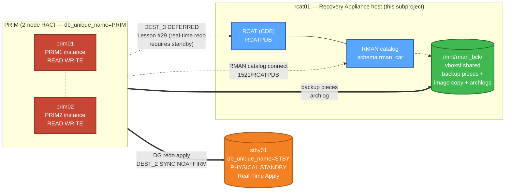

# 💾 ZDLRA_like — Recovery Appliance Backup Layer for Oracle 26ai HA MAA LAB

[](https://oracle.com)
[](https://oracle.com/linux)
[]()
[]()
[]()
[](https://github.com/krzysztof-i-cabaj/oracle-26ai-fsfo-tac-lab)
[](README_PL.md)

> 🇵🇱 [Polska wersja README →](README_PL.md)

> 🎯 **Backup layer** for the Oracle 26ai HA MAA LAB. Adds an Oracle 26ai recovery host (`rcat01`) running an RMAN catalog + a ZDLRA-like simulation (image copy + L1 incremental merge + real-time redo evaluation), completing the full **MAA = HA + DR + Backup** stack. Includes a fully autonomous test session executed by an AI agent.

---

## 🌐 Live diagram + 21-minute test walkthrough

> 🚀 **[Open the interactive landing page →](https://krzysztof-i-cabaj.github.io/oracle-26ai-fsfo-tac-lab/ZDLRA_like/zdlra.html)**

One screen, three things you don't get from `git log`:

- 🏛️ **Topology at a glance** — PRIM RAC ↔ STBY ↔ rcat01 (the missing recovery layer) with DG redo, RMAN catalog connect, and the architecturally-blocked DEST_3 all visualized
- ⏱️ **Timeline of the killer demo** — autonomous AI agent ran 4 phases + 2 scenarios in 21 minutes; **100% PITR recovery (1000/1000 rows) in 1m 8s**
- 🎓 **5 newest lessons** (#30 → #34) — including the `ORA-65025` *"Pluggable database not closed on all instances"* trap that silently fails any RAC PDB PITR without `INSTANCES=ALL`

Dark-mode, self-contained HTML — no build, no JS framework, no external dependencies. Source: [`zdlra.html`](zdlra.html).

---

## 🏛️ Architecture



The new VM `rcat01` provides:

- Oracle Database 26ai 23.26.1 (Single Instance, CDB `RCAT` + PDB `RCATPDB`)
- An **RMAN Recovery Catalog** schema that registers the PRIM database
- A simulation of the key features of **Zero Data Loss Recovery Appliance** in plain RMAN:
  - Real-time redo transport from primary (DEFERRED — see Lesson #29 for architectural limit)
  - Virtual Full Backup (incremental merge: image copy + L1 INCR FOR RECOVER OF COPY)
  - Compression (basic, no ACO)
- **Auto-start** of the database after OS reboot via a systemd unit (without Grid Infrastructure)
- A **fully autonomous test session** executed by Claude Opus 4.7 (see [zdlra-backup-live-test/](zdlra-backup-live-test/))

---

## 📋 Requirements

| Item | Value |
|---|---|
| Host RAM | ≥ 64 GB |
| Host disk free | ≥ 300 GB (60 GB OS + 200 GB catalog/FRA/backups) |
| VirtualBox | 7.x |
| Oracle Linux ISO | `OracleLinux-R8-U10-x86_64-dvd.iso` (same as the rest of the LAB) |
| Oracle DB binary | 23.26.1 (LINUX.X64_23ai_database.zip) |
| Parent FSFO/TAC LAB | running (PRIM RAC + STBY DG up — this subproject extends them) |

---

## 📁 Directory structure

```
ZDLRA_like/                              ← project root
├── README.md, README_PL.md              ← this file (EN/PL)
├── DESIGN.md, DESIGN_PL.md              ← ADRs, architecture, security (EN/PL)
├── SETTINGS.md                          ← project conventions + paths + secrets policy
├── LICENSE, .gitignore, CONTRIBUTING.md
├── zdlra.html, zdlra_PL.html            ← landing page with topology SVG (PL/EN)
│
├── docs/                                ← 10 chapters × 2 langs = 20 .md files
│   ├── 01_Architecture.md               (EN/PL)
│   ├── 02_Boot_Automation_PoC.md        (Sprint 0)
│   ├── 03_VM_Preparation.md             (Sprint 1)
│   ├── 04_DB_Install_and_Auto_Start.md  (Sprint 1)
│   ├── 05_Catalog_Setup.md              (Sprint 1)
│   ├── 06_Backup_Policy.md              (Sprint 2)
│   ├── 07_ZDLRA_Like_Simulation.md      (Sprint 3 + Lesson #29 + Sprint 5 optional)
│   ├── 08_Backup_Restore_Scenarios.md   (8 scenarios B-1..B-8)
│   ├── 09_DG_Integration.md             (Backup ↔ Data Guard)
│   ├── 10_Troubleshooting.md            (cumulative lessons #1-34)
│   └── architecture.svg                 ← standalone topology diagram
│
├── kickstart/ks-rcat01.cfg              ← Anaconda kickstart for rcat01
│
├── response_files/db_rcat_se2.rsp       ← silent install response file
│
├── scripts/                             ← 21 shell + PowerShell scripts
│   ├── boot/                            Sprint 0: VBox keyboard automation (4 .ps1)
│   ├── *.sh / *.ps1                     install, catalog, RMAN, ZDLRA-sim
│   └── systemd/oracle-rcat.service      auto-start unit
│
├── sql/                                 ← 8 SQL files (catalog schema, RMAN config, health)
│
└── zdlra-backup-live-test/              ← 🔴 KILLER DEMO — autonomous AI agent test session
    ├── README.md, README_PL.md
    ├── logs/autonomous_zdlra_backup_test_PL.md, .md   ← full PL/EN log (~31 KB each)
    └── scripts/phase0..phase4_*.sh       ← 6 phase scripts
```

---

## 🚀 Quick start (sprint-by-sprint)

> 📌 Run from `ZDLRA_like/` as the project root. SSH to `rcat01` requires passwordless mesh (set up by parent FSFO/TAC LAB).

```bash
# Sprint 0 — proof-of-concept: automated kickstart boot
.\scripts\boot\boot_rcat_via_scancode.ps1

# Sprint 1 — VM rcat01 + DB + catalog
.\scripts\vbox_create_rcat.ps1
ssh kris@rcat01 'sudo /tmp/scripts/install_db_silent_rcat.sh'
ssh kris@rcat01 'sudo /tmp/scripts/dbca_create_rcat.sh'
ssh kris@rcat01 'sudo /tmp/scripts/setup_systemd_oracle_unit.sh'
ssh kris@rcat01 'sudo /tmp/scripts/catalog_create.sh'
ssh kris@rcat01 'sudo /tmp/scripts/catalog_register_prim.sh'
ssh kris@rcat01 'sudo /tmp/scripts/catalog_register_stby.sh'

# Sprint 2 — full backup cycle + persistent RMAN config
ssh kris@rcat01 'sudo /tmp/scripts/rman_setup_config.sh'
ssh kris@rcat01 'sudo /tmp/scripts/rman_full_backup.sh'

# Sprint 3 — ZDLRA-like simulation
ssh kris@rcat01 'sudo /tmp/scripts/zdlra_sim_setup.sh --init'
ssh kris@rcat01 'sudo /tmp/scripts/zdlra_sim_setup.sh --merge'
```

For the **autonomous AI agent test session** (Sprint 3 validation), see [zdlra-backup-live-test/README.md](zdlra-backup-live-test/README.md).

---

## 🔴 Killer demo: autonomous AI agent test session

A 21-minute autonomous backup + restore session executed by Claude Opus 4.7:

| Phase | Operation | Time | Result |
|---|---|---|---|
| 0 | Pre-flight (DG, RMAN catalog, storage) | ~30s | ✅ |
| 1 | ZDLRA-Like full backup (`RECOVER COPY`) | **53s** | image copy SCN advanced ~17,000 |
| 2 | Backup merge cycle (workload + new L1) | **138s** | 6 L1 + 5 archlog pieces (~129 MB) |
| 3.B-1 | Compressed FULL + ARCHLOG + CROSSCHECK | ~5 min | 13 pieces (519 MB) |
| 3.B-4 | **PITR after DROP TABLE in APPPDB (RAC)** | **1m 8s** | **100% recovery (1000/1000 rows)** |
| 4 | Cleanup + DG verify | ~30s | Apply Lag 0s ✅ |

Full log + 5 new lessons learned (#30-34): **[zdlra-backup-live-test/](zdlra-backup-live-test/)** ([logs/autonomous_zdlra_backup_test.md](zdlra-backup-live-test/logs/autonomous_zdlra_backup_test.md))

---

## 🎓 Lessons learned (cumulative #1-#34)

Full troubleshooting catalog with reproductions in [docs/10_Troubleshooting.md](docs/10_Troubleshooting.md). Highlights:

- **#27** RMAN catalog connection requires **pwfile binary-identical** between PRIM and rcat01 (not just plaintext password sync) — `DBMS_FILE_TRANSFER` from `+DATA/PRIM/PASSWORD/`
- **#29** Real-time redo to rcat01 (DEST_3) → DEFERRED. Architectural limit: Oracle DG redo transport requires a **physical standby** target (identical `db_name` + `dbid`), not an arbitrary Oracle DB. See [doc 07 § Sprint 5 optional](docs/07_ZDLRA_Like_Simulation.md) for the workaround path.
- **#30** RAC PDB PITR requires `ALTER PLUGGABLE DATABASE ... CLOSE IMMEDIATE INSTANCES=ALL` — without it: `ORA-65025`.

---

## 👤 Author

KCB Kris (krzysztof.i.cabaj@gmail.com) + Claude (autonomous AI agent — Anthropic Claude Opus 4.7)

## 📜 Licensing notes

The `.sh`/`.ps1`/`.sql` scripts are educational. Standard RMAN operations such as `BACKUP DATABASE`,
`RESTORE`, `DUPLICATE` do not require additional licences beyond Oracle DB SE2/EE.
**Diagnostic/Tuning Pack is NOT required** for this subproject.

See [LICENSE](LICENSE) for terms.

## 🔗 Related documents

- 🏛️ Parent project: [oracle-26ai-fsfo-tac-lab](https://github.com/krzysztof-i-cabaj/oracle-26ai-fsfo-tac-lab) — FSFO/TAC LAB (PRIM RAC + STBY + observers + TAC)
- 🏗️ [DESIGN.md](DESIGN.md) — architecture decisions (ADRs)
- ⚙️ [SETTINGS.md](SETTINGS.md) / [SETTINGS_PL.md](SETTINGS_PL.md) — project conventions, paths, secrets policy
- 📖 [docs/01_Architecture.md](docs/01_Architecture.md) — subproject architecture details
- 📖 [docs/07_ZDLRA_Like_Simulation.md](docs/07_ZDLRA_Like_Simulation.md) — image copy + merge cycle
- 📖 [docs/08_Backup_Restore_Scenarios.md](docs/08_Backup_Restore_Scenarios.md) — 8 scenarios B-1..B-8
- 🔴 [zdlra-backup-live-test/](zdlra-backup-live-test/) — autonomous AI agent test session
