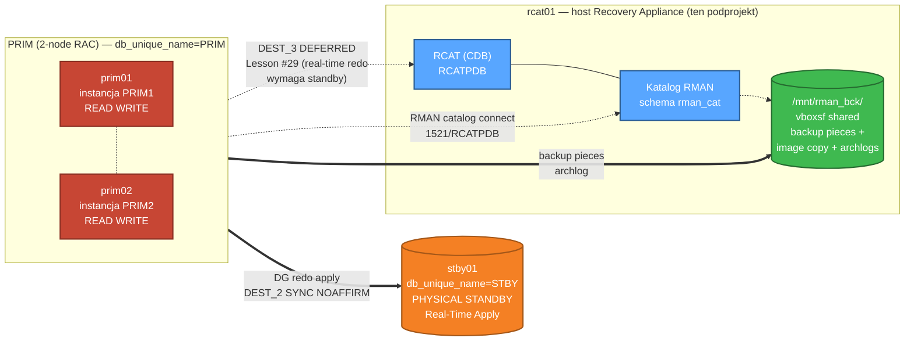

# 💾 ZDLRA_like — Backup Layer dla LAB Oracle 26ai HA MAA

[](https://oracle.com)
[](https://oracle.com/linux)
[]()
[]()
[]()
[](https://github.com/krzysztof-i-cabaj/oracle-26ai-fsfo-tac-lab)
[](README.md)

> 🇬🇧 [English README →](README.md)

> 🎯 **Warstwa backup** dla LAB Oracle 26ai HA MAA. Dodaje hosta Oracle 26ai (`rcat01`) z RMAN catalog + symulację ZDLRA-Like (image copy + L1 incremental merge + ewaluacja real-time redo), domykając pełen stack **MAA = HA + DR + Backup**. Zawiera w pełni autonomiczną sesję testową wykonaną przez agenta AI.

---

## 🌐 Diagram + 21-minutowy walkthrough sesji testowej

> 🚀 **[Otwórz interaktywną landing page →](https://krzysztof-i-cabaj.github.io/oracle-26ai-fsfo-tac-lab/ZDLRA_like/zdlra_PL.html)**

Jeden ekran, trzy rzeczy których nie zobaczysz w `git log`:

- 🏛️ **Topologia na jeden rzut oka** — PRIM RAC ↔ STBY ↔ rcat01 (brakująca warstwa backup) z zaznaczonym DG redo, RMAN catalog connect oraz architekturalnie zablokowanym DEST_3
- ⏱️ **Timeline killer demo** — autonomiczny agent AI wykonał 4 fazy + 2 scenariusze w 21 minut; **100% PITR recovery (1000/1000 wierszy) w 1m 8s**
- 🎓 **5 najnowszych lekcji** (#30 → #34) — w tym pułapka `ORA-65025` *"Pluggable database not closed on all instances"* która po cichu wysadzi każdy RAC PDB PITR bez `INSTANCES=ALL`

Dark-mode, samodzielny HTML — brak build, brak JS frameworka, brak zewnętrznych zależności. Źródło: [`zdlra_PL.html`](zdlra_PL.html).

---

## 🏛️ Architektura



Nowa VM `rcat01` zawiera:

- Oracle Database 26ai 23.26.1 (Single Instance, CDB `RCAT` + PDB `RCATPDB`)
- Schemat **RMAN Recovery Catalog** rejestrujący bazę PRIM
- Symulację kluczowych funkcji **Zero Data Loss Recovery Appliance** w plain RMAN:
  - Real-time redo transport z primary (DEFERRED — patrz Lesson #29 dla architectural limit)
  - Virtual Full Backup (incremental merge: image copy + L1 INCR FOR RECOVER OF COPY)
  - Compression (basic, bez ACO)
- **Auto-start** bazy po reboocie OS przez systemd unit (bez Grid Infrastructure)
- **W pełni autonomiczną sesję testową** wykonaną przez Claude Opus 4.7 (patrz [zdlra-backup-live-test/](zdlra-backup-live-test/))

---

## 📋 Wymagania

| Element | Wartość |
|---|---|
| RAM hosta | ≥ 64 GB |
| Wolne miejsce na dysku | ≥ 300 GB (60 GB OS + 200 GB catalog/FRA/backups) |
| VirtualBox | 7.x |
| Oracle Linux ISO | `OracleLinux-R8-U10-x86_64-dvd.iso` (jak reszta LAB-u) |
| Oracle DB binary | 23.26.1 (LINUX.X64_23ai_database.zip) |
| Parent FSFO/TAC LAB | uruchomiony (PRIM RAC + STBY DG up — ten subproject je rozszerza) |

---

## 📁 Struktura katalogów

```
ZDLRA_like/                              ← root projektu
├── README.md, README_PL.md              ← ten plik (EN/PL)
├── DESIGN.md, DESIGN_PL.md              ← ADR-y, architektura, bezpieczeństwo (EN/PL)
├── SETTINGS.md                          ← konwencje projektu + ścieżki + secrets policy
├── LICENSE, .gitignore, CONTRIBUTING.md
├── zdlra.html, zdlra_PL.html            ← landing page z topology SVG (PL/EN)
│
├── docs/                                ← 10 rozdziałów × 2 języki = 20 plików .md
│   ├── 01_Architecture.md               (EN/PL)
│   ├── 02_Boot_Automation_PoC.md        (Sprint 0)
│   ├── 03_VM_Preparation.md             (Sprint 1)
│   ├── 04_DB_Install_and_Auto_Start.md  (Sprint 1)
│   ├── 05_Catalog_Setup.md              (Sprint 1)
│   ├── 06_Backup_Policy.md              (Sprint 2)
│   ├── 07_ZDLRA_Like_Simulation.md      (Sprint 3 + Lesson #29 + Sprint 5 opcjonalny)
│   ├── 08_Backup_Restore_Scenarios.md   (8 scenariuszy B-1..B-8)
│   ├── 09_DG_Integration.md             (Backup ↔ Data Guard)
│   ├── 10_Troubleshooting.md            (kumulatywne lekcje #1-34)
│   └── architecture.svg                 ← standalone diagram topologii
│
├── kickstart/ks-rcat01.cfg              ← kickstart Anaconda dla rcat01
│
├── response_files/db_rcat_se2.rsp       ← response file dla silent install
│
├── scripts/                             ← 21 shell + PowerShell skryptów
│   ├── boot/                            Sprint 0: VBox keyboard automation (4 .ps1)
│   ├── *.sh / *.ps1                     install, catalog, RMAN, ZDLRA-sim
│   └── systemd/oracle-rcat.service      auto-start unit
│
├── sql/                                 ← 8 plików SQL (catalog schema, RMAN config, health)
│
└── zdlra-backup-live-test/              ← 🔴 KILLER DEMO — autonomous AI agent test session
    ├── README.md, README_PL.md
    ├── logs/autonomous_zdlra_backup_test_PL.md, .md   ← pełen log PL/EN (~31 KB każdy)
    └── scripts/phase0..phase4_*.sh       ← 6 phase scripts
```

---

## 🚀 Szybki start (sprint po sprincie)

> 📌 Uruchamiaj z `ZDLRA_like/` jako root projektu. SSH do `rcat01` wymaga passwordless mesh (skonfigurowane przez parent FSFO/TAC LAB).

```bash
# Sprint 0 — proof-of-concept: zautomatyzowany kickstart boot
.\scripts\boot\boot_rcat_via_scancode.ps1

# Sprint 1 — VM rcat01 + DB + catalog
.\scripts\vbox_create_rcat.ps1
ssh kris@rcat01 'sudo /tmp/scripts/install_db_silent_rcat.sh'
ssh kris@rcat01 'sudo /tmp/scripts/dbca_create_rcat.sh'
ssh kris@rcat01 'sudo /tmp/scripts/setup_systemd_oracle_unit.sh'
ssh kris@rcat01 'sudo /tmp/scripts/catalog_create.sh'
ssh kris@rcat01 'sudo /tmp/scripts/catalog_register_prim.sh'
ssh kris@rcat01 'sudo /tmp/scripts/catalog_register_stby.sh'

# Sprint 2 — pełny cykl backup + persistent RMAN config
ssh kris@rcat01 'sudo /tmp/scripts/rman_setup_config.sh'
ssh kris@rcat01 'sudo /tmp/scripts/rman_full_backup.sh'

# Sprint 3 — symulacja ZDLRA-like
ssh kris@rcat01 'sudo /tmp/scripts/zdlra_sim_setup.sh --init'
ssh kris@rcat01 'sudo /tmp/scripts/zdlra_sim_setup.sh --merge'
```

Dla **autonomicznej sesji testowej agenta AI** (walidacja Sprint 3) — patrz [zdlra-backup-live-test/README_PL.md](zdlra-backup-live-test/README_PL.md).

---

## 🔴 Killer demo: autonomiczna sesja testowa agenta AI

21-minutowa autonomiczna sesja backup + restore wykonana przez Claude Opus 4.7:

| Phase | Operacja | Czas | Wynik |
|---|---|---|---|
| 0 | Pre-flight (DG, RMAN catalog, storage) | ~30s | ✅ |
| 1 | ZDLRA-Like full backup (`RECOVER COPY`) | **53s** | image copy SCN advanced ~17 000 |
| 2 | Backup merge cycle (workload + new L1) | **138s** | 6 L1 + 5 archlog pieces (~129 MB) |
| 3.B-1 | Compressed FULL + ARCHLOG + CROSSCHECK | ~5 min | 13 pieces (519 MB) |
| 3.B-4 | **PITR po DROP TABLE w APPPDB (RAC)** | **1m 8s** | **100% recovery (1000/1000 wierszy)** |
| 4 | Cleanup + DG verify | ~30s | Apply Lag 0s ✅ |

Pełen log + 5 nowych lessons learned (#30-34): **[zdlra-backup-live-test/](zdlra-backup-live-test/)** ([logs/autonomous_zdlra_backup_test_PL.md](zdlra-backup-live-test/logs/autonomous_zdlra_backup_test_PL.md))

---

## 🎓 Lessons learned (kumulatywne #1-#34)

Pełen catalog troubleshooting z reprodukcjami w [docs/10_Troubleshooting_PL.md](docs/10_Troubleshooting_PL.md). Highlights:

- **#27** RMAN catalog connection wymaga **pwfile binary-identical** między PRIM a rcat01 (nie tylko plaintext password sync) — `DBMS_FILE_TRANSFER` z `+DATA/PRIM/PASSWORD/`
- **#29** Real-time redo do rcat01 (DEST_3) → DEFERRED. Architectural limit: Oracle DG redo transport wymaga **physical standby** target (identyczny `db_name` + `dbid`), nie dowolnej Oracle DB. Patrz [doc 07 § Sprint 5 opcjonalny](docs/07_ZDLRA_Like_Simulation_PL.md) dla ścieżki workaround-u.
- **#30** RAC PDB PITR wymaga `ALTER PLUGGABLE DATABASE ... CLOSE IMMEDIATE INSTANCES=ALL` — bez tego: `ORA-65025`.

---

## 👤 Autor

KCB Kris (krzysztof.i.cabaj@gmail.com) + Claude (autonomous AI agent — Anthropic Claude Opus 4.7)

## 📜 Uwagi licencyjne

Skrypty `.sh`/`.ps1`/`.sql` mają charakter edukacyjny. Standardowe operacje RMAN takie jak `BACKUP DATABASE`,
`RESTORE`, `DUPLICATE` nie wymagają dodatkowych licencji poza Oracle DB SE2/EE.
**Diagnostic/Tuning Pack NIE jest wymagany** dla tego subprojektu.

Patrz [LICENSE](LICENSE) dla warunków.

## 🔗 Powiązane dokumenty

- 🏛️ Parent project: [oracle-26ai-fsfo-tac-lab](https://github.com/krzysztof-i-cabaj/oracle-26ai-fsfo-tac-lab) — LAB FSFO/TAC (PRIM RAC + STBY + observers + TAC)
- 🏗️ [DESIGN_PL.md](DESIGN_PL.md) — decyzje architektoniczne (ADR-y)
- ⚙️ [SETTINGS_PL.md](SETTINGS_PL.md) / [SETTINGS.md](SETTINGS.md) — konwencje projektu, ścieżki, secrets policy
- 📖 [docs/01_Architecture_PL.md](docs/01_Architecture_PL.md) — szczegóły architektury subprojektu
- 📖 [docs/07_ZDLRA_Like_Simulation_PL.md](docs/07_ZDLRA_Like_Simulation_PL.md) — image copy + merge cycle
- 📖 [docs/08_Backup_Restore_Scenarios_PL.md](docs/08_Backup_Restore_Scenarios_PL.md) — 8 scenariuszy B-1..B-8
- 🔴 [zdlra-backup-live-test/](zdlra-backup-live-test/) — autonomous AI agent test session
