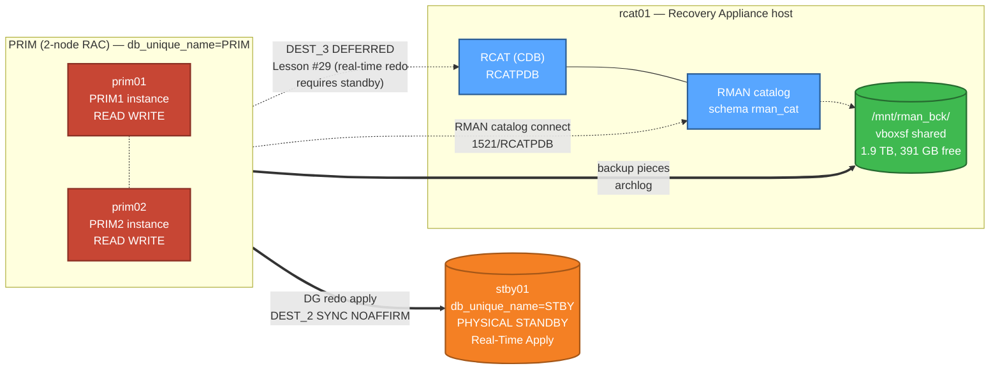

# 🤖 ZDLRA-Like Backup & Restore — Autonomous AI Agent Test

[-red)]()
[]()
[]()
[]()
[]()
[]()
[]()

> 🇵🇱 [Polska wersja README →](README_PL.md)

> 🎯 End-to-end demo of a Recovery Appliance / ZDLRA-Like backup + restore workflow, executed by an autonomous AI agent (Claude Opus 4.7) in a 2-node RAC + Data Guard + RMAN catalog LAB. Every command + every result logged.

This case is part of the broader **[oracle-26ai-fsfo-tac-lab](../README.md)** project.

---

## 🏛️ LAB topology



**Key:** PRIM RAC primary writes redo → STBY (DG MaxPerformance, FSFO Disabled). RMAN catalog on rcat01 (separate Oracle host). Backup storage `/mnt/rman_bck/` shared via VirtualBox vboxsf. Real-time redo to rcat01 (DEST_3) is **architecturally limited** — see Lesson #29.

---

## ⏱️ Test session timeline (2026-05-04)

| Time | Phase | Operation | Result |
|------|-------|-----------|--------|
| 16:50 | Phase 0 | Pre-flight diagnostics (DG, RMAN catalog, storage) | ✅ ~30s |
| 16:55 | Phase 1 | ZDLRA-Like full backup = `RECOVER COPY` | ✅ **53s** — image copy SCN advanced by ~17,000 |
| 16:56 | Phase 2 | Workload (15K rows) + new L1 INCR FOR RECOVER OF COPY + archlog | ✅ **138s** — 6 L1 + 5 archlog pieces (~129 MB) |
| 16:59 | Phase 3 / B-1 | `BACKUP INCREMENTAL LEVEL 0 AS COMPRESSED BACKUPSET ... DATABASE PLUS ARCHIVELOG` + CROSSCHECK | ✅ **~5 min** — 13 pieces (519 MB) |
| 17:05 | Phase 3 / B-4 | PITR after DROP TABLE in APPPDB (RAC-aware) | ✅ **1m 8s** — 100% recovery (1000/1000 rows) |
| 17:11 | Phase 4 | Cleanup + DG verify + final state | ✅ Apply Lag 0s, Transport Lag 0s |

**Total: ~21 minutes.** 28 new RMAN backup pieces (~684 MB).

---

## 🎯 What was validated

- ✅ **ZDLRA-Like Virtual Full Backup** pattern: `BACKUP INCREMENTAL LEVEL 1 FOR RECOVER OF COPY` followed by `RECOVER COPY OF DATABASE` advances the synthetic L0 image copy without requiring a fresh full backup.
- ✅ **Compressed full backup** workflow with archivelog and crosscheck (B-1 from doc 08).
- ✅ **Single-PDB Point-in-Time Recovery** in RAC (B-4): DROP TABLE → SCN-based PITR → table fully recovered.
- ✅ **DG broker survives** per-PDB RESETLOGS — Apply Lag stays at 0s after the test.
- ✅ **RMAN catalog** connection through pwfile binary sync (a previous lesson, validated in production paths).

---

## 🎓 Lessons learned (5 new entries: #30 → #34)

| # | Lesson | Why it matters |
|---|--------|----------------|
| **#30** | RAC PDB PITR requires `ALTER PLUGGABLE DATABASE ... CLOSE IMMEDIATE INSTANCES=ALL`. Without `INSTANCES=ALL` → `ORA-65025: Pluggable database is not closed on all instances`. | Single-instance Oracle docs assume `CLOSE IMMEDIATE` is enough. In RAC every instance must close the PDB before RMAN PITR. |
| **#31** | SQL\*Plus heredoc `<<SQL ... SQL` over SSH is **session-isolated**: `ALTER SESSION SET CONTAINER` in one heredoc does NOT persist to the next. | Capture variables (e.g. `SCN_BEFORE`) must be in the same heredoc as the operation that depends on them, OR use a single SQL file `@/tmp/script.sql`. |
| **#32** | First line of every SQL file: `SET LINESIZE 220 PAGESIZE 50 FEEDBACK ON HEADING ON ECHO OFF`. | Default settings in some environments (`glogin.sql`, login profiles) may hide query results below `FEEDBACK 1` threshold — looks like commands silently fail. |
| **#33** | A table created + committed in one autonomous phase **disappeared** before the next phase, with no entry in `dba_recyclebin`. Workaround: fresh CREATE inside the same session as the test. | Symptom not yet root-caused — possibly related to Lesson #31's session isolation. Fresh setup makes tests reproducible. |
| **#34** | doc 08 § B-5 block corruption demo (`dd if=/dev/zero of=/u02/oradata/...`) **not applicable** to ASM-based datafiles. | LAB datafiles live on `+DATA/PRIM/...` — ASM. To simulate corruption you'd need ASMCMD-based or `DBMS_REPAIR` approaches, not raw `dd`. |

---

## 📝 The killer demo — B-4 PITR after DROP TABLE

```sql
-- 1. Set up: 1000 rows, capture SCN
ALTER SESSION SET CONTAINER=APPPDB;
CREATE TABLE app_user.b4_test AS
  SELECT level AS id, 'b4_row_' || level AS payload, SYSDATE AS created_at
  FROM dual CONNECT BY level <= 1000;

SCN_BEFORE = 22911077    -- captured target

-- 2. Force archive log
ALTER SYSTEM SWITCH LOGFILE; ALTER SYSTEM SWITCH LOGFILE;
ALTER SYSTEM ARCHIVE LOG CURRENT;
ALTER SYSTEM CHECKPOINT;

-- 3. The "accident"
DROP TABLE app_user.b4_test PURGE;
ALTER SYSTEM SWITCH LOGFILE; ALTER SYSTEM SWITCH LOGFILE;

-- 4. RAC-aware close (key fix for Lesson #30)
ALTER PLUGGABLE DATABASE APPPDB CLOSE IMMEDIATE INSTANCES=ALL;

-- 5. RMAN PITR (3 channels parallel, ~46s biggest restore + 5s recovery)
RMAN> RUN {
  SET UNTIL SCN 22911077;
  RESTORE PLUGGABLE DATABASE APPPDB;
  RECOVER PLUGGABLE DATABASE APPPDB;
}

-- 6. Open + verify
ALTER PLUGGABLE DATABASE APPPDB OPEN RESETLOGS;
SELECT COUNT(*) FROM app_user.b4_test;   -- 1000   ✅ 100% recovery
```

**Total wall-clock time: 1 minute 8 seconds** (DROP → table fully restored).

---

## 📁 Files in this folder

| File | Description |
|------|-------------|
| [README.md](README.md) | This file (English) |
| [README_PL.md](README_PL.md) | Polish version of the README |
| [logs/autonomous_zdlra_backup_test.md](logs/autonomous_zdlra_backup_test.md) | Full English log: every command + result, 4 phases (~31 KB) |
| [logs/autonomous_zdlra_backup_test_PL.md](logs/autonomous_zdlra_backup_test_PL.md) | Full Polish log (~31 KB) |
| [scripts/phase0_preflight.sh](scripts/phase0_preflight.sh) | Pre-flight diagnostics script |
| [scripts/phase1_zdlra_init.sh](scripts/phase1_zdlra_init.sh) | Phase 1 — RECOVER COPY |
| [scripts/phase2_merge.sh](scripts/phase2_merge.sh) | Phase 2 — workload + new L1 incremental |
| [scripts/phase3_b1.sh](scripts/phase3_b1.sh) | B-1 — full RMAN catalog cycle |
| [scripts/phase3_b4v2.sh](scripts/phase3_b4v2.sh) | B-4 — PITR after DROP TABLE (RAC-aware) |
| [scripts/phase4_cleanup.sh](scripts/phase4_cleanup.sh) | Phase 4 — DG verify + cleanup |

---

## 🚀 How to reproduce

> ⚠️ Requires the full LAB from the parent project up and running (PRIM RAC + STBY DG + rcat01 RMAN catalog). See parent [README](../README.md) for setup.

```bash
# Run on prim01 as oracle user (needs source ~/.lab_secrets for LAB_PASS):
bash scripts/phase0_preflight.sh
bash scripts/phase1_zdlra_init.sh
bash scripts/phase2_merge.sh
bash scripts/phase3_b1.sh
bash scripts/phase3_b4v2.sh
bash scripts/phase4_cleanup.sh
```

Each script is **idempotent** for non-destructive parts, but B-4 requires a fresh `app_user.b4_test` table (the script creates it).

---

## 🔗 Related

- **LAB project:** [oracle-26ai-fsfo-tac-lab](../README.md) — full setup of PRIM RAC + STBY + FSFO + TAC
- **ZDLRA architecture rationale:** [docs/07_ZDLRA_Like_Simulation.md](../docs/07_ZDLRA_Like_Simulation.md)
- **Backup/restore scenarios catalog:** [docs/08_Backup_Restore_Scenarios.md](../docs/08_Backup_Restore_Scenarios.md)
- **Cumulative lessons learned:** [docs/10_Troubleshooting.md](../docs/10_Troubleshooting.md)

---

**Author:** KCB Kris + Claude (autonomous AI agent — Anthropic Claude Opus 4.7)
**Date:** 2026-05-04
**LAB:** Oracle 26ai (23.26.1.0.0) on Oracle Linux 8.10, RAC 2-node + DG + RMAN catalog
**License:** see parent repository
