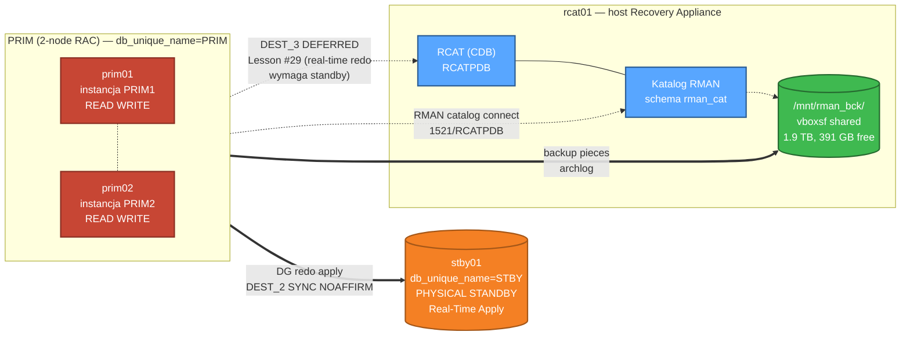

# 🤖 ZDLRA-Like Backup & Restore — Autonomiczny test agenta AI

[-red)]()
[]()
[]()
[]()
[]()
[]()
[]()

> 🇬🇧 [English README →](README.md)

> 🎯 End-to-end demo Recovery Appliance / ZDLRA-Like backup + restore wykonane przez autonomicznego agenta AI (Claude Opus 4.7) w LAB-ie z 2-node RAC + Data Guard + RMAN catalog. Każda komenda + każdy wynik zalogowany.

Ten case jest częścią szerszego projektu **[oracle-26ai-fsfo-tac-lab](../README.md)**.

---

## 🏛️ Topologia LAB-u



**Legenda:** PRIM RAC primary zapisuje redo → STBY (DG MaxPerformance, FSFO Disabled). Katalog RMAN na rcat01 (osobny host Oracle). Backup storage `/mnt/rman_bck/` współdzielony przez VirtualBox vboxsf. Real-time redo do rcat01 (DEST_3) jest **architekturalnie ograniczony** — patrz Lesson #29.

---

## ⏱️ Timeline sesji testowej (2026-05-04)

| Czas | Phase | Operacja | Wynik |
|------|-------|----------|-------|
| 16:50 | Phase 0 | Pre-flight diagnostyka (DG, RMAN catalog, storage) | ✅ ~30s |
| 16:55 | Phase 1 | ZDLRA-Like full backup = `RECOVER COPY` | ✅ **53s** — image copy SCN advanced o ~17 000 |
| 16:56 | Phase 2 | Workload (15 tys. wierszy) + nowy L1 INCR FOR RECOVER OF COPY + archlog | ✅ **138s** — 6 L1 + 5 archlog pieces (~129 MB) |
| 16:59 | Phase 3 / B-1 | `BACKUP INCREMENTAL LEVEL 0 AS COMPRESSED BACKUPSET ... DATABASE PLUS ARCHIVELOG` + CROSSCHECK | ✅ **~5 min** — 13 pieces (519 MB) |
| 17:05 | Phase 3 / B-4 | PITR po DROP TABLE w APPPDB (RAC-aware) | ✅ **1m 8s** — 100% recovery (1000/1000 wierszy) |
| 17:11 | Phase 4 | Cleanup + DG verify + final state | ✅ Apply Lag 0s, Transport Lag 0s |

**Łącznie: ~21 minut.** 28 nowych RMAN backup pieces (~684 MB).

---

## 🎯 Co zostało zwalidowane

- ✅ **ZDLRA-Like Virtual Full Backup** pattern: `BACKUP INCREMENTAL LEVEL 1 FOR RECOVER OF COPY` + `RECOVER COPY OF DATABASE` advances synthetic L0 image copy bez konieczności robienia świeżego full backup-u.
- ✅ **Compressed full backup** workflow z archivelog i crosscheck (B-1 z doc 08).
- ✅ **Single-PDB Point-in-Time Recovery** w RAC (B-4): DROP TABLE → SCN-based PITR → tabela w pełni odzyskana.
- ✅ **DG broker survives** per-PDB RESETLOGS — Apply Lag pozostaje 0s po teście.
- ✅ **Katalog RMAN** połączenie przez pwfile binary sync (poprzednia lekcja, walidacja w prod-path).

---

## 🎓 Lessons learned (5 nowych: #30 → #34)

| # | Lekcja | Dlaczego ważne |
|---|--------|-----------------|
| **#30** | RAC PDB PITR wymaga `ALTER PLUGGABLE DATABASE ... CLOSE IMMEDIATE INSTANCES=ALL`. Bez `INSTANCES=ALL` → `ORA-65025: Pluggable database is not closed on all instances`. | Single-instance docs zakładają że `CLOSE IMMEDIATE` wystarczy. W RAC każda instancja musi zamknąć PDB przed RMAN PITR. |
| **#31** | SQL\*Plus heredoc `<<SQL ... SQL` przez SSH jest **session-isolated**: `ALTER SESSION SET CONTAINER` w jednym heredoc NIE persists do następnego. | Capture zmiennych (np. `SCN_BEFORE`) musi być w tym samym heredoc co operacja od nich zależna, ALBO użyj jednego SQL file `@/tmp/script.sql`. |
| **#32** | Pierwsza linia każdego SQL pliku: `SET LINESIZE 220 PAGESIZE 50 FEEDBACK ON HEADING ON ECHO OFF`. | Domyślne ustawienia w niektórych środowiskach (`glogin.sql`, login profiles) mogą ukrywać wyniki SELECT poniżej `FEEDBACK 1` threshold — wygląda jak commands silently fail. |
| **#33** | Tabela utworzona + zacommitowana w jednej fazie autonomicznej **zniknęła** przed kolejną fazą, bez wpisu w `dba_recyclebin`. Workaround: świeży CREATE wewnątrz tej samej sesji co test. | Symptom nie zdiagnozowany do końca — możliwe związanie z izolacją sesji z Lesson #31. Świeży setup czyni testy reproducible. |
| **#34** | doc 08 § B-5 block corruption demo (`dd if=/dev/zero of=/u02/oradata/...`) **nie applicable** dla ASM-based datafiles. | LAB datafiles są na `+DATA/PRIM/...` — ASM. Symulacja corruption wymaga ASMCMD-based lub `DBMS_REPAIR` approaches, nie raw `dd`. |

---

## 📝 Killer demo — B-4 PITR po DROP TABLE

```sql
-- 1. Setup: 1000 wierszy, capture SCN
ALTER SESSION SET CONTAINER=APPPDB;
CREATE TABLE app_user.b4_test AS
  SELECT level AS id, 'b4_row_' || level AS payload, SYSDATE AS created_at
  FROM dual CONNECT BY level <= 1000;

SCN_BEFORE = 22911077    -- captured target

-- 2. Wymuszenie archive log
ALTER SYSTEM SWITCH LOGFILE; ALTER SYSTEM SWITCH LOGFILE;
ALTER SYSTEM ARCHIVE LOG CURRENT;
ALTER SYSTEM CHECKPOINT;

-- 3. "Akcydent"
DROP TABLE app_user.b4_test PURGE;
ALTER SYSTEM SWITCH LOGFILE; ALTER SYSTEM SWITCH LOGFILE;

-- 4. RAC-aware close (key fix dla Lesson #30)
ALTER PLUGGABLE DATABASE APPPDB CLOSE IMMEDIATE INSTANCES=ALL;

-- 5. RMAN PITR (3 channels parallel, ~46s biggest restore + 5s recovery)
RMAN> RUN {
  SET UNTIL SCN 22911077;
  RESTORE PLUGGABLE DATABASE APPPDB;
  RECOVER PLUGGABLE DATABASE APPPDB;
}

-- 6. Open + walidacja
ALTER PLUGGABLE DATABASE APPPDB OPEN RESETLOGS;
SELECT COUNT(*) FROM app_user.b4_test;   -- 1000   ✅ 100% recovery
```

**Total wall-clock time: 1 minuta 8 sekund** (DROP → tabela w pełni odzyskana).

---

## 📁 Pliki w tym folderze

| Plik | Opis |
|------|------|
| [README.md](README.md) | English version |
| [README_PL.md](README_PL.md) | Ten plik (polski) |
| [logs/autonomous_zdlra_backup_test_PL.md](logs/autonomous_zdlra_backup_test_PL.md) | Pełen log polski: każda komenda + wynik, 4 phases (~31 KB) |
| [logs/autonomous_zdlra_backup_test.md](logs/autonomous_zdlra_backup_test.md) | Full English log (~31 KB) |
| [scripts/phase0_preflight.sh](scripts/phase0_preflight.sh) | Pre-flight diagnostyka |
| [scripts/phase1_zdlra_init.sh](scripts/phase1_zdlra_init.sh) | Phase 1 — RECOVER COPY |
| [scripts/phase2_merge.sh](scripts/phase2_merge.sh) | Phase 2 — workload + nowy L1 incremental |
| [scripts/phase3_b1.sh](scripts/phase3_b1.sh) | B-1 — pełny cykl katalogu RMAN |
| [scripts/phase3_b4v2.sh](scripts/phase3_b4v2.sh) | B-4 — PITR po DROP TABLE (RAC-aware) |
| [scripts/phase4_cleanup.sh](scripts/phase4_cleanup.sh) | Phase 4 — DG verify + cleanup |

---

## 🚀 Jak odtworzyć

> ⚠️ Wymaga pełnego LAB-u z parent project uruchomionego (PRIM RAC + STBY DG + rcat01 RMAN catalog). Patrz parent [README](../README.md) dla setup-u.

```bash
# Uruchom na prim01 jako oracle (wymaga source ~/.lab_secrets dla LAB_PASS):
bash scripts/phase0_preflight.sh
bash scripts/phase1_zdlra_init.sh
bash scripts/phase2_merge.sh
bash scripts/phase3_b1.sh
bash scripts/phase3_b4v2.sh
bash scripts/phase4_cleanup.sh
```

Każdy skrypt jest **idempotent** dla non-destructive części, ale B-4 wymaga świeżej tabeli `app_user.b4_test` (skrypt sam ją tworzy).

---

## 🔗 Powiązane

- **Projekt LAB:** [oracle-26ai-fsfo-tac-lab](../README.md) — pełen setup PRIM RAC + STBY + FSFO + TAC
- **ZDLRA architecture rationale:** [docs/07_ZDLRA_Like_Simulation_PL.md](../docs/07_ZDLRA_Like_Simulation_PL.md)
- **Backup/restore scenarios catalog:** [docs/08_Backup_Restore_Scenarios_PL.md](../docs/08_Backup_Restore_Scenarios_PL.md)
- **Cumulative lessons learned:** [docs/10_Troubleshooting_PL.md](../docs/10_Troubleshooting_PL.md)

---

**Autor:** KCB Kris + Claude (autonomous AI agent — Anthropic Claude Opus 4.7)
**Data:** 2026-05-04
**LAB:** Oracle 26ai (23.26.1.0.0) on Oracle Linux 8.10, RAC 2-node + DG + RMAN catalog
**Licencja:** patrz parent repository
