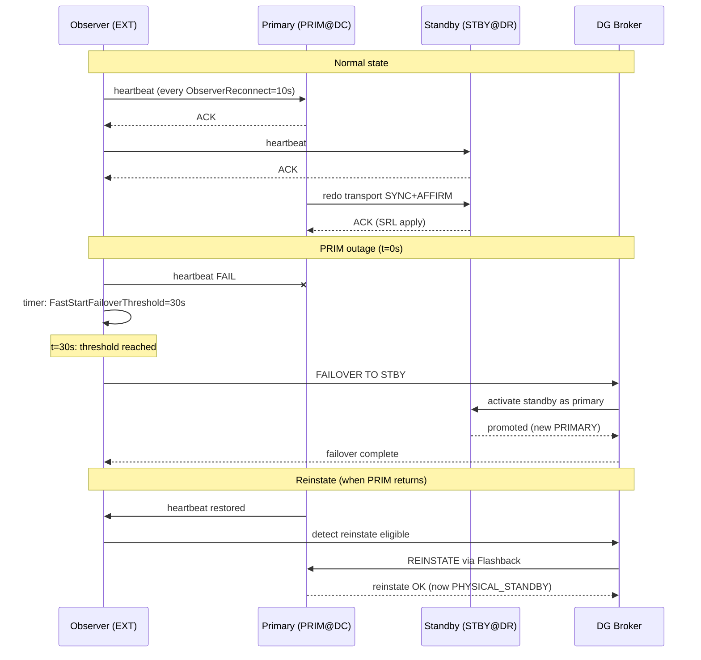
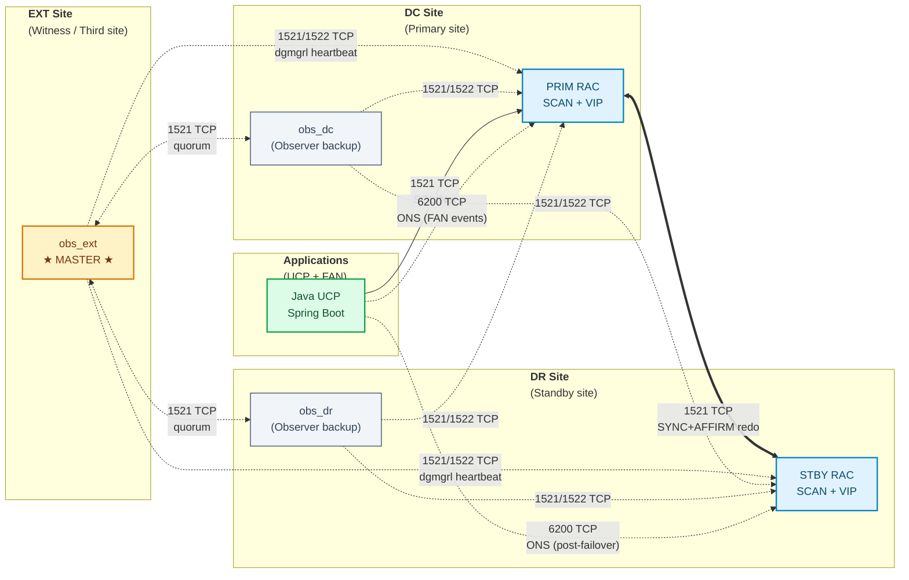

> 🇬🇧 English | [🇵🇱 Polski](./FSFO-GUIDE_PL.md)

# 🔄 FSFO-GUIDE.md — Fast-Start Failover for Oracle 19c


> Complete deployment guide for Fast-Start Failover — from diagnostics to production.

**Author:** KCB Kris | **Date:** 2026-04-23 | **Version:** 1.0
**Related:** [README.md](../README.md) • [DESIGN.md](DESIGN.md) • [PLAN.md](PLAN.md) • [TAC-GUIDE.md](TAC-GUIDE.md) • [INTEGRATION-GUIDE.md](INTEGRATION-GUIDE.md)

---

## 📋 Table of Contents

1. [Introduction](#1-introduction)
2. [Architecture](#2-architecture)
3. [Prerequisites](#3-prerequisites)
4. [Broker Configuration](#4-broker-configuration)
5. [FSFO Configuration](#5-fsfo-configuration)
6. [Observer HA Deployment](#6-observer-ha-deployment)
7. [Testing](#7-testing)
8. [Operational Runbook](#8-operational-runbook)
9. [Monitoring](#9-monitoring)
10. [Troubleshooting](#10-troubleshooting)
11. [Appendix](#11-appendix)

---

## 1. Introduction

### 1.1 What is FSFO?

**Fast-Start Failover (FSFO)** is a Data Guard Broker feature that **automatically** fails over the primary database to a standby when the primary becomes unavailable. It removes the need for human intervention in the failover decision by using a lightweight Observer process that independently monitors both primary and standby.

**Key characteristics:**
- Decision made by **Observer** (not by primary or standby) — avoids split-brain
- Automatic **reinstate** of the old primary once it comes back online
- Works only with **Data Guard Broker** (not with manual DG setup)
- Requires **Standby Redo Logs (SRL)** for real-time apply

### 1.2 FSFO vs Manual Failover vs Switchover

| Feature | Manual Failover | Switchover | FSFO |
|---------|-----------------|------------|------|
| Initiator | DBA (command) | DBA (planned) | Observer (automatic) |
| Primary alive? | NO | YES (clean handshake) | NO |
| Data loss risk (RPO) | Depends on transport mode | 0 (clean) | 0 with MaxAvailability |
| Time (RTO) | minutes (decision + commands) | seconds | ~30-45 s (auto) |
| Reinstate required? | YES | NO | Auto (when AutoReinstate=TRUE) |
| When to use | Outage, no Observer | Planned maintenance | 24/7 production with SLA |

### 1.3 Industry Trends 2024-2026

| Trend | Impact on FSFO |
|-------|----------------|
| Zero-downtime mandates (fintech, banking) | FSFO as standard — automatic RTO ≤ 30 s |
| Multi-site DR for regulations (DORA, RBI, NIS2) | Third-site Observer became a compliance requirement |
| Cloud parity (OCI, AWS RDS Oracle) | FSFO available out-of-the-box; on-premise still needs setup |
| Chaos engineering / GameDays | Quarterly failover drills = norm in regulated sectors |
| Oracle 26ai on-premise | FSFO remains a core feature; new diagnostic tools (AI-driven) |
| Automation / IaC | systemd + Ansible for Observer deployment replace manual mkstore |

---

## 2. Architecture

### 2.1 FSFO Architecture Components

FSFO involves four core components working together:

1. **Primary Database** — the production RAC cluster (DC site, DB name `PRIM`)
2. **Standby Database** — the DR replica (DR site, DB name `STBY`), kept current via redo transport
3. **Data Guard Broker** — the configuration manager running on both DBs, exposing `dgmgrl` CLI
4. **Observer** — a lightweight `dgmgrl` process watching both DBs; triggers FSFO when primary unreachable

### 2.2 Observer Placement — Location Rules

**Main rule:** the Observer **MUST NOT** be in the same site as the primary. The MAA best practice is a **third-site Observer**.

| Observer Location | Rating | Rationale |
|-------------------|--------|-----------|
| In primary site (DC) | ❌ BAD | DC site outage takes down PRIM **and** the Observer — FSFO has nobody to decide |
| In standby site (DR) | 🟡 OK | Better than DC, but a DC↔DR network partition blocks FSFO (Observer cannot see PRIM) |
| In a third site (EXT) | ✅ BEST | Observer sees both sites independently of any DC↔DR partition |

**In this project:** Master Observer in EXT; backups in DC and DR (for **Observer HA**).

### 2.3 Observer HA — 3-site Topology (DC / DR / EXT)

```mermaid
flowchart TB
    subgraph DC["DC Site (Primary Site)"]
        PRIM["<b>PRIM</b> &bull; 2-node RAC &bull; SCAN:1521"]
        OBSDC["obs_dc<br/>(Observer backup)<br/>systemd"]
    end
    subgraph DR["DR Site (Standby Site)"]
        STBY["<b>STBY</b> &bull; 2-node RAC &bull; SCAN:1521"]
        OBSDR["obs_dr<br/>(Observer backup)<br/>systemd"]
    end
    subgraph EXT["EXT Site (Third Site)"]
        OBSEXT["obs_ext<br/>&#9733; MASTER OBSERVER &#9733;<br/>systemd"]
    end

    PRIM -.->|"SYNC+AFFIRM<br/>redo transport"| STBY
    STBY -.->|Apply + SRL| STBY

    OBSEXT -->|heartbeat| PRIM
    OBSEXT -->|heartbeat| STBY
    OBSDC -.->|standby heartbeat| PRIM
    OBSDC -.->|standby heartbeat| STBY
    OBSDR -.->|standby heartbeat| PRIM
    OBSDR -.->|standby heartbeat| STBY

    OBSEXT <-.->|quorum| OBSDC
    OBSEXT <-.->|quorum| OBSDR

    classDef dbNode fill:#e0f2fe,stroke:#0284c7,stroke-width:2px,color:#0c4a6e
    classDef obsMaster fill:#fef3c7,stroke:#d97706,stroke-width:2px,color:#78350f
    classDef obsBackup fill:#f1f5f9,stroke:#64748b,stroke-width:1.5px,color:#334155
    class PRIM,STBY dbNode
    class OBSEXT obsMaster
    class OBSDC,OBSDR obsBackup
```



### 2.4 Site-to-Role Mapping

| Site | Database | Role | Observer | Observer Role |
|------|----------|------|----------|---------------|
| **DC**  | PRIM | PRIMARY | obs_dc  | Backup / Hot standby for observer master |
| **DR**  | STBY | PHYSICAL_STANDBY | obs_dr | Backup / Hot standby for observer master |
| **EXT** | — (no DB) | — | obs_ext | **Master Observer** |

### 2.5 Observer HA — Failure Scenarios

| # | Scenario | FSFO Reaction | Time |
|---|----------|---------------|------|
| S1 | Master Observer (obs_ext) crash | obs_dc or obs_dr takes over the master role (quorum-based election) | ≤ 60 s |
| S2 | DC site outage (PRIM + obs_dc go down) | obs_ext (master) sees no heartbeat from PRIM; after the 30 s threshold initiates FSFO; obs_dr takes over the backup-master role | ~30-45 s FSFO + ~60 s re-election |
| S3 | DR site outage (STBY + obs_dr go down) | Primary remains primary; FSFO does not fire (nowhere to fail over to); alert | immediate (alert) |
| S4 | EXT outage (obs_ext dies, but PRIM and STBY are alive) | obs_dc or obs_dr takes over as master; FSFO remains active | ≤ 60 s |
| S5 | Network partition DC↔DR (EXT sees both) | The observer master (EXT) holds quorum: the decision depends on which side has heartbeats | ~45 s |
| S6 | Network partition DC↔EXT (obs_ext isolated) | obs_dc or obs_dr takes over; FSFO active | ≤ 60 s |
| S7 | All 3 observers down | FSFO stays `ENABLED` but **does not fail over** (no decision maker); alert to on-call; manual failover available | alert < 60 s |

### 2.6 Observer HA — Start Order & Commands

**Start order** (important for a cold start after an outage):

1. Primary DB (PRIM) + listeners (if the entire stack went down)
2. Standby DB (STBY) + listeners
3. Master Observer: `systemctl start dgmgrl-observer-ext` **on the EXT host**
4. Backup Observers: `systemctl start dgmgrl-observer-dc` (DC) and `dgmgrl-observer-dr` (DR)

**Commands:**

```bash
# On each of the 3 hosts (DC/DR/EXT)

# Status
systemctl status dgmgrl-observer-ext

# Start (auto-start at boot after deployment)
systemctl start dgmgrl-observer-ext

# Stop (for maintenance)
systemctl stop dgmgrl-observer-ext

# Restart (after wallet or TNS change)
systemctl restart dgmgrl-observer-ext

# Logs
journalctl -u dgmgrl-observer-ext -f
```

**From dgmgrl (on PRIM):**

```
DGMGRL> SHOW OBSERVER
Configuration - DG_CONFIG_PRIM_STBY

  Fast-Start Failover: Enabled in Potential Data Loss Mode

  Master Observer: obs_ext (192.168.30.10)

  Observers:
    obs_ext   - Master, Connected (192.168.30.10)
    obs_dc    - Backup, Connected (192.168.10.20)
    obs_dr    - Backup, Connected (192.168.20.30)
```

> 💡 **Where do these IP addresses come from?** 3 different subnets (`192.168.10/20/30.0/24`) = 3 independent sites — the detailed addressing plan (subnets, allocation, DNS, architectural rationale) is in [§ 3.2.4 IP addressing scheme](#324-ip-addressing-scheme).

### 2.7 systemd Units per Site

Each site has its own `.service` with a unique:
- `WorkingDirectory` (per-site observer logs directory)
- `Environment=TNS_ADMIN=/etc/oracle/tns/<site>` (site-specific TNS aliases)
- `Environment=WALLET_LOCATION=/etc/oracle/wallet/observer-<site>`
- `ExecStart` with the observer name (obs_dc / obs_dr / obs_ext)

The files are located in [systemd/](../systemd/):
- [systemd/dgmgrl-observer-dc.service](../systemd/dgmgrl-observer-dc.service)
- [systemd/dgmgrl-observer-dr.service](../systemd/dgmgrl-observer-dr.service)
- [systemd/dgmgrl-observer-ext.service](../systemd/dgmgrl-observer-ext.service)

### 2.8 Observer Wallet per Site

Each host has its own Oracle Wallet:

| Site | Wallet path | TNS aliases |
|------|-------------|-------------|
| DC  | `/etc/oracle/wallet/observer-dc/`  | `PRIM_ADMIN`, `STBY_ADMIN` |
| DR  | `/etc/oracle/wallet/observer-dr/`  | `PRIM_ADMIN`, `STBY_ADMIN` |
| EXT | `/etc/oracle/wallet/observer-ext/` | `PRIM_ADMIN`, `STBY_ADMIN` |

**Creating the wallet** (one-time, on every observer host):

```bash
# As the oracle user
export WALLET_DIR=/etc/oracle/wallet/observer-ext   # or -dc / -dr

# Create the wallet with auto-login
mkstore -wrl $WALLET_DIR -create
# (remember the wallet password; it is stored only in the DBA's head or in an enterprise secret store)

# Add credential for primary
mkstore -wrl $WALLET_DIR -createCredential PRIM_ADMIN sys <SYS_PASSWORD_PRIM>

# Add credential for standby
mkstore -wrl $WALLET_DIR -createCredential STBY_ADMIN sys <SYS_PASSWORD_STBY>

# Set permissions
chmod 600 $WALLET_DIR/*
chown oracle:oinstall $WALLET_DIR/*

# TNS alias (pointing to the wallet via $WALLET_LOCATION)
cat >> /etc/oracle/tns/ext/tnsnames.ora <<EOF
PRIM_ADMIN =
  (DESCRIPTION =
    (ADDRESS = (PROTOCOL=TCP)(HOST=scan-dc)(PORT=1521))
    (CONNECT_DATA = (SERVER=DEDICATED)(SERVICE_NAME=PRIM)(UR=A))
  )

STBY_ADMIN =
  (DESCRIPTION =
    (ADDRESS = (PROTOCOL=TCP)(HOST=scan-dr)(PORT=1521))
    (CONNECT_DATA = (SERVER=DEDICATED)(SERVICE_NAME=STBY)(UR=A))
  )
EOF

# sqlnet.ora on the same host
cat >> /etc/oracle/tns/ext/sqlnet.ora <<EOF
WALLET_LOCATION = (SOURCE = (METHOD=FILE)(METHOD_DATA = (DIRECTORY=/etc/oracle/wallet/observer-ext)))
SQLNET.WALLET_OVERRIDE = TRUE
EOF

# Test
dgmgrl /@PRIM_ADMIN "show configuration"
```

**Note:** `UR=A` in the TNS alias allows connecting to a Data Guard database before it is open (after a restart).

### 2.9 FSFO Communication Flow (Mermaid)



### 2.10 Data Guard Transport Modes with FSFO

| Transport Mode | Protection Mode | RPO | FSFO supported? |
|----------------|------------------|-----|-----------------|
| `ASYNC` | MAX PERFORMANCE | > 0 (seconds) | Yes (but with data-loss risk) |
| `SYNC` (no AFFIRM) | MAX PERFORMANCE | 0 (when LGWR ACK) | Yes, not recommended |
| `SYNC + AFFIRM` | **MAX AVAILABILITY** | **0** | ✅ **Recommended** |
| `SYNC + AFFIRM` (all standbys) | MAX PROTECTION | 0 | Yes, but stalls primary on issues |

**In this project:** MAX AVAILABILITY with SYNC+AFFIRM (DC↔DR). See [ADR-002](DESIGN.md#adr-002-protection-mode--max-availability-syncaffirm).

---

## 3. Prerequisites

### 3.1 Database requirements

| # | Requirement | Verification command |
|---|-------------|----------------------|
| 1 | Oracle 19c EE (19.16+ recommended) | `SELECT banner_full FROM v$version;` |
| 2 | Force logging enabled | `SELECT force_logging FROM v$database;` → `YES` |
| 3 | Flashback Database enabled | `SELECT flashback_on FROM v$database;` → `YES` |
| 4 | Archivelog mode | `SELECT log_mode FROM v$database;` → `ARCHIVELOG` |
| 5 | Standby Redo Logs (SRL) | `SELECT COUNT(*) FROM v$standby_log;` ≥ `(threads × groups + 1)` |
| 6 | DG Broker running | `SELECT value FROM v$parameter WHERE name='dg_broker_start';` → `TRUE` |
| 7 | `LOG_ARCHIVE_CONFIG` configured | `SHOW PARAMETER log_archive_config` |
| 8 | FRA (`db_recovery_file_dest`) configured | `SHOW PARAMETER db_recovery_file_dest` |

### 3.2 Network requirements

#### 3.2.1 Port matrix

| Source | Destination | Port | Protocol | Usage |
|--------|-------------|------|----------|-------|
| PRIM nodes | STBY nodes | 1521 | TCP | Redo transport (SQL*Net) |
| STBY nodes | PRIM nodes | 1521 | TCP | Switchover / reinstate |
| Observer hosts (DC/DR/EXT) | PRIM SCAN | 1521 | TCP | dgmgrl heartbeat + broker |
| Observer hosts | STBY SCAN | 1521 | TCP | dgmgrl heartbeat + broker |
| Observer hosts | PRIM nodes | 1522 | TCP | Static listener `PRIM_DGMGRL` (for pre-open access) |
| Observer hosts | STBY nodes | 1522 | TCP | Static listener `STBY_DGMGRL` |
| Observer master (EXT) | Observer backups (DC/DR) | 1521 | TCP | Observer HA quorum |
| App nodes (UCP/FAN clients) | PRIM nodes | **6200** | TCP | **ONS (FAN events: SERVICE UP/DOWN, NODE DOWN)** — critical for TAC |
| App nodes | STBY nodes | **6200** | TCP | ONS post-failover (the new primary publishes FAN) |
| PRIM nodes ↔ PRIM nodes | inside RAC | **6200** | TCP | ONS local (cross-node within the RAC cluster) |
| PRIM nodes ↔ PRIM nodes | inside RAC | **6123** | TCP | CRS notification (`evmd`/`evmlogger`) — intra-cluster event exchange |
| PRIM ↔ STBY (optional) | between clusters | **6200** | TCP | Cross-site ONS — enables FAN from both clusters in a single client configuration |
| **Latency** | DC↔DR | — | — | **≤ 2 ms** (SYNC transport requirement) |
| **Latency** | Observers ↔ DB | — | — | **≤ 50 ms** (heartbeat stability) |
| **Latency** | App ↔ ONS | — | — | **≤ 100 ms** (FAN event delivery) |

> **Note:** ports 6200 (ONS) and 6123 (CRS) are the defaults in Oracle 19c. Verify the actual values with `srvctl config nodeapps -onsonly` and `srvctl config nodeapps -a`.

#### 3.2.2 Network topology diagram with ports



**Line legend:**
- `<==>` solid (bold): synchronous redo transport — requires low latency (≤ 2 ms DC↔DR)
- `-.->` dashed: heartbeat / control signal — tolerates higher latency
- Ports labelled on the arrows: 1521 (SQL\*Net listener), 1522 (static DGMGRL listener), 6200 (ONS/FAN), 6123 (CRS — intra-cluster, not shown)

#### 3.2.3 Firewall ACL checklist

Before deployment, make sure that the following rules are open on the firewalls **between sites** (intra-cluster communication on 6123 is local within the RAC — usually it does not pass through an external firewall):

- [ ] DC ↔ DR: 1521/TCP (redo transport, bidirectional)
- [ ] DC ↔ DR: 1522/TCP (static DGMGRL, bidirectional)
- [ ] EXT → DC, EXT → DR: 1521/TCP + 1522/TCP
- [ ] DC ↔ DR, DC ↔ EXT, DR ↔ EXT: 1521/TCP for quorum between observers
- [ ] App zone → DC, App zone → DR: 1521/TCP + 6200/TCP
- [ ] DNS: `scan-dc`, `scan-dr` and observer hostnames **must be resolvable from every site** (in both directions)

#### 3.2.4 IP addressing scheme

> **Note:** the plan below is a **reference proposal** for lab and developer environments. In a production environment the addressing must be agreed with network engineering in line with the local CIDR/VLAN policy. The key architectural principle: **3 independent subnets** (a partition of one site must not cut connectivity between the other two).

##### Subnets per site

| Site | Proposed subnet | Role | Purpose |
|------|-----------------|------|---------|
| **DC**  | `192.168.10.0/24` | Primary site | PRIM RAC (2 nodes) + Observer backup `obs_dc` + applications |
| **DR**  | `192.168.20.0/24` | Standby site | STBY RAC (2 nodes) + Observer backup `obs_dr` |
| **EXT** | `192.168.30.0/24` | Witness / third site | Master Observer `obs_ext` (no DB; dedicated host) |
| DC RAC interconnect | `192.168.110.0/24` | RAC private | Cluster interconnect (non-routable, 10 Gbps dedicated) |
| DR RAC interconnect | `192.168.120.0/24` | RAC private | Cluster interconnect (non-routable, 10 Gbps dedicated) |

##### Allocation inside a subnet (per-site pattern)

| Range | Function | DC example (`192.168.10.x`) |
|-------|----------|-----------------------------|
| `.1` | Gateway / router | `192.168.10.1` |
| `.2–.9` | Infra (DNS, monitoring, jump-host) | `.5` = bastion, `.6` = Prometheus |
| `.11–.12` | RAC nodes physical | `.11` = prim-node1, `.12` = prim-node2 |
| `.20` | Observer host | `.20` = obs-dc *(see § 2.7)* |
| `.21–.22` | RAC node VIPs | `.21` = prim-node1-vip, `.22` = prim-node2-vip |
| `.31–.33` | SCAN VIPs (3 × for RAC) | `.31–.33` = scan-dc |
| `.100–.254` | Clients / application zone | UCP pool source IPs |

##### Mapping for the addresses used in § 2.7 (DGMGRL SHOW OBSERVER)

| Observer | IP | Site | Comment |
|----------|----|------|---------|
| `obs_ext` | `192.168.30.10` | EXT | Master Observer — first service in the EXT subnet (no DB there, so `.10` is free) |
| `obs_dc`  | `192.168.10.20` | DC  | Backup Observer in DC — slot `.20` in the observer range |
| `obs_dr`  | `192.168.20.30` | DR  | Backup Observer in DR — slot `.30` (DR has a different layout than DC — the second octet identifies the site, the last octet does not need to be identical) |

**Why the different last octets?** `.20` / `.30` / `.10` are intentionally inconsistent because this is a **real-world artefact** of the environment — addresses assigned at different points in time. In a greenfield lab it is worth using a uniform slot (e.g. always `.20` for an observer in every subnet) to simplify runbooks.

##### DNS and reverse-DNS — mandatory

Each of the 3 subnets must have **mutual DNS resolution** with the other two:

| From location → to host | Resolution required |
|-------------------------|---------------------|
| Observer in EXT → `scan-dc`, `scan-dr` | ✅ yes |
| Observer in EXT → `prim-node1-vip`, `prim-node2-vip`, `stby-node*-vip` | ✅ yes |
| Application client (any zone) → `scan-dc`, `scan-dr` | ✅ yes (for FAN post-failover) |
| Observer in DC → `obs-ext`, `obs-dr` | ✅ yes (quorum between observers) |
| **Reverse DNS for all RAC addresses (PTR records)** | ✅ **mandatory** (required by Oracle Clusterware — installing CRS without PTR = failed precheck) |

**Tip:** in dev labs the simplest option is to configure `/etc/hosts` on every host instead of a full DNS server. In production — dedicated DNS zones with replication between sites (BIND master-slave or Active Directory Integrated Zones).

##### Why 3 separate subnets (and not one shared /22)?

1. **Fault isolation** — the failure of one L2/L3 segment does not propagate to the other sites.
2. **Quorum protection** — the Observer in EXT must be **physically and logically separated** from DC and DR; a shared subnet = a shared failure domain = FSFO loses its "judge".
3. **Firewall granularity** — it is easier to define rules per subnet than per IP (the ACLs from § 3.2.3 operate on the concepts of "DC zone", "DR zone", "EXT zone").
4. **Routing** — inter-DC routing over dedicated links (e.g. MPLS, dark fibre) lets you enforce a latency SLA for redo transport (≤ 2 ms DC↔DR).

##### What **not** to do

- ❌ **Shared /24 for PRIM + STBY + Observer** — one broadcast storm kills the whole HA setup.
- ❌ **Observer in the same subnet as the database it monitors** — a segment partition = the observer sees only a "dead" database.
- ❌ **Public IP (routable Internet) for the RAC interconnect** — security + performance.
- ❌ **NAT between Observer and DB** — the broker uses SCN and hostnames in heartbeats; NAT complicates reverse-DNS and breaks Oracle Wallet hostname matching.
- ❌ **Observer in a public cloud, in the same region/AZ as the DB** — an AZ partition isolates the observer together with one of the databases (see § 5.1.1 ObserverOverride for cloud cases).

### 3.3 Observer host requirements

| Resource | Minimum | Recommended |
|----------|---------|-------------|
| CPU | 2 vCPU | 4 vCPU |
| RAM | 2 GB | 4 GB |
| Disk (observer logs) | 10 GB | 50 GB (30-day retention) |
| OS | RHEL/OL 7.x | RHEL/OL 8.x or 9.x |
| Oracle Client | 19c full client | 19c full client (dgmgrl + sqlplus) |
| systemd | required | required |
| Network to 2 DCs | bidirectional | bidirectional + monitoring |

### 3.4 Verification via script

Before Phase 1, run the readiness check:

```bash
sqlconn.sh -s PRIM -f sql/fsfo_check_readiness.sql -o reports/PRIM_readiness.txt
sqlconn.sh -s STBY -r -f sql/fsfo_check_readiness.sql -o reports/STBY_readiness.txt
```

Expected: all 6 sections of `fsfo_check_readiness.sql` return PASS.

### 3.5 Capacity planning

This section provides **formulas and thresholds** for sizing an FSFO+TAC environment. Plug in your own numbers based on AWR/ASH metrics — the generic values are a starting point, not a target.

#### 3.5.1 Standby Redo Logs (SRL)

**Formula:** `SRL groups per thread = N + 1` where `N` = number of online redo log groups per thread.

- For a 2-node RAC with 3 ORL groups per thread: **minimum 4 SRL groups per thread = 8 SRL groups total**.
- The size of each SRL group **≥ the size of the largest ORL group** (Oracle requires this; otherwise `FAIL` in `fsfo_check_readiness.sql` section 3).
- Recommendation: `bytes_srl = bytes_orl × 1.0` — identical (avoids reallocation when the ORLs are resized).

**Verification:**
```sql
SELECT thread#, COUNT(*) AS grupy, MAX(bytes)/1024/1024 AS mb
FROM v$standby_log GROUP BY thread#;
-- Expected: COUNT(*) >= N+1 per thread
```

#### 3.5.2 Flash Recovery Area (FRA)

**Formula:** `FRA_size ≥ 3 × daily_archive_rate + flashback_retention × archive_rate + RMAN_backup_buffer`

Components:
- `daily_archive_rate` = `SUM(blocks × block_size)` from `v$archived_log` / number of days from the last week
- `flashback_retention × archive_rate` = `DB_FLASHBACK_RETENTION_TARGET` (minutes) × redo rate per minute; for reinstate it must cover the longest FSFO outage + a margin
- `RMAN_backup_buffer` = 1–2× daily backup size (if FRA also stores RMAN backups)

**Example for a medium OLTP database with `DB_FLASHBACK_RETENTION_TARGET=1440` (24h):**

| Metric | Value | Source |
|--------|-------|--------|
| Daily archive rate | 40 GB/d | `v$archived_log` from 7 days |
| Flashback retention window | 24 h = 1 day | GUC |
| Flashback × rate | 40 GB | |
| RMAN buffer (1 full backup) | 120 GB | `USED_BYTES` size from `v$database` |
| **FRA minimum** | **3×40 + 40 + 120 = 280 GB** | |
| **FRA recommended** | **400–500 GB** | + 40% margin for spikes |

**Query for measuring archive rate:**
```sql
SELECT ROUND(SUM(blocks * block_size) / 1024 / 1024 / 1024, 1) AS gb_daily_avg
FROM   v$archived_log
WHERE  completion_time > SYSDATE - 7
  AND  dest_id = 1
GROUP BY TRUNC(completion_time);
```

#### 3.5.3 DB_FLASHBACK_RETENTION_TARGET

**Formula:** `retention_minutes ≥ 2 × FastStartFailoverThreshold_seconds / 60 + reinstate_buffer`

For this project: `FastStartFailoverThreshold = 30 s`, so the minimum is 1 minute. In practice, reinstate requires flashback logs covering the entire outage window — **minimum 60 min, recommended 1440 min (24 h)**.

If FSFO fires at 02:00 and the DBA starts the reinstate at 08:00 (after SEV-1 communication), flashback must cover at least 6 h. With a margin: **1440 min = 24 h**.

#### 3.5.4 SYSAUX with `retention_timeout=86400 s` (TAC LTXID)

Each TAC transaction writes its LTXID to `SYS.LTXID_TRANS$`. A retention of `86400 s = 24 h` means the table holds entries from the last 24 h.

**Formula:** `LTXID_rows ≈ TPS × retention_timeout`, `LTXID_size ≈ rows × ~120 bytes/row`

**Example for 500 TPS:**

| Metric | Value |
|--------|-------|
| TPS | 500 |
| Retention | 86 400 s (24 h) |
| Rows in LTXID_TRANS$ | 500 × 86 400 = **43 200 000** |
| Size (with index) | ~5 GB |
| Purge job | Background (automatic) |

**Size monitoring:**
```sql
SELECT segment_name, ROUND(bytes/1024/1024, 1) AS mb
FROM   dba_segments
WHERE  segment_name LIKE 'LTXID%' OR segment_name LIKE 'I_LTXID%'
ORDER  BY bytes DESC;

-- Expected: <5 GB for 500 TPS with retention 86400.
-- Alert: >10 GB = check whether the background purge job is running.
```

**Alert trigger:** if the size of `LTXID_TRANS$` > 10 GB, or it grows linearly without stabilising after 24 h → file a Service Request (SR) with Oracle (a known bug in some PSUs prior to 19.18).

#### 3.5.5 SYSAUX in general (AWR × 3 standbys)

`SYSAUX` holds AWR snapshots, ASH, and the SQL Management Base. With 3 observers and frequent broker polling, the volume of AWR snapshots grows.

**Formula:** `sysaux_size ≈ (AWR_retention_days × 24) × snap_count × avg_snap_size`

- `avg_snap_size` ≈ 2–5 MB for medium OLTP
- `snap_count` = 8 (every 15 min with `INTERVAL => 900`) or 2 (every 60 min — the default; recommended to lower it for FSFO diagnostics)

**Example for `AWR_retention=30d`, snap every 15 min, 3 MB/snap:**
`30 × 24 × 4 × 3 MB = 8 640 MB ≈ 9 GB` for AWR alone, + 2 GB SMB + 3 GB ASH = **~14 GB SYSAUX minimum**.

**Recommendation:** allocate **a minimum of 30 GB SYSAUX** for a production environment with FSFO+TAC+AWR.

#### 3.5.6 Observer hosts — capacity summary

Already covered in § 3.3 (CPU/RAM/Disk). Additionally, for a 30-day retention of observer logs:
- Average size of `observer.log` ≈ 50–100 MB/day (depending on polling frequency and the number of DG events)
- 30 days = 1.5–3 GB per observer host
- **The 50 GB disk from § 3.3 leaves a comfortable margin.**

#### 3.5.7 Capacity — pre-deployment checklist

- [ ] SRL count per thread = N+1 verified
- [ ] SRL size = max ORL size
- [ ] FRA ≥ 3× daily archive + flashback retention × rate + RMAN buffer
- [ ] `DB_FLASHBACK_RETENTION_TARGET ≥ 1440 min`
- [ ] SYSAUX ≥ 30 GB with a growth projection for `LTXID_TRANS$` based on your TPS
- [ ] Observer hosts 50 GB disk, 4 vCPU, 4 GB RAM
- [ ] Alerting on `LTXID_TRANS$ > 10 GB` configured in the monitor (Grafana/Zabbix/OEM)
- [ ] AWR snapshot interval verified (recommended: 15 min for FSFO diagnostics)

---

## 4. Broker Configuration

### 4.1 Enabling the broker

On **both** databases (PRIM and STBY), on every RAC instance:

```sql
-- Required: SYSDBA / SYSDG
ALTER SYSTEM SET dg_broker_start=TRUE SCOPE=BOTH SID='*';
```

Verification:
```sql
SELECT inst_id, value
FROM gv$parameter
WHERE name='dg_broker_start';
-- Expected: TRUE in every row
```

### 4.2 Static listener (required for the broker)

In `$ORACLE_HOME/network/admin/listener.ora` on **every** RAC node (both sites):

**PRIM nodes:**
```
SID_LIST_LISTENER =
  (SID_LIST =
    (SID_DESC =
      (GLOBAL_DBNAME = PRIM_DGMGRL)
      (ORACLE_HOME = /u01/app/oracle/product/19.0.0/dbhome_1)
      (SID_NAME = PRIM1)          -- PRIM2 on the second node
    )
  )
```

**STBY nodes:**
```
SID_LIST_LISTENER =
  (SID_LIST =
    (SID_DESC =
      (GLOBAL_DBNAME = STBY_DGMGRL)
      (ORACLE_HOME = /u01/app/oracle/product/19.0.0/dbhome_1)
      (SID_NAME = STBY1)          -- STBY2 on the second node
    )
  )
```

Reload the listener:
```bash
lsnrctl reload
```

### 4.3 Generating the dgmgrl script

Use the `sql/fsfo_configure_broker.sql` generator — parameterised, emits a `.dgmgrl` file for review:

```bash
sqlconn.sh -s PRIM -i -f sql/fsfo_configure_broker.sql -o broker_setup.dgmgrl
```

The script prompts for:
- `primary_db_unique_name` (e.g. `PRIM`)
- `primary_scan` (e.g. `scan-dc.corp.local`)
- `standby_db_unique_name` (e.g. `STBY`)
- `standby_scan` (e.g. `scan-dr.corp.local`)
- `protection_mode` (`MAXAVAILABILITY` | `MAXPERFORMANCE`)

Output: `broker_setup.dgmgrl` — a file with commands **for review and execution**.

### 4.4 Typical contents of broker_setup.dgmgrl

```
-- BROKER SETUP for PRIM + STBY
-- Review and approve before applying

CONNECT /@PRIM_ADMIN

CREATE CONFIGURATION 'DG_CONFIG_PRIM_STBY' AS
  PRIMARY DATABASE IS 'PRIM'
  CONNECT IDENTIFIER IS 'PRIM';

ADD DATABASE 'STBY' AS
  CONNECT IDENTIFIER IS 'STBY'
  MAINTAINED AS PHYSICAL;

-- Transport and protection
EDIT DATABASE 'PRIM' SET PROPERTY 'LogXptMode'='SYNC';
EDIT DATABASE 'STBY' SET PROPERTY 'LogXptMode'='SYNC';
EDIT DATABASE 'PRIM' SET PROPERTY 'LogShipping'='ON';
EDIT DATABASE 'STBY' SET PROPERTY 'LogShipping'='ON';
EDIT DATABASE 'PRIM' SET PROPERTY 'DelayMins'='0';
EDIT DATABASE 'STBY' SET PROPERTY 'DelayMins'='0';

-- Enable the configuration
ENABLE CONFIGURATION;

-- Protection mode (after ENABLE)
EDIT CONFIGURATION SET PROTECTION MODE AS MAXAVAILABILITY;

-- Verification
SHOW CONFIGURATION;
SHOW DATABASE PRIM;
SHOW DATABASE STBY;
```

### 4.5 Apply

```bash
# After review:
dgmgrl sys/@PRIM_ADMIN @broker_setup.dgmgrl
```

Expected: `SHOW CONFIGURATION` returns `SUCCESS`.

### 4.6 Verification

```bash
sqlconn.sh -s PRIM -f sql/fsfo_broker_status.sql
```

Look for:
- `CONFIGURATION` = `SUCCESS`
- `PRIM` = `SUCCESS` + `role=PRIMARY`
- `STBY` = `SUCCESS` + `role=PHYSICAL STANDBY`
- `Transport Lag` ≈ 0 s
- `Apply Lag` ≈ 0 s

---

## 5. FSFO Configuration

### 5.1 Setting the FSFO properties

On PRIM (after the broker has been started):

```
DGMGRL> EDIT CONFIGURATION SET PROPERTY FastStartFailoverThreshold=30;
DGMGRL> EDIT CONFIGURATION SET PROPERTY FastStartFailoverLagLimit=30;
DGMGRL> EDIT CONFIGURATION SET PROPERTY FastStartFailoverAutoReinstate=TRUE;
DGMGRL> EDIT CONFIGURATION SET PROPERTY ObserverOverride=TRUE;
DGMGRL> EDIT CONFIGURATION SET PROPERTY ObserverReconnect=10;
```

**Meaning of the parameters:**

| Parameter | Value | Meaning |
|-----------|-------|---------|
| `FastStartFailoverThreshold` | 30 | Seconds of silence before the Observer initiates FSFO |
| `FastStartFailoverLagLimit` | 30 | Maximum apply lag at which FSFO is permitted; > 30 s blocks FSFO |
| `FastStartFailoverAutoReinstate` | TRUE | The broker reinstates the old primary itself once it returns |
| `ObserverOverride` | TRUE | The Observer can force a failover even when the primary claims to be alive |
| `ObserverReconnect` | 10 | How often (in seconds) the Observer retries to reconnect after a lost heartbeat |

#### 5.1.1 `ObserverOverride` — when TRUE, when FALSE

**Concept:** in the default mode (`FALSE`), FSFO fires only when **both** the Observer **and** the Primary agree that the standby is reachable while the primary is not. With `TRUE`, the Observer alone can take the failover decision even if the Primary claims to be OK.

**Why this is dangerous:** if the Observer sees a "bad world" (e.g. a network partition isolates it from the Primary) while the Primary is actually working and clients keep writing, `TRUE` may trigger a failover → **split-brain** (see § 10.4).

**Why `TRUE` is nevertheless recommended for a 3-site MAA:** an Observer in the third site (EXT) sees PRIM and STBY independently. If EXT loses connectivity to PRIM but still sees STBY, that means **the applications have probably also lost connectivity to PRIM** → a failover makes sense. In a 2-site topology (Observer in DR), `TRUE` is risky because the observer may be isolated together with the standby.

**Decision matrix:**

| Topology / Scenario | `ObserverOverride` | Rationale |
|---------------------|--------------------|-----------|
| 3-site with Observer in a third DC (like this project) | **TRUE** ✅ | The Observer in EXT is the "judge" — sees both databases independently |
| 2-site, Observer in DC (primary site) | **FALSE** | Observer = SPOF with the primary; if DC dies, the observer dies too |
| 2-site, Observer in DR (standby site) | **FALSE** | DC↔DR partition: the Observer sees only STBY, the Primary keeps working — do not force the issue |
| Cloud, Observer in another AZ of the same region | **FALSE** | An AZ partition can isolate the observer together with one DB — false positive |
| Cloud, Observer in another region / Outposts | **TRUE** ✅ | Regions are independent; the observer is an independent judge |
| Single observer (non-HA) | **FALSE** | Observer SPOF + TRUE = one false alarm = an unnecessary failover |
| Observer HA cluster with quorum (≥ 3) | **TRUE** ✅ | Quorum protects against false positives — the majority decides |
| DB with MaxProtection (hard RPO=0) | **FALSE** | MaxProtection already stalls the Primary on sync loss — ObserverOverride is unnecessary |
| OLTP database where RTO > RPO (we tolerate brief data loss for fast recovery) | **TRUE** ✅ | Faster failover even at the cost of risking an unnecessary failover |
| Analytical / DWH database where switchover costs hours | **FALSE** | Failover is too expensive — better a manual one with a careful DBA decision |

**What changes when you change the value:**

```
-- The change requires re-ENABLE of the configuration (the broker enforces this)
DGMGRL> EDIT CONFIGURATION SET PROPERTY ObserverOverride='FALSE';
DGMGRL> SHOW CONFIGURATION VERBOSE;
```

**Audit trail:** in the observer logs (`/var/log/oracle/observer/obs_*.log`) every failover indicates whether the decision was "unanimous" (Primary+Observer) or "override-triggered". Look for the string `initiated by observer override`.

**For this project (3-site DC/DR/EXT with Master Observer on EXT + quorum):** we use **TRUE** in line with ADR-003. If the topology changes in the future to 2-site (e.g. after decommissioning EXT), **change it to FALSE** and update the ADR.

### 5.2 Adding observers to the configuration

```
DGMGRL> ADD OBSERVER 'obs_dc' ON 'host-dc-obs.corp.local'
        LOG FILE IS '/var/log/oracle/observer/obs_dc.log';

DGMGRL> ADD OBSERVER 'obs_dr' ON 'host-dr-obs.corp.local'
        LOG FILE IS '/var/log/oracle/observer/obs_dr.log';

DGMGRL> ADD OBSERVER 'obs_ext' ON 'host-ext-obs.corp.local'
        LOG FILE IS '/var/log/oracle/observer/obs_ext.log';

DGMGRL> SET MASTEROBSERVER TO obs_ext;
```

### 5.3 Enabling FSFO

```
DGMGRL> ENABLE FAST_START FAILOVER;
```

Verification:
```
DGMGRL> SHOW FAST_START FAILOVER;

Fast-Start Failover: Enabled in Potential Data Loss Mode
  Threshold:          30 seconds
  Target:             STBY
  Observer:           obs_ext (MASTER)
  Lag Limit:          30 seconds
  Shutdown Primary:   TRUE
  Auto-reinstate:     TRUE
  Observer Reconnect: 10 seconds
  Observer Override:  TRUE
```

### 5.4 Starting the observers

On **each** of the 3 hosts (after deploying the systemd units from [Step 6](#6-observer-ha-deployment)):

```bash
# Master on EXT — start FIRST
systemctl start dgmgrl-observer-ext
systemctl enable dgmgrl-observer-ext

# Backups
systemctl start dgmgrl-observer-dc
systemctl enable dgmgrl-observer-dc

systemctl start dgmgrl-observer-dr
systemctl enable dgmgrl-observer-dr
```

Verification from PRIM:

```
DGMGRL> SHOW OBSERVER
  obs_ext  Master  Connected
  obs_dc   Backup  Connected
  obs_dr   Backup  Connected
```

---

## 6. Observer HA Deployment

### 6.1 Task list

The Observer HA deployment requires:

1. ✅ Per-site wallet (Section 2.8 + [bash/fsfo_setup.sh](../bash/fsfo_setup.sh))
2. ✅ Per-site TNS aliases
3. ✅ Per-site systemd unit (Section 2.7)
4. ✅ `ADD OBSERVER` in the broker (§ 5.2)
5. ✅ `SET MASTEROBSERVER` on EXT
6. ✅ Start through systemctl
7. ✅ Verification with `SHOW OBSERVER`

### 6.2 Directory layout on the observer host

```
/etc/oracle/
├── tns/
│   └── ext/                              (or hh, oe)
│       ├── tnsnames.ora
│       └── sqlnet.ora
├── wallet/
│   └── observer-ext/
│       ├── ewallet.p12
│       └── cwallet.sso
└── systemd/
    (deployment files copied here before install)

/var/log/oracle/observer/
├── obs_ext.log                    (or obs_dc.log, obs_dr.log)
└── obs_ext.dat                    (background file)
```

### 6.3 systemd unit template

The file [systemd/dgmgrl-observer-ext.service](../systemd/dgmgrl-observer-ext.service) (analogous for DC and DR):

```ini
[Unit]
Description=Data Guard Observer (EXT — master) for FSFO
After=network-online.target
Wants=network-online.target

[Service]
Type=simple
User=oracle
Group=oinstall
Environment=ORACLE_HOME=/u01/app/oracle/product/19.0.0/dbhome_1
Environment=TNS_ADMIN=/etc/oracle/tns/ext
Environment=LD_LIBRARY_PATH=/u01/app/oracle/product/19.0.0/dbhome_1/lib
WorkingDirectory=/var/log/oracle/observer
ExecStart=/u01/app/oracle/product/19.0.0/dbhome_1/bin/dgmgrl \
    -echo /@PRIM_ADMIN \
    "START OBSERVER obs_ext IN BACKGROUND FILE='/var/log/oracle/observer/obs_ext.dat' LOGFILE='/var/log/oracle/observer/obs_ext.log'"
ExecStop=/u01/app/oracle/product/19.0.0/dbhome_1/bin/dgmgrl \
    -echo /@PRIM_ADMIN "STOP OBSERVER obs_ext"
Restart=on-failure
RestartSec=30s
StandardOutput=journal
StandardError=journal

[Install]
WantedBy=multi-user.target
```

### 6.4 Step-by-step deployment

```bash
# 1. Copy the unit file to the host
scp systemd/dgmgrl-observer-ext.service oracle@host-ext-obs:/tmp/

# 2. On host-ext-obs, as root:
sudo mv /tmp/dgmgrl-observer-ext.service /etc/systemd/system/
sudo chmod 644 /etc/systemd/system/dgmgrl-observer-ext.service
sudo systemctl daemon-reload

# 3. Create the directories
sudo mkdir -p /var/log/oracle/observer /etc/oracle/tns/ext /etc/oracle/wallet/observer-ext
sudo chown -R oracle:oinstall /var/log/oracle /etc/oracle

# 4. Create the wallet (as oracle — § 2.8)

# 5. Test (do not enable yet):
sudo systemctl start dgmgrl-observer-ext
sudo systemctl status dgmgrl-observer-ext

# 6. Check the logs
sudo journalctl -u dgmgrl-observer-ext -f

# 7. Once stable — enable for auto-start:
sudo systemctl enable dgmgrl-observer-ext
```

### 6.5 Repeat for DC and DR

In the same way, replacing `ext` with `hh` / `oe` and `WALLET_LOCATION` accordingly.

---

## 7. Testing

### 7.1 Test Matrix

| # | Test | Command | Expected | SLA |
|---|------|---------|----------|-----|
| T-1 | Planned switchover | `SWITCHOVER TO STBY;` | Role switch, apps continue via TAC | ≤ 60 s |
| T-2 | Manual failover (Observer off) | `systemctl stop dgmgrl-observer-ext` + `FAILOVER TO STBY IMMEDIATE` | Primary goes down, STBY takes over | < 30 s |
| T-3 | Auto-failover (PRIM crash simulation) | `ssh prim-node1 "shutdown abort"` + `ssh prim-node2 "shutdown abort"` | Observer detects, FSFO executes | ≤ 45 s |
| T-4 | Auto-reinstate | After T-3, `startup mount` on the old PRIM | Broker reinstates automatically | ≤ 5 min |
| T-5 | Observer master failover | `systemctl stop dgmgrl-observer-ext` | obs_dc or obs_dr becomes master | ≤ 60 s |
| T-6 | Network partition DC↔DR | `iptables -A INPUT -s dr-network -j DROP` on PRIM | Observer (EXT) sees both; quorum decision | ≤ 45 s |
| T-7 | Rolling patch (with FSFO active) | Patch STBY, switchover, patch the old PRIM, switchback | Zero application downtime | — |
| T-8 | Full DR drill (DC site down) | Simulate the loss of the entire DC | FSFO + TAC replay; the application keeps working | ≤ 60 s end-to-end |

### 7.2 Auto-failover test steps (T-3)

```bash
# 1. Pre-flight
sqlconn.sh -s PRIM -f sql/fsfo_broker_status.sql
# Expected: SUCCESS, FSFO ENABLED, Observer connected

# 2. Start monitoring in a separate window
watch -n 2 "sqlconn.sh -s PRIM -f sql/fsfo_broker_status.sql"

# 3. Simulate a PRIM outage (both RAC nodes)
ssh oracle@prim-node1 "sqlplus / as sysdba <<< 'SHUTDOWN ABORT'"
ssh oracle@prim-node2 "sqlplus / as sysdba <<< 'SHUTDOWN ABORT'"

# 4. Watch the Observer log
journalctl -u dgmgrl-observer-ext -f --since "5 minutes ago"

# Expected events:
# t=0s: PRIM shutdown abort
# t=1-5s: Observer loses heartbeat
# t=30s: Threshold reached, FSFO initiating
# t=35s: FAILOVER TO STBY started
# t=40s: STBY becomes new primary
# t=45s: Apps reconnect (via TAC if configured)

# 5. Verify
sqlconn.sh -s STBY -f sql/fsfo_broker_status.sql
# Expected: role=PRIMARY, original PRIM marked for reinstate
```

### 7.3 Auto-reinstate steps (T-4)

```bash
# After T-3, bring back the old PRIM:
ssh oracle@prim-node1 "sqlplus / as sysdba <<< 'STARTUP MOUNT'"

# The broker will detect this and reinstate automatically:
# - flashback to the failover time
# - convert to PHYSICAL_STANDBY
# - restart transport from the new primary (STBY, now PRIMARY)

# Verify (after ~2-5 min):
dgmgrl /@STBY_ADMIN "show database PRIM"
# Expected: SUCCESS, role=PHYSICAL STANDBY
```

### 7.4 Observer HA test (T-5)

```bash
# Check who is the master
dgmgrl /@PRIM_ADMIN "show observer"
# e.g. Master: obs_ext

# Kill the master
ssh oracle@host-ext-obs "sudo systemctl stop dgmgrl-observer-ext"

# Wait ~30-60 s, then check
dgmgrl /@PRIM_ADMIN "show observer"
# Expected: new Master = obs_dc or obs_dr
# obs_ext = "Pending" or "Not Connected"

# Restore
ssh oracle@host-ext-obs "sudo systemctl start dgmgrl-observer-ext"

# After ~60 s, obs_ext rejoins as Backup
```

---

## 8. Operational Runbook

### 8.1 Planned switchover (FSFO-aware)

```
# On PRIM
dgmgrl /@PRIM_ADMIN

# Check pre-flight
DGMGRL> SHOW CONFIGURATION;
# Expected: SUCCESS

# Switchover
DGMGRL> SWITCHOVER TO STBY;
# The broker drains services (drain_timeout), switches the role, FSFO remains active

# Verify
DGMGRL> SHOW CONFIGURATION;
DGMGRL> SHOW FAST_START FAILOVER;
# Expected: ENABLED, new Target = PRIM (the old primary)

# Check the services
srvctl status service -d STBY   # now in role PRIMARY, MYAPP_TAC running here
```

### 8.2 SEV-1 runbook: "Observer lost" (emergency manual failover)

> **Use when:** all 3 observers (DC + DR + EXT) are unavailable **and** the Primary has stopped responding. FSFO cannot decide → a manual DBA decision is required. **Potential data loss** depends on the apply lag at the time of the outage.

#### ⏱ Phase 0 — Incident detected (T+0:00)

Typical trigger: an alert from `fsfo_monitor.sh` or PagerDuty — `Observer Present: NO × 3` **+** application clients reporting ORA-03113 / connection timeout.

#### 🔍 Phase 1 — Triage (T+0:00 → T+0:05)

**Goal:** confirm that this really is "3/3 observers down + primary unreachable" and not a false alarm from a single observer.

```bash
# 1a. From the DBA laptop - check all 3 observers over SSH
for HOST in obs-dc obs-dr obs-ext; do
    echo "=== $HOST ==="
    timeout 5 ssh -o BatchMode=yes oracle@$HOST \
        "systemctl is-active dgmgrl-observer-${HOST#obs-}" || echo "UNREACHABLE"
done
```

**Decision:**
- If even one observer responds with `active` → **this is NOT a SEV-1 Observer-lost event**. Restart the observer (`systemctl restart dgmgrl-observer-<site>`) and observe.
- If 3/3 are `UNREACHABLE` or `inactive` → **proceed to Phase 2**.

```bash
# 1b. Check the primary — is this a DB outage or only an observer outage?
timeout 10 sqlplus /nolog <<EOF
CONNECT sys/@PRIM_ADMIN AS SYSDBA
SELECT instance_name, status FROM v\$instance;
EOF
```

**Decision:**
- **PRIM responds** (status `OPEN`) → this is just an observer outage. **No failover is performed.** Repair the observers (Phase 5 alternative: restart the observers). The application keeps running on PRIM unchanged.
- **PRIM does not respond** (timeout / ORA-12170) → **full SEV-1 scenario**. Continue with Phase 2.

#### 📊 Phase 2 — Pre-failover checks (T+0:05 → T+0:10)

**Goal:** estimate the RPO (how much data we will lose) before taking the FAILOVER decision.

```bash
# Connect to STBY (the candidate for the new primary)
dgmgrl /@STBY_ADMIN
```

```
DGMGRL> SHOW CONFIGURATION;
-- Expected state: "WARNING: ORA-16820" or "ORA-16819" (observer down)
-- STBY status should be "PHYSICAL STANDBY" in OK

DGMGRL> SHOW DATABASE 'STBY' 'TransportLag';
-- Transport lag in seconds. For MAX AVAILABILITY it should be near 0.

DGMGRL> SHOW DATABASE 'STBY' 'ApplyLag';
-- Apply lag. How many seconds of redo are unapplied?

DGMGRL> VALIDATE DATABASE 'STBY';
-- Detailed diagnostics — look for:
--   "Ready For Failover: Yes"
--   "Flashback Database Status: ENABLED"
--   "Apply-Related Property Settings: Configuration OK"
```

**FAILOVER GO/NO-GO decision:**

| Observation | Decision | Rationale |
|-------------|----------|-----------|
| `Ready For Failover: Yes` + lag ≤ 30 s | **GO** | Acceptable data loss (≤ FastStartFailoverLagLimit) |
| `Ready For Failover: Yes` + lag 30–300 s | **GO with escalation** | Inform the business about potential loss (X seconds of transactions) before FAILOVER |
| `Ready For Failover: Yes` + lag > 300 s | **STOP** | Wait for apply to catch up or escalate to Oracle Support (incremental recovery from PRIM archive) |
| `Ready For Failover: No` + gap in archivelogs | **STOP** | Resolve the gap first — `FETCH ARCHIVELOGS` from PRIM (if PRIM storage is available) |
| `Flashback Database Status: DISABLED` | **GO, but no REINSTATE possible** | After failover the old PRIM requires `RMAN DUPLICATE FROM ACTIVE DATABASE` (4–6 h) |

#### 📢 Phase 3 — Communication (T+0:10, in parallel)

**Before executing FAILOVER:**
- [ ] Notify the on-call manager (phone, not Slack)
- [ ] Post in the `#incident-sev1` channel on Slack/Teams (template below)
- [ ] Notify the Network team (last chance to find the cause of the observer outage — could it be a network partition?)
- [ ] Notify the Application team about the upcoming reconnect (FAN events will fire automatically, but the application must be ready for a brief lack of service)

**Message template:**
```
[SEV-1] Oracle FSFO — Observer cluster lost, manual failover in progress
Time: <YYYY-MM-DD HH:MM UTC>
Impact: PRIM unreachable; 3/3 observers down; starting manual FAILOVER to STBY
Expected RPO: <X> seconds (based on apply lag at T+5min)
Expected RTO: ~5 min (failover) + ~2 min (client reconnect via FAN)
Reinstate of old PRIM: TBD, not blocking user service
Next update: T+15min
```

#### ⚡ Phase 4 — Executing FAILOVER (T+0:10 → T+0:15)

```
-- Still in dgmgrl /@STBY_ADMIN

-- If lag ≤ 30 s and apply is near zero:
DGMGRL> FAILOVER TO 'STBY';
-- This variant WAITS for the remaining redo from the SRL to be applied (minimises data loss)

-- If apply cannot keep up and the business accepts data loss:
DGMGRL> FAILOVER TO 'STBY' IMMEDIATE;
-- IMMEDIATE = right now, without waiting for the remaining redo to apply
-- USE ONLY when the primary is COMPLETELY UNAVAILABLE and waiting makes no sense
```

**Expected output:**
```
Converting database "STBY" to a Primary database
Database is in primary role
Failover succeeded, new primary is "STBY"
```

**If FAILOVER fails** (ORA-16625 or ORA-16661):
- ORA-16625 "cannot reach database" → check the listener on STBY
- ORA-16661 "database requires reinstate" → this means STBY itself has unrecovered redo; **escalate to Oracle Support immediately**

#### ✅ Phase 5 — Post-failover verification (T+0:15 → T+0:20)

```
DGMGRL> SHOW CONFIGURATION;
-- Expected:
--   Primary database:   STBY
--   Physical standby databases (disabled):
--     PRIM - Disabled, requires reinstate

DGMGRL> SHOW DATABASE 'STBY';
-- Expected: Role: PRIMARY, Status: SUCCESS, Intended State: TRANSPORT-OFF (because there is no partner)
```

```bash
# Check whether applications reconnect via FAN
# On the new primary (STBY):
srvctl status service -d STBY

# Check application connections
sqlplus /nolog <<EOF
CONNECT / AS SYSDBA
SELECT service_name, COUNT(*) FROM gv\$session
WHERE service_name LIKE '%TAC%' GROUP BY service_name;
EOF
# Expected: the number of sessions on STBY (the former) increases = the application reconnected via FAN
```

**TAC replay verification:**
```sql
SELECT * FROM gv$replay_stat_summary
ORDER BY con_id, service_name;
-- Expected: requests_replayed > 0 (AC replayed the transactions)
-- Alarm: requests_failed > 5% = some transactions were not replayed
```

#### 🔧 Phase 6 — Reinstate of the old primary (T+0:30 → T+2:00)

Perform this **after** the application service has stabilised and connectivity to the old PRIM has returned.

**Path A — Flashback ENABLED (fast, ~5–10 min):**
```bash
# On the host of the old PRIM
ssh oracle@prim-node1 "sqlplus / as sysdba <<< 'STARTUP MOUNT'"

# From the new primary (STBY)
dgmgrl /@STBY_ADMIN

DGMGRL> REINSTATE DATABASE 'PRIM';
# Flashback to the failover SCN + differential apply = PRIM becomes PHYSICAL STANDBY
```

**Path B — Flashback DISABLED (long, 2–6 h depending on size):**
```bash
# Reinstate is not possible — a full rebuild from the active primary is required
# See: section 8.4 (RMAN DUPLICATE FROM ACTIVE DATABASE)
# Time: depends on the database size and network bandwidth (≈ 100 GB/h over 1 GbE)
```

#### 🔎 Phase 7 — Repairing the observers (T+0:30, in parallel with Phase 6)

```bash
# Diagnose the root cause of the observer outage (root cause)
for HOST in obs-dc obs-dr obs-ext; do
    ssh oracle@$HOST "journalctl -u dgmgrl-observer-${HOST#obs-} --since '1 hour ago' | tail -50"
done

# Restart the observers (in order: first the future master EXT, then the backups)
ssh oracle@obs-ext "sudo systemctl restart dgmgrl-observer-ext"
sleep 10
ssh oracle@obs-dc  "sudo systemctl restart dgmgrl-observer-dc"
ssh oracle@obs-dr  "sudo systemctl restart dgmgrl-observer-dr"

# Verification in dgmgrl
dgmgrl /@STBY_ADMIN "SHOW OBSERVER"
# Expected: 3 observers Connected; Master obs_ext
```

**If the Observer still does not start:**
- [ ] Check the wallet (`mkstore -wrl <path> -listCredential`) — is it intact?
- [ ] Check `tnsnames.ora` — does the alias `PRIM_ADMIN` point to the NEW primary (i.e. the former STBY)?
- [ ] Check DNS (hostname resolution) from the observer host
- [ ] As a last resort: `mkstore -createCredential` from scratch

#### 📝 Phase 8 — Post-mortem & closeout (T+1:00 → T+24:00)

- [ ] ITSM ticket: root cause of the observer outage (network / infra / wallet expired?)
- [ ] Data-loss report to the business: exact number of transactions lost (`lag × TPS`)
- [ ] Update of `DESIGN.md` (ADR-001 or a new one) if any architectural conclusions emerged
- [ ] Update this document's runbook with lessons learned

#### 📊 RPO/RTO summary for this runbook

| Metric | Value |
|--------|-------|
| Detection → decision | ~5 min (Phases 1–2) |
| Decision → FAILOVER complete | ~5 min (Phases 3–4) |
| FAILOVER → app reconnected via FAN | ~2 min (Phase 5) |
| **Total RTO** | **~12 min** |
| RPO (data loss) | Depends on the apply lag at the time of the outage; typically 0–30 s for MAX AVAILABILITY |
| Reinstate | 5–10 min (Flashback ON) or 2–6 h (Flashback OFF → RMAN DUPLICATE) |

### 8.3 Reinstate after failover — basic path (Flashback ON)

```
# Automatic (when AutoReinstate=TRUE and Flashback ON) — do nothing
# Manual (when AutoReinstate=FALSE or Flashback OFF):

# On the new primary (STBY after failover)
dgmgrl /@STBY_ADMIN

# The old primary must be in MOUNT
# ssh prim-node1 "sqlplus / as sysdba <<< 'STARTUP MOUNT'"

DGMGRL> REINSTATE DATABASE PRIM;

# Verification
DGMGRL> SHOW DATABASE PRIM;
# Expected: PHYSICAL STANDBY, apply running
```

**Typical time:** 5–10 min (depending on the amount of redo to roll back via flashback + differential apply).

### 8.4 Reinstate without Flashback — RMAN DUPLICATE FROM ACTIVE DATABASE

> **Use when:** the old Primary does not have `FLASHBACK DATABASE` enabled, or the flashback retention was too short, or the flashback logs have been deleted (FRA full). `REINSTATE` returns `ORA-16653` — the entire database has to be rebuilt from scratch from the new primary.

**Alternative:** if you have an `RMAN backup` of the old primary **from before the failover**, you can try `RESTORE DATABASE UNTIL SCN <failover_scn>` instead of DUPLICATE — cheaper on the network, but it requires a fresh backup. This runbook shows the variant via **DUPLICATE FROM ACTIVE DATABASE** (no backup required, the stream goes over the network).

#### 8.4.1 Prerequisites

- [ ] The new Primary (ex-STBY) is running stably in the PRIMARY role (applications already switched — RMAN DUPLICATE will load the network and CPU of the new primary for 2–6 h)
- [ ] The old Primary: shut down CLEANLY (`SHUTDOWN IMMEDIATE` + `SHUTDOWN ABORT` if it hangs)
- [ ] The old Primary: **datafiles deleted or ready to be overwritten** (RMAN DUPLICATE will not overwrite existing files without `NOFILENAMECHECK` + `SET` directives)
- [ ] DC↔DR network bandwidth confirmed — DUPLICATE copies the **entire** database (datafiles + controlfile + spfile + password file)
- [ ] Free space on the old primary's storage ≥ size of the new database
- [ ] TNS aliases: `PRIM_DUP_AUX` (auxiliary = old primary in MOUNT/NOMOUNT) + `STBY_PRIMARY` (source)
- [ ] Password file copied from the source (mismatch = `ORA-01031`)

#### 8.4.2 Preparing the auxiliary (old primary)

```bash
# 1. Copy the password file from the new primary to the old primary (ALL RAC nodes)
scp oracle@ex-stby-node1:$ORACLE_HOME/dbs/orapwSTBY \
    oracle@old-prim-node1:$ORACLE_HOME/dbs/orapwPRIM

# 2. Copy a baseline init.ora / pfile (if the spfile is corrupted)
ssh oracle@old-prim-node1 <<'EOF'
cat > $ORACLE_HOME/dbs/initPRIM1.ora <<PFILE
DB_NAME=PRIM
DB_UNIQUE_NAME=PRIM
COMPATIBLE=19.0.0
SGA_TARGET=4G
PGA_AGGREGATE_TARGET=2G
CONTROL_FILES='+DATA'
REMOTE_LOGIN_PASSWORDFILE=EXCLUSIVE
LOG_ARCHIVE_FORMAT='%t_%s_%r.arc'
DB_CREATE_FILE_DEST='+DATA'
DB_RECOVERY_FILE_DEST='+FRA'
DB_RECOVERY_FILE_DEST_SIZE=500G
PFILE
EOF

# 3. Static listener entry for the old primary (required for RMAN DUPLICATE FROM ACTIVE)
# In $ORACLE_HOME/network/admin/listener.ora (on node1 of the old primary):
#   SID_LIST_LISTENER = (SID_LIST = (SID_DESC =
#     (GLOBAL_DBNAME=PRIM)(ORACLE_HOME=...)(SID_NAME=PRIM1)))
# lsnrctl reload

# 4. Startup NOMOUNT from the pfile (auxiliary instance)
ssh oracle@old-prim-node1 <<'EOF'
export ORACLE_SID=PRIM1
sqlplus / as sysdba <<SQL
STARTUP NOMOUNT PFILE=?/dbs/initPRIM1.ora;
SELECT status FROM v\$instance;
-- Expected: STARTED
SQL
EOF
```

#### 8.4.3 Running DUPLICATE (from the new primary)

```bash
# From the new primary (ex-STBY)
ssh oracle@ex-stby-node1 <<'RMANEOF'
rman TARGET sys/<pwd>@STBY_PRIMARY AUXILIARY sys/<pwd>@PRIM_DUP_AUX <<EOF

# DUPLICATE as STANDBY (we do not want a second primary!)
DUPLICATE TARGET DATABASE FOR STANDBY FROM ACTIVE DATABASE
  SPFILE
    SET DB_UNIQUE_NAME='PRIM'
    SET DB_FILE_NAME_CONVERT='+DATA/STBY/','+DATA/PRIM/'
    SET LOG_FILE_NAME_CONVERT='+DATA/STBY/','+DATA/PRIM/','+FRA/STBY/','+FRA/PRIM/'
    SET FAL_SERVER='STBY'
    SET LOG_ARCHIVE_CONFIG='DG_CONFIG=(PRIM,STBY)'
    SET LOG_ARCHIVE_DEST_2='SERVICE=STBY ASYNC VALID_FOR=(ONLINE_LOGFILES,PRIMARY_ROLE) DB_UNIQUE_NAME=STBY'
    SET STANDBY_FILE_MANAGEMENT='AUTO'
    SET DG_BROKER_START='FALSE'             -- The broker will be reactivated later
  NOFILENAMECHECK
  DORECOVER
  SECTION SIZE 32G;                           -- parallelisation of large datafiles

EXIT;
EOF
RMANEOF
```

**Key clauses:**

| Clause | What it does |
|--------|--------------|
| `FOR STANDBY` | The result is a PHYSICAL STANDBY, not a new primary (critical — otherwise split-brain) |
| `FROM ACTIVE DATABASE` | A network stream from the live source — no RMAN backup needed |
| `SPFILE SET ...` | Modifies parameters during duplication (DB_FILE_NAME_CONVERT, FAL_SERVER) |
| `NOFILENAMECHECK` | Allows reusing the same path structure (for identical mount points) |
| `DORECOVER` | Performs recovery up to the redo available on the source |
| `SECTION SIZE 32G` | Parallelisation of large datafiles — speeds things up 2–3× |
| `DG_BROKER_START='FALSE'` | First DUPLICATE, then broker — avoids configuration conflicts |

**Estimated execution time:**

| Database size | 1 GbE | 10 GbE |
|---------------|-------|--------|
| 100 GB | 30–45 min | 8–12 min |
| 500 GB | 2–3 h | 30–45 min |
| 2 TB | 6–8 h | 2–3 h |
| 10 TB | ~40 h (too long — consider physical shipping + incremental catch-up) | 8–10 h |

**Progress monitoring (in parallel, from another session):**

```sql
-- On the new primary (ex-STBY) — that is where RMAN runs
SELECT event, time_remaining, sofar, totalwork,
       ROUND(sofar*100/totalwork,1) AS pct_done
FROM   v$session_longops
WHERE  opname LIKE 'RMAN%'
  AND  totalwork > 0
ORDER  BY start_time DESC;
```

#### 8.4.4 Post-DUPLICATE configuration

After a successful DUPLICATE, the old primary is already a PHYSICAL STANDBY, but **the broker does not see it** (we disabled `DG_BROKER_START` to avoid conflicts).

```bash
# 1. Re-enable the broker on the old primary (now the new standby)
ssh oracle@old-prim-node1 <<'EOF'
sqlplus / as sysdba <<SQL
ALTER SYSTEM SET DG_BROKER_START=TRUE SCOPE=BOTH SID='*';
SQL
EOF

# 2. Re-register in the broker (from the new primary - ex STBY)
dgmgrl /@STBY_ADMIN <<EOF
-- First remove the old entry (if it remained as "Disabled, requires reinstate")
REMOVE DATABASE 'PRIM';

-- Re-add as PHYSICAL STANDBY
ADD DATABASE 'PRIM' AS
  CONNECT IDENTIFIER IS 'PRIM'
  MAINTAINED AS PHYSICAL;

ENABLE DATABASE 'PRIM';

-- Start apply
EDIT DATABASE 'PRIM' SET STATE='APPLY-ON';

-- Force the protection mode (if previously MAX AVAILABILITY)
EDIT CONFIGURATION SET PROTECTION MODE AS MAXAVAILABILITY;
EOF
```

#### 8.4.5 Final verification

```
DGMGRL> SHOW CONFIGURATION;
-- Expected: SUCCESS (not WARNING!)
--   Primary: STBY, Standby: PRIM

DGMGRL> SHOW DATABASE 'PRIM';
-- Expected: Role=PHYSICAL_STANDBY, Intended State=APPLY-ON, Transport Lag < 30 s

DGMGRL> SHOW FAST_START FAILOVER;
-- If you want to restore FSFO with the new primary=STBY, target=PRIM (reversed):
DGMGRL> ENABLE FAST_START FAILOVER;
```

After ~30 minutes apply will catch up and the lag will drop to ~0. **The configuration is now symmetrical** — you can do another switchover to bring PRIM back to the primary role (optional, depending on the topology ADR).

#### 8.4.6 Post-DUPLICATE checklist

- [ ] `SHOW CONFIGURATION` = SUCCESS
- [ ] Apply lag (PRIM as standby) < 30 s
- [ ] FSFO re-enabled with the new target
- [ ] Flashback Database **enabled** on the new standby (`ALTER DATABASE FLASHBACK ON`) — so that the next reinstate is fast
- [ ] Password file synchronised (`orapw*` on both)
- [ ] Static listener on PRIM (in case another reinstate requires it)
- [ ] Backup of the old database from the new standby to confirm consistency (`RMAN> VALIDATE DATABASE;`)
- [ ] ITSM ticket update covering the full recovery cycle (for the post-mortem)

### 8.5 Observer maintenance (without downtime)

**Option A — patching a single observer (HA preserved):**

```bash
# 1. Identify the master
dgmgrl /@PRIM_ADMIN "show observer"

# 2. If it is the master — promote another observer (preemptive)
dgmgrl /@PRIM_ADMIN "SET MASTEROBSERVER TO obs_dc"

# 3. Stop the observer to be patched (e.g. obs_ext)
ssh host-ext-obs "sudo systemctl stop dgmgrl-observer-ext"

# 4. Patch the host

# 5. Start the observer
ssh host-ext-obs "sudo systemctl start dgmgrl-observer-ext"

# 6. Optionally restore it as master
dgmgrl /@PRIM_ADMIN "SET MASTEROBSERVER TO obs_ext"
```

**Option B — rotating all observers (e.g. wallet password rotation):**

1. Update the wallet on obs_dc → restart
2. Update the wallet on obs_dr → restart
3. Update the wallet on obs_ext (master) → restart (another observer becomes master in the meantime)

### 8.6 Patching with FSFO active

Oracle 19c RU (Release Update):

```bash
# Step 1: Patch STBY (standby first)
# - Stop instance STBY1, patch OPatch, startup mount; repeat for STBY2
# - The broker will resume redo apply itself

# Step 2: Verify broker status
dgmgrl /@PRIM_ADMIN "show configuration"
# Expected: SUCCESS

# Step 3: Switchover PRIM → STBY (now STBY = primary)
dgmgrl /@PRIM_ADMIN "SWITCHOVER TO STBY"
# TAC replays in-flight transactions; the application has no downtime

# Step 4: Patch the old PRIM (now STBY)
# - Stop instance PRIM1, patch, startup mount; repeat for PRIM2

# Step 5: Switchback
dgmgrl /@PRIM_ADMIN "SWITCHOVER TO PRIM"

# Step 6: Verify
dgmgrl /@PRIM_ADMIN "show configuration"
```

### 8.7 Troubleshooting checklist

| Check | Command | Expected |
|-------|---------|----------|
| Broker config | `dgmgrl "show configuration"` | `SUCCESS` |
| FSFO status | `dgmgrl "show fast_start failover"` | `Enabled` |
| Observer alive | `dgmgrl "show observer"` | Master connected + backups |
| Apply lag | `SELECT * FROM v$dataguard_stats` | < 30 s |
| Transport lag | as above | < 5 s |
| PRIM alert log | `tail -f $ORACLE_BASE/diag/rdbms/.../alert*.log` | No ORA-16xxx |
| Observer log | `journalctl -u dgmgrl-observer-ext -n 100` | No "Connection refused" |

---

## 9. Monitoring

### 9.1 Key views

| View | Purpose |
|------|---------|
| `V$DATABASE` | DB role, protection mode, FS failover status |
| `V$DATAGUARD_STATS` | Apply lag, transport lag |
| `V$DATAGUARD_STATUS` | Recent DG events |
| `DBA_DG_BROKER_CONFIG` | Broker configuration members |
| `DBA_DG_BROKER_CONFIG_PROPERTIES` | FSFO properties |
| `V$FS_FAILOVER_STATS` | FSFO statistics — failover history |
| `V$STANDBY_LOG` | SRL status |
| `V$ARCHIVE_GAP` | Transport gaps |
| `V$MANAGED_STANDBY` | Managed recovery (MRP) status |

### 9.2 Monitoring query

```sql
-- Full FSFO snapshot (run every minute)
SELECT
  (SELECT db_unique_name FROM v$database) AS baza,
  (SELECT database_role FROM v$database) AS rola,
  (SELECT fs_failover_status FROM v$database) AS fsfo_status,
  (SELECT fs_failover_current_target FROM v$database) AS fsfo_target,
  (SELECT fs_failover_observer_present FROM v$database) AS observer_present,
  (SELECT fs_failover_observer_host FROM v$database) AS observer_host,
  (SELECT fs_failover_threshold FROM v$database) AS threshold_sek,
  (SELECT MAX(CASE WHEN name='apply lag' THEN value END) FROM v$dataguard_stats) AS apply_lag,
  (SELECT MAX(CASE WHEN name='transport lag' THEN value END) FROM v$dataguard_stats) AS transport_lag,
  SYSDATE AS czas_odczytu
FROM dual;
```

### 9.3 Automated monitoring (cron)

```bash
# crontab -e (as oracle on any host with sqlconn.sh)
*/5 * * * * /path/to/20260423-FSFO-TAC-guide/bash/fsfo_monitor.sh -s PRIM -a >> /var/log/fsfo_monitor.log 2>&1
```

`fsfo_monitor.sh -a` returns:
- `exit 0` — everything is OK
- `exit 1` — WARNING (e.g. lag > 15 s)
- `exit 2` — CRITICAL (FSFO disabled, Observer down, lag > threshold)

Integration with PagerDuty / OpsGenie via the exit code in crontab.

---

## 10. Troubleshooting

### 10.1 Common issues

| Problem | Possible cause | Resolution |
|---------|----------------|------------|
| `ORA-16817` Unsynchronized fast-start failover | LagLimit exceeded | Check transport lag; fix the network |
| `ORA-16819` Fast-Start Failover Threshold not exceeded | The Observer did not run out the timer | Normal; wait or increase the threshold |
| `ORA-16820` Fast-Start Failover Threshold exceeded | Primary unavailable > threshold | The Observer should fail over; check the Observer connection |
| `ORA-16821` DB role change failed during FSFO | Network / disk issue | Alert log; check Flashback ON, SRL |
| `ORA-16825` Multiple errors during FSFO | Various | Alert log + `DBA_DG_BROKER_LOG` |
| Observer does not start | Wallet permissions / TNS | `dgmgrl /@PRIM_ADMIN "show configuration"` → test credentials |
| `SHOW OBSERVER` empty | `ADD OBSERVER` not executed | Run `ADD OBSERVER 'obs_ext' ON 'host-ext-obs'` |
| Observer connected but FSFO does not work | Different protection mode or `Observer Override=FALSE` | Set `ObserverOverride=TRUE` |

### 10.2 Logs to review

1. **Observer log:** `/var/log/oracle/observer/obs_<site>.log` or `journalctl -u dgmgrl-observer-<site>`
2. **Broker log:** `$ORACLE_BASE/diag/rdbms/<db>/<sid>/trace/drc<SID>.log` (the Data Guard Broker log)
3. **PRIM / STBY alert log:** `$ORACLE_BASE/diag/rdbms/<db>/<sid>/trace/alert_<SID>.log`
4. **SQL from V$DATAGUARD_STATUS:** the latest DG events

### 10.3 Most common gotchas

- **Static listener required:** the broker connects to `<DB>_DGMGRL` before the database is open (for reinstate). Without a static listener: `ORA-12514` during reinstate.
- **FRA too small:** `AutoReinstate=TRUE` requires Flashback ON; without sufficient FRA it fills up and flashback stops.
- **ASM shared storage:** in RAC, the Observer sees the broker through one of the nodes; SCAN failover lets it keep working when one node dies.
- **Cross-site DNS:** the Observer in EXT must resolve `scan-dc` and `scan-dr` — DNS + firewall.
- **`UR=A`** in the TNS alias is required for the Observer to connect to the standby before it is open.

### 10.4 Split-brain diagnostics

> **Split-brain** = both DBs are simultaneously in the PRIMARY role and accept writes, usually after a failover when the old Primary was network-fenced but kept running and applications kept writing to it. Consequence: **the changes cannot be merged** — one database (the older one) has to be discarded.

#### 10.4.1 Signals that a split-brain may have occurred

Monitoring alerts indicating a possible split-brain:

| Signal | Where it shows up | Interpretation |
|--------|-------------------|----------------|
| `ORA-16661` during REINSTATE | `v$database.database_role` on the old primary | The broker recognises that the old primary has inconsistent redo — this requires reinstate but on its own does NOT confirm split-brain |
| `current_scn` of the old primary > `current_scn` of the new primary at the failover moment | `v$database.current_scn` on both | **Strong split-brain signal** — the old primary accepted new writes after failover |
| Applications report "operation succeeded" on the old primary even though the broker has already failed over | application log + `v$session.logon_time` | **Confirmation** that clients kept writing to the old primary |
| `ORA-16789: standby database has diverged from primary` | Alert log of the new primary | The broker detects the divergence when trying to restore the old primary as a standby |

#### 10.4.2 Diagnostic runbook

**Goal:** confirm whether a split-brain occurred and identify the scope of the lost transactions.

**Step 1 — Check the state of both databases from the DBA laptop:**

```bash
# Check roles - expected: one PRIMARY, the other (old) PHYSICAL STANDBY or disabled
for DB in PRIM STBY; do
    echo "=== $DB ==="
    timeout 10 sqlplus -s / as sysdba <<EOF
    CONNECT sys/@${DB}_ADMIN AS SYSDBA
    SET HEADING OFF FEEDBACK OFF
    SELECT 'role=' || database_role || ' scn=' || current_scn ||
           ' open=' || open_mode || ' unique=' || db_unique_name
    FROM v\$database;
EOF
done

# Red flag: both return role=PRIMARY + open_mode=READ WRITE
```

**Step 2 — Is the old Primary still accepting writes?**

```sql
-- On the old primary (if reachable)
SELECT logon_time, username, osuser, machine, program, status
FROM   v$session
WHERE  username NOT IN ('SYS','SYSTEM','DBSNMP')
  AND  logon_time > (SELECT TO_DATE('&failover_timestamp','YYYY-MM-DD HH24:MI:SS') FROM dual)
ORDER  BY logon_time;

-- If there are sessions whose logon_time is AFTER the failover time = split-brain!
```

**Step 3 — Scope of lost transactions (rate of SCN divergence):**

```sql
-- On the new primary:
SELECT current_scn AS new_primary_scn FROM v$database;

-- On the old primary (if reachable, MOUNT or OPEN):
SELECT current_scn AS old_primary_scn FROM v$database;

-- Calculate the number of commits in the split-brain window (on the old primary):
SELECT COUNT(*) AS committed_after_failover
FROM   flashback_transaction_query
WHERE  start_scn > &failover_scn
  AND  operation = 'INSERT' OR operation = 'UPDATE' OR operation = 'DELETE';
-- Requires UNDO retention covering the split-brain window; otherwise use LogMiner on the archivelogs
```

**Step 4 — LogMiner for a precise list of post-failover transactions on the old primary:**

```sql
-- On the old primary or another database that has access to its archivelogs
BEGIN
  DBMS_LOGMNR.ADD_LOGFILE(
    logfilename => '/u01/archive/prim_1_1234_xxx.arc',
    options     => DBMS_LOGMNR.NEW);
END;
/

BEGIN
  DBMS_LOGMNR.START_LOGMNR(
    startscn => &failover_scn,
    options  => DBMS_LOGMNR.DICT_FROM_ONLINE_CATALOG);
END;
/

-- Pull all post-failover COMMITs
SELECT scn, timestamp, seg_owner, seg_name, sql_redo
FROM   v$logmnr_contents
WHERE  operation IN ('INSERT','UPDATE','DELETE','COMMIT')
ORDER  BY scn;

-- These transactions are potentially LOST — the business has to decide whether to re-apply them manually
```

#### 10.4.3 Remediation steps

After confirming split-brain:

| Scenario | Action | Comment |
|----------|--------|---------|
| Split-brain window < 30 s, < 10 transactions | Identify the transactions via LogMiner; the business decides on re-applying them on the new primary | Minimal effort, acceptable loss |
| Split-brain window 30 s – 5 min, several dozen transactions | Export the transactions from LogMiner to CSV + business review + `INSERT/UPDATE` mirroring them on the new primary | Up to 1 day of work |
| Window > 5 min, critical data (payments, orders) | **SEV-1 escalation to the business**: decision whether to undo the failover (switch the Primary back to the old one, lose the new primary's changes) or keep the new primary and reconcile manually | A business decision, not a technical one |
| Split-brain detected after many hours | LogMiner + manual reconciliation + business audit | The worst-case scenario — may require stopping the application for hours |

#### 10.4.4 How to prevent split-brain

| Mechanism | What it gives you |
|-----------|-------------------|
| **MaxProtection mode** | The Primary STALLS on sync loss → physically there cannot be a split-brain. Cost: hard RPO=0, but reduced availability. |
| **Cold-fencing after failover** | After FAILOVER a script automatically stops the listener of the old primary (SSH + `lsnrctl stop`). Clients cannot connect. |
| **Hardware STONITH** | IPMI / iLO forces a reboot of the old primary after failover. Provides physical fencing. |
| **Observer quorum (3-site)** | The Observer in the third site sees which side is "really online" → reduced risk of a false-positive failover |
| **FastStartFailoverLagLimit < RPO** | Does not allow FSFO to fire when divergence > X seconds — limits the split-brain window |
| **Cross-site network monitoring** | Detects partitions before FSFO decides — the DBA intervenes before an automatic failover happens |

**In this project:** we use MAX AVAILABILITY (ADR-002) + 3-site Observer quorum (ADR-001) + `FastStartFailoverLagLimit=30` (ADR-003). What we are missing is **cold-fencing post-failover** — a candidate to add as ADR-009 in Phase 2.

#### 10.4.5 Post-split-brain — mandatory post-mortem

- [ ] Detailed timeline: when the failover happened, when the old primary became reachable again, when split-brain was detected
- [ ] Full list of modified records (LogMiner export)
- [ ] Documentation of the manual re-apply (what was done and by whom)
- [ ] Business audit: were the un-applied transactions in financial / SOX reconciliation?
- [ ] Update of the SEV-1 runbook (§ 8.2) with the new lessons learned
- [ ] Decision on cold-fencing / STONITH as a Phase 2 remediation

---

## 11. Appendix

### 11.1 File Reference

**Documents (5)**

| File | Purpose |
|------|---------|
| [README.md](../README.md) | Project overview + quickstart |
| [DESIGN.md](DESIGN.md) | Architecture decisions (8 ADRs), compatibility, security |
| [PLAN.md](PLAN.md) | 6-phase deployment plan + Risk Matrix (8 risks) |
| [TAC-GUIDE.md](TAC-GUIDE.md) | TAC guide (10 sections) |
| [INTEGRATION-GUIDE.md](INTEGRATION-GUIDE.md) | FSFO+TAC integration (8 sections) |
| [checklist.html](../checklist.html) | Interactive deployment checklist + Timeline + Risk Matrix |

**SQL scripts (8)**

| File | Purpose |
|------|---------|
| [sql/fsfo_check_readiness.sql](../sql/fsfo_check_readiness.sql) | FSFO pre-deployment readiness check (6 sections) |
| [sql/fsfo_broker_status.sql](../sql/fsfo_broker_status.sql) | Broker & FSFO runtime status (5 sections) |
| [sql/fsfo_configure_broker.sql](../sql/fsfo_configure_broker.sql) | dgmgrl command generator (parameterised) |
| [sql/fsfo_monitor.sql](../sql/fsfo_monitor.sql) | Ongoing FSFO+TAC health monitoring (7 sections) |
| [sql/tac_configure_service_rac.sql](../sql/tac_configure_service_rac.sql) | TAC service configuration (srvctl + DBMS_SERVICE) |
| [sql/tac_full_readiness.sql](../sql/tac_full_readiness.sql) | TAC full readiness check (12 sections) |
| [sql/tac_replay_monitor.sql](../sql/tac_replay_monitor.sql) | TAC replay monitoring (6 sections) |
| [sql/validate_environment.sql](../sql/validate_environment.sql) | Combined FSFO+TAC validation (12 checks) |

**Bash scripts (4) + targets.lst**

| File | Purpose |
|------|---------|
| [bash/fsfo_setup.sh](../bash/fsfo_setup.sh) | FSFO setup orchestrator |
| [bash/fsfo_monitor.sh](../bash/fsfo_monitor.sh) | FSFO health monitor (cron-friendly, exit 0/1/2) |
| [bash/tac_deploy.sh](../bash/tac_deploy.sh) | TAC service deployment |
| [bash/validate_all.sh](../bash/validate_all.sh) | Full multi-DB validation |
| [targets.lst](targets.lst) | DB list for validate_all.sh |

**systemd units (3)**

| File | Purpose |
|------|---------|
| [systemd/dgmgrl-observer-dc.service](../systemd/dgmgrl-observer-dc.service) | Observer DC (backup) |
| [systemd/dgmgrl-observer-dr.service](../systemd/dgmgrl-observer-dr.service) | Observer DR (backup) |
| [systemd/dgmgrl-observer-ext.service](../systemd/dgmgrl-observer-ext.service) | Observer EXT (master, third-site) |

### 11.2 Quick Reference Card

```
FSFO Quick Reference

ENABLE:    ENABLE FAST_START FAILOVER
DISABLE:   DISABLE FAST_START FAILOVER
STATUS:    SHOW FAST_START FAILOVER
OBSERVER:  START OBSERVER <name> IN BACKGROUND FILE '/path/obs.dat'
STOP OBS:  STOP OBSERVER <name>
SWITCH:    SWITCHOVER TO <standby_db>
FAILOVER:  FAILOVER TO <standby_db> [IMMEDIATE]
REINSTATE: REINSTATE DATABASE <old_primary>

KEY PROPERTIES:
FastStartFailoverThreshold     = 30   (seconds)
FastStartFailoverLagLimit      = 30   (seconds)
FastStartFailoverAutoReinstate = TRUE
ObserverOverride               = TRUE
ObserverReconnect              = 10   (seconds)

TOOLKIT:
sqlconn.sh -s <svc> -f sql/fsfo_check_readiness.sql   (FSFO readiness)
sqlconn.sh -s <svc> -f sql/tac_full_readiness.sql     (TAC readiness, 12 sections)
sqlconn.sh -s <svc> -f sql/fsfo_monitor.sql           (FSFO+TAC monitor)
sqlconn.sh -s <svc> -f sql/tac_replay_monitor.sql     (TAC replay stats)
sqlconn.sh -s <svc> -f sql/validate_environment.sql   (12 checks combined)
bash/fsfo_setup.sh -s <svc> -d                        (dry-run orchestrator)
bash/fsfo_monitor.sh -s <svc> -a                      (alert mode, cron)
bash/tac_deploy.sh -s <svc> -d                        (TAC deploy, dry-run)
bash/validate_all.sh -l targets.lst                   (multi-DB validation)
```

### 11.3 Glossary

| Term | Definition |
|------|------------|
| FSFO | Fast-Start Failover — automatic database failover mechanism |
| Observer | Lightweight process monitoring primary and standby for FSFO |
| Broker | Data Guard Broker — management framework for DG configuration |
| dgmgrl | Data Guard Manager CLI tool |
| MAA | Maximum Availability Architecture — Oracle's HA reference architecture |
| SRL | Standby Redo Logs — required for real-time apply and FSFO |
| FAN | Fast Application Notification — event system for application failover |
| TAC | Transparent Application Continuity — seamless transaction replay |
| SYSDG | System role for Data Guard operations (12.2+) |
| Observer HA | 3+ observers with master election for FSFO decision-making |
| MaxAvailability | Protection mode: SYNC+AFFIRM, RPO=0 when synced |

### 11.4 External references

- [Oracle Data Guard Broker 19c Documentation](https://docs.oracle.com/en/database/oracle/oracle-database/19/dgbkr/)
- [Oracle MAA Best Practices](https://www.oracle.com/database/technologies/high-availability/maa.html)
- [MOS Note 2064122.1 — FSFO Observer Best Practices]
- [MOS Note 1470951.1 — Using the Data Guard Broker for Data Guard Configuration]

---

**Document generated:** 2026-04-23 | **Author:** KCB Kris | **Version:** 1.0
