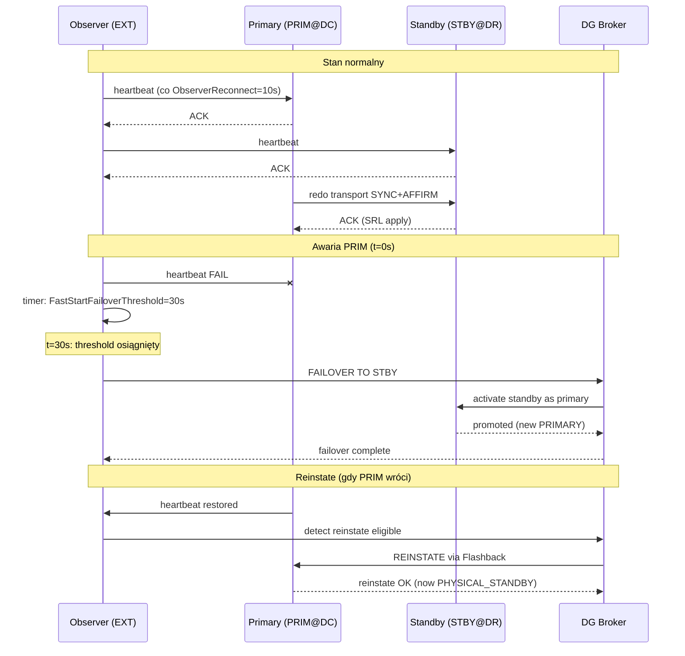
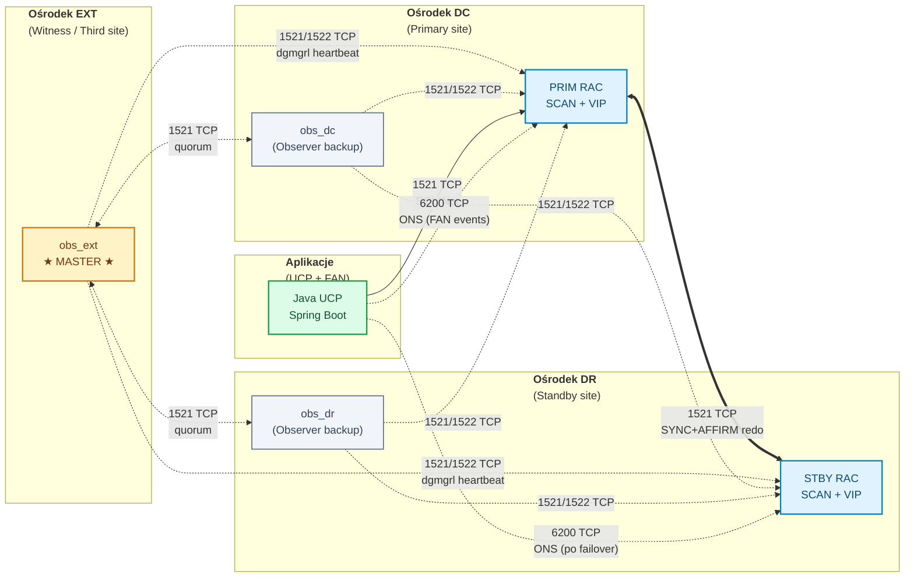

> [🇬🇧 English](./FSFO-GUIDE.md) | 🇵🇱 Polski

# 🔄 FSFO-GUIDE.md — Fast-Start Failover dla Oracle 19c


> Kompletny poradnik wdrożeniowy Fast-Start Failover — od diagnostyki do produkcji.
> Complete deployment guide for Fast-Start Failover — from diagnostics to production.

**Autor / Author:** KCB Kris | **Data / Date:** 2026-04-23 | **Wersja / Version:** 1.0
**Related:** [README.md](../README.md) • [DESIGN.md](DESIGN.md) • [PLAN.md](PLAN.md) • [TAC-GUIDE.md](TAC-GUIDE.md) • [INTEGRATION-GUIDE.md](INTEGRATION-GUIDE.md)

---

## 📋 Spis treści / Table of Contents

1. [Wprowadzenie / Introduction](#1-wprowadzenie--introduction)
2. [Architektura / Architecture](#2-architektura--architecture)
3. [Wymagania wstępne / Prerequisites](#3-wymagania-wstępne--prerequisites)
4. [Konfiguracja Broker / Broker Configuration](#4-konfiguracja-broker--broker-configuration)
5. [Konfiguracja FSFO / FSFO Configuration](#5-fsfo-configuration)
6. [Observer HA Deployment](#6-observer-ha-deployment)
7. [Testing / Testowanie](#7-testing--testowanie)
8. [Operational Runbook / Runbook operacyjny](#8-operational-runbook--runbook-operacyjny)
9. [Monitoring / Monitorowanie](#9-monitoring--monitorowanie)
10. [Troubleshooting](#10-troubleshooting)
11. [Appendix / Dodatki](#11-appendix--dodatki)

---

## 1. Wprowadzenie / Introduction

### 1.1 [EN] What is FSFO?

**Fast-Start Failover (FSFO)** is a Data Guard Broker feature that **automatically** fails over the primary database to a standby when the primary becomes unavailable. It removes the need for human intervention in the failover decision by using a lightweight Observer process that independently monitors both primary and standby.

**Key characteristics:**
- Decision made by **Observer** (not by primary or standby) — avoids split-brain
- Automatic **reinstate** of the old primary once it comes back online
- Works only with **Data Guard Broker** (not with manual DG setup)
- Requires **Standby Redo Logs (SRL)** for real-time apply

### 1.2 [PL] Czym jest FSFO?

**Fast-Start Failover (FSFO)** to mechanizm Data Guard Broker, który **automatycznie** przełącza primary na standby, gdy primary staje się niedostępny. Eliminuje potrzebę ręcznej decyzji o failoverze — robi to dedykowany proces **Observer** niezależnie monitorujący obie bazy.

**Kluczowe cechy:**
- Decyzja należy do **Observera** (nie do primary ani standby) — unika "split-brain"
- Automatyczny **reinstate** starego primary po jego powrocie do działania
- Działa wyłącznie z **Data Guard Broker** (nie z ręczną konfiguracją DG)
- Wymaga **Standby Redo Logs (SRL)** dla real-time apply

### 1.3 FSFO vs Manual Failover vs Switchover

| Cecha / Feature | Manual Failover | Switchover | FSFO |
|-----------------|-----------------|------------|------|
| Inicjator / Initiator | DBA (polecenie) | DBA (planowane) | Observer (automatyczny) |
| Primary dostępny? / Primary alive? | NIE | TAK (czysty handshake) | NIE |
| Data loss risk (RPO) | Zależy od transport mode | 0 (clean) | 0 przy MaxAvailability |
| Czas / Time (RTO) | minuty (decyzja + polecenia) | sekundy | ~30-45 s (auto) |
| Reinstate wymagany? | TAK | NIE | Auto (gdy AutoReinstate=TRUE) |
| Kiedy użyć / When to use | Awaria, brak Observera | Planowany maintenance | Produkcja 24/7 z SLA |

### 1.4 Trendy branżowe 2024-2026 / Industry Trends

| Trend | Wpływ na FSFO / Impact on FSFO |
|-------|-------------------------------|
| Zero-downtime mandates (fintech, banki) | FSFO jako standard — automatyczne RTO ≤ 30 s |
| Multi-site DR dla regulacji (DORA, RBI, NIS2) | Third-site Observer stał się wymaganiem compliance |
| Cloud parity (OCI, AWS RDS Oracle) | FSFO dostępne out-of-the-box; on-premise wciąż potrzebuje setup |
| Chaos engineering / GameDays | Kwartalne failover drills = norma w sektorze regulowanym |
| Oracle 26ai on-premise | FSFO nadal core feature; nowe narzędzia diagnostyczne (AI-driven) |
| Automation / IaC | systemd + Ansible dla Observer deployment zastępują manualny mkstore |

---

## 2. Architektura / Architecture

### 2.1 [EN] FSFO Architecture Components

FSFO involves four core components working together:

1. **Primary Database** — the production RAC cluster (DC site, DB name `PRIM`)
2. **Standby Database** — the DR replica (DR site, DB name `STBY`), kept current via redo transport
3. **Data Guard Broker** — the configuration manager running on both DBs, exposing `dgmgrl` CLI
4. **Observer** — a lightweight `dgmgrl` process watching both DBs; triggers FSFO when primary unreachable

### 2.2 [PL] Komponenty architektury FSFO

FSFO opiera się na czterech współpracujących komponentach:

1. **Primary Database** — produkcyjny klaster RAC (site DC, baza `PRIM`)
2. **Standby Database** — replika DR (site DR, baza `STBY`), aktualizowana redo transport
3. **Data Guard Broker** — framework zarządzający działający na obu DB, z CLI `dgmgrl`
4. **Observer** — lekki proces `dgmgrl` monitorujący obie DB; inicjuje FSFO gdy primary jest nieosiągalny

### 2.3 Observer Placement — Zasady lokalizacji

**Zasada główna / Main rule:** Observer **NIE** może być w tym samym ośrodku co primary. Najlepsza praktyka MAA to **third-site Observer**.

| Lokalizacja Observera | Ocena | Uzasadnienie |
|-----------------------|-------|--------------|
| W ośrodku primary (DC) | ❌ BAD | Awaria ośrodka DC zabiera PRIM **i** Observera — FSFO nie ma kto zdecydować |
| W ośrodku standby (DR) | 🟡 OK | Lepsze niż w DC, ale partycja sieciowa DC↔DR blokuje FSFO (Observer nie widzi PRIM) |
| W trzecim ośrodku (EXT) | ✅ BEST | Observer widzi oba ośrodki niezależnie od partycji DC↔DR |

**W tym projekcie:** Master Observer w EXT; backupy w DC i DR (dla **Observer HA**).

### 2.4 Observer HA — Topologia 3-site (DC / DR / EXT)

```mermaid
flowchart TB
    subgraph DC["Osrodek DC (Primary Site)"]
        PRIM["<b>PRIM</b> &bull; 2-node RAC &bull; SCAN:1521"]
        OBSDC["obs_dc<br/>(Observer backup)<br/>systemd"]
    end
    subgraph DR["Osrodek DR (Standby Site)"]
        STBY["<b>STBY</b> &bull; 2-node RAC &bull; SCAN:1521"]
        OBSDR["obs_dr<br/>(Observer backup)<br/>systemd"]
    end
    subgraph EXT["Osrodek EXT (Third Site)"]
        OBSEXT["obs_ext<br/>&#9733; MASTER OBSERVER &#9733;<br/>systemd"]
    end

    PRIM -.->|"SYNC+AFFIRM<br/>redo transport"| STBY
    STBY -.->|Apply + SRL| STBY

    OBSEXT -->|heartbeat| PRIM
    OBSEXT -->|heartbeat| STBY
    OBSDC -.->|standby heartbeat| PRIM
    OBSDC -.->|standby heartbeat| STBY
    OBSDR -.->|standby heartbeat| PRIM
    OBSDR -.->|standby heartbeat| STBY

    OBSEXT <-.->|quorum| OBSDC
    OBSEXT <-.->|quorum| OBSDR

    classDef dbNode fill:#e0f2fe,stroke:#0284c7,stroke-width:2px,color:#0c4a6e
    classDef obsMaster fill:#fef3c7,stroke:#d97706,stroke-width:2px,color:#78350f
    classDef obsBackup fill:#f1f5f9,stroke:#64748b,stroke-width:1.5px,color:#334155
    class PRIM,STBY dbNode
    class OBSEXT obsMaster
    class OBSDC,OBSDR obsBackup
```



### 2.5 Site-to-Role Mapping / Mapowanie site → rola

| Site | Baza DB | Rola / Role | Observer | Observer Role |
|------|---------|-------------|----------|---------------|
| **DC**  | PRIM | PRIMARY | obs_dc  | Backup / Hot standby for observer master |
| **DR**  | STBY | PHYSICAL_STANDBY | obs_dr | Backup / Hot standby for observer master |
| **EXT** | — (no DB) | — | obs_ext | **Master Observer** |

### 2.6 Observer HA — Failure Scenarios / Scenariusze awarii

| # | Scenariusz | Reakcja FSFO | Czas / Time |
|---|------------|--------------|-------------|
| S1 | Master Observer (obs_ext) crash | obs_dc lub obs_dr przejmuje rolę mastera (quorum-based election) | ≤ 60 s |
| S2 | Awaria ośrodka DC (PRIM + obs_dc padają) | obs_ext (master) widzi brak heartbeat z PRIM; po 30 s threshold inicjuje FSFO; obs_dr przejmuje rolę backup mastera | ~30-45 s FSFO + ~60 s re-election |
| S3 | Awaria ośrodka DR (STBY + obs_dr padają) | Primary zostaje primary; FSFO nie zadziała (nie ma gdzie failoverować); alert | natychmiast (alert) |
| S4 | Awaria EXT (obs_ext pada, ale PRIM i STBY żyją) | obs_dc lub obs_dr przejmuje rolę mastera; FSFO nadal aktywny | ≤ 60 s |
| S5 | Network partition DC↔DR (EXT widzi obie) | Observer master (EXT) ma quorum: decyzja zależy od strony, która ma heartbeat | ~45 s |
| S6 | Network partition DC↔EXT (obs_ext izolowany) | obs_dc lub obs_dr przejmuje; FSFO active | ≤ 60 s |
| S7 | Wszystkie 3 observery padają | FSFO pozostaje `ENABLED` ale **nie failover** (brak decision maker); alert do on-call; manual failover dostępny | alert < 60 s |

### 2.7 Observer HA — Start Order & Commands

**Kolejność startowania / Start order** (ważne przy zimnym starcie po awarii):

1. Primary DB (PRIM) + listeners (jeśli padł cały stack)
2. Standby DB (STBY) + listeners
3. Master Observer: `systemctl start dgmgrl-observer-ext` **na hoście EXT**
4. Backup Observery: `systemctl start dgmgrl-observer-dc` (DC) i `dgmgrl-observer-dr` (DR)

**Komendy / Commands:**

```bash
# Na każdym z 3 hostów (DC/DR/EXT)

# Status
systemctl status dgmgrl-observer-ext

# Start (auto-start at boot po wdrożeniu)
systemctl start dgmgrl-observer-ext

# Stop (dla maintenance)
systemctl stop dgmgrl-observer-ext

# Restart (po zmianie wallet lub TNS)
systemctl restart dgmgrl-observer-ext

# Logi
journalctl -u dgmgrl-observer-ext -f
```

**Z poziomu dgmgrl (na PRIM):**

```
DGMGRL> SHOW OBSERVER
Configuration - DG_CONFIG_PRIM_STBY

  Fast-Start Failover: Enabled in Potential Data Loss Mode

  Master Observer: obs_ext (192.168.30.10)

  Observers:
    obs_ext   - Master, Connected (192.168.30.10)
    obs_dc    - Backup, Connected (192.168.10.20)
    obs_dr    - Backup, Connected (192.168.20.30)
```

> 💡 **Skąd te adresy IP?** 3 różne podsieci (`192.168.10/20/30.0/24`) = 3 niezależne ośrodki — szczegółowy plan adresacji (podsieci, alokacja, DNS, uzasadnienie architektoniczne) w [§ 3.2.4 Schemat adresacji IP](#324-schemat-adresacji-ip--ip-addressing-scheme).

### 2.8 systemd Units per Site / Jednostki systemd na każdym site

Każdy ośrodek ma własny `.service` z unikatowym:
- `WorkingDirectory` (na katalog observer logs per-site)
- `Environment=TNS_ADMIN=/etc/oracle/tns/<site>` (TNS aliasy site-specific)
- `Environment=WALLET_LOCATION=/etc/oracle/wallet/observer-<site>`
- `ExecStart` z nazwą observera (obs_dc / obs_dr / obs_ext)

Pliki znajdują się w [systemd/](../systemd/):
- [systemd/dgmgrl-observer-dc.service](../systemd/dgmgrl-observer-dc.service)
- [systemd/dgmgrl-observer-dr.service](../systemd/dgmgrl-observer-dr.service)
- [systemd/dgmgrl-observer-ext.service](../systemd/dgmgrl-observer-ext.service)

### 2.9 Observer Wallet per Site / Wallet Observera na każdym site

Każdy host ma własny Oracle Wallet:

| Site | Wallet path | TNS aliasy |
|------|-------------|------------|
| DC  | `/etc/oracle/wallet/observer-dc/`  | `PRIM_ADMIN`, `STBY_ADMIN` |
| DR  | `/etc/oracle/wallet/observer-dr/`  | `PRIM_ADMIN`, `STBY_ADMIN` |
| EXT | `/etc/oracle/wallet/observer-ext/` | `PRIM_ADMIN`, `STBY_ADMIN` |

**Tworzenie wallet / Creating wallet** (jednorazowe, na każdym observer host):

```bash
# Jako oracle user
export WALLET_DIR=/etc/oracle/wallet/observer-ext   # lub -dc / -dr

# Stwórz wallet z auto-login
mkstore -wrl $WALLET_DIR -create
# (zapamiętaj hasło do walletu; trzyma się tylko w głowie DBA lub sekretach enterprise)

# Dodaj credential dla primary
mkstore -wrl $WALLET_DIR -createCredential PRIM_ADMIN sys <HASLO_SYS_PRIM>

# Dodaj credential dla standby
mkstore -wrl $WALLET_DIR -createCredential STBY_ADMIN sys <HASLO_SYS_STBY>

# Ustaw uprawnienia
chmod 600 $WALLET_DIR/*
chown oracle:oinstall $WALLET_DIR/*

# TNS alias (wskazujący na wallet przez $WALLET_LOCATION)
cat >> /etc/oracle/tns/ext/tnsnames.ora <<EOF
PRIM_ADMIN =
  (DESCRIPTION =
    (ADDRESS = (PROTOCOL=TCP)(HOST=scan-dc)(PORT=1521))
    (CONNECT_DATA = (SERVER=DEDICATED)(SERVICE_NAME=PRIM)(UR=A))
  )

STBY_ADMIN =
  (DESCRIPTION =
    (ADDRESS = (PROTOCOL=TCP)(HOST=scan-dr)(PORT=1521))
    (CONNECT_DATA = (SERVER=DEDICATED)(SERVICE_NAME=STBY)(UR=A))
  )
EOF

# sqlnet.ora na tym samym hoście
cat >> /etc/oracle/tns/ext/sqlnet.ora <<EOF
WALLET_LOCATION = (SOURCE = (METHOD=FILE)(METHOD_DATA = (DIRECTORY=/etc/oracle/wallet/observer-ext)))
SQLNET.WALLET_OVERRIDE = TRUE
EOF

# Test
dgmgrl /@PRIM_ADMIN "show configuration"
```

**Uwaga:** `UR=A` w TNS alias pozwala łączyć się do Data Guard przed otwarciem bazy (po restartcie).

### 2.10 FSFO Communication Flow (Mermaid)



### 2.11 Data Guard Transport Modes with FSFO

| Transport Mode | Protection Mode | RPO | FSFO wspierany? |
|----------------|------------------|-----|-----------------|
| `ASYNC` | MAX PERFORMANCE | > 0 (seconds) | Tak (ale ryzyko utraty danych) |
| `SYNC` (bez AFFIRM) | MAX PERFORMANCE | 0 (gdy LGWR ACK) | Tak, niepolecane |
| `SYNC + AFFIRM` | **MAX AVAILABILITY** | **0** | ✅ **Polecane** |
| `SYNC + AFFIRM` (wszyscy standby) | MAX PROTECTION | 0 | Tak, ale zatrzymuje primary przy problemach |

**W tym projekcie:** MAX AVAILABILITY z SYNC+AFFIRM (DC↔DR). Zob. [ADR-002](DESIGN.md#adr-002-protection-mode--max-availability-syncaffirm).

---

## 3. Wymagania wstępne / Prerequisites

### 3.1 Wymagania bazy / Database requirements

| # | Wymaganie [PL] | Requirement [EN] | Polecenie sprawdzające |
|---|----------------|-------------------|------------------------|
| 1 | Oracle 19c EE (19.16+ rekomendowane) | Oracle 19c EE (19.16+ recommended) | `SELECT banner_full FROM v$version;` |
| 2 | Force logging włączone | Force logging enabled | `SELECT force_logging FROM v$database;` → `YES` |
| 3 | Flashback Database włączony | Flashback Database enabled | `SELECT flashback_on FROM v$database;` → `YES` |
| 4 | Archivelog mode | Archivelog mode | `SELECT log_mode FROM v$database;` → `ARCHIVELOG` |
| 5 | Standby Redo Logs (SRL) | Standby Redo Logs | `SELECT COUNT(*) FROM v$standby_log;` ≥ `(threads × groups + 1)` |
| 6 | DG Broker uruchomiony | DG Broker running | `SELECT value FROM v$parameter WHERE name='dg_broker_start';` → `TRUE` |
| 7 | `LOG_ARCHIVE_CONFIG` skonfigurowane | `LOG_ARCHIVE_CONFIG` configured | `SHOW PARAMETER log_archive_config` |
| 8 | FRA (`db_recovery_file_dest`) skonfigurowana | FRA configured | `SHOW PARAMETER db_recovery_file_dest` |

### 3.2 Wymagania sieciowe / Network requirements

#### 3.2.1 Tabela portów / Port matrix

| Source | Destination | Port | Protokół | Użycie |
|--------|-------------|------|----------|--------|
| PRIM nodes | STBY nodes | 1521 | TCP | Redo transport (SQL*Net) |
| STBY nodes | PRIM nodes | 1521 | TCP | Switchover / reinstate |
| Observer hosts (DC/DR/EXT) | PRIM SCAN | 1521 | TCP | dgmgrl heartbeat + broker |
| Observer hosts | STBY SCAN | 1521 | TCP | dgmgrl heartbeat + broker |
| Observer hosts | PRIM nodes | 1522 | TCP | Static listener `PRIM_DGMGRL` (dla przed-open) |
| Observer hosts | STBY nodes | 1522 | TCP | Static listener `STBY_DGMGRL` |
| Observer master (EXT) | Observer backups (DC/DR) | 1521 | TCP | Observer HA quorum |
| App nodes (klienci UCP/FAN) | PRIM nodes | **6200** | TCP | **ONS (FAN events: SERVICE UP/DOWN, NODE DOWN)** — krytyczne dla TAC |
| App nodes | STBY nodes | **6200** | TCP | ONS po failover (nowy primary publikuje FAN) |
| PRIM nodes ↔ PRIM nodes | wewnątrz RAC | **6200** | TCP | ONS local (cross-node w klastrze RAC) |
| PRIM nodes ↔ PRIM nodes | wewnątrz RAC | **6123** | TCP | CRS notification (`evmd`/`evmlogger`) — wewnątrzklastrowa wymiana zdarzeń |
| PRIM ↔ STBY (opcjonalnie) | między klastrami | **6200** | TCP | Cross-site ONS — umożliwia FAN z obu klastrów w jednej konfiguracji klienta |
| **Latency** | DC↔DR | — | — | **≤ 2 ms** (SYNC transport requirement) |
| **Latency** | Observers ↔ DB | — | — | **≤ 50 ms** (heartbeat stability) |
| **Latency** | App ↔ ONS | — | — | **≤ 100 ms** (FAN event delivery) |

> **Uwaga:** port 6200 (ONS) i 6123 (CRS) są domyślne w Oracle 19c. Aktualne wartości zweryfikuj komendą `srvctl config nodeapps -onsonly` oraz `srvctl config nodeapps -a`.

#### 3.2.2 Diagram topologii sieciowej z portami / Network topology diagram



**Legenda linii / Line legend:**
- `<==>` ciągłe (pogrubione): synchroniczny transport redo — wymaga niskiej latencji (≤ 2 ms DC↔DR)
- `-.->` przerywane: heartbeat / sygnał kontrolny — toleruje wyższą latencję
- Porty oznaczone na strzałkach: 1521 (SQL\*Net listener), 1522 (static DGMGRL listener), 6200 (ONS/FAN), 6123 (CRS — wewnątrzklastrowy, nie pokazany)

#### 3.2.3 Firewall ACL checklist

Przed wdrożeniem upewnij się, że następujące reguły są otwarte na ścianach ogniowych **między ośrodkami** (intra-cluster komunikacja na 6123 jest lokalna w obrębie RAC — zwykle nie przechodzi przez external firewall):

- [ ] DC ↔ DR: 1521/TCP (redo transport, bidirectional)
- [ ] DC ↔ DR: 1522/TCP (static DGMGRL, bidirectional)
- [ ] EXT → DC, EXT → DR: 1521/TCP + 1522/TCP
- [ ] DC ↔ DR, DC ↔ EXT, DR ↔ EXT: 1521/TCP dla quorum między observerami
- [ ] App zone → DC, App zone → DR: 1521/TCP + 6200/TCP
- [ ] DNS: `scan-dc`, `scan-dr` oraz hostname'y observerów **muszą być resolvowalne z każdego site** (obustronnie)

#### 3.2.4 Schemat adresacji IP / IP addressing scheme

> **Uwaga:** poniższy plan jest **propozycją referencyjną** dla środowisk labowych i developerskich. W środowisku produkcyjnym adresacja musi być uzgodniona z network engineeringiem zgodnie z lokalną polityką CIDR/VLAN. Kluczowa zasada architektoniczna: **3 niezależne podsieci** (partycja jednego site nie może zabrać łączności między pozostałymi dwoma).

##### Podsieci per site / Subnets per site

| Site | Proponowana podsieć | Rola | Przeznaczenie |
|---|---|---|---|
| **DC**  | `192.168.10.0/24` | Primary site | PRIM RAC (2 nodes) + Observer backup `obs_dc` + aplikacje |
| **DR**  | `192.168.20.0/24` | Standby site | STBY RAC (2 nodes) + Observer backup `obs_dr` |
| **EXT** | `192.168.30.0/24` | Witness / third site | Master Observer `obs_ext` (brak bazy; dedykowany host) |
| DC RAC interconnect | `192.168.110.0/24` | RAC private | Cluster interconnect (non-routable, 10 Gbps dedicated) |
| DR RAC interconnect | `192.168.120.0/24` | RAC private | Cluster interconnect (non-routable, 10 Gbps dedicated) |

##### Alokacja wewnątrz podsieci (wzorzec per-site)

| Zakres | Funkcja | Przykład DC (`192.168.10.x`) |
|---|---|---|
| `.1` | Gateway / router | `192.168.10.1` |
| `.2–.9` | Infra (DNS, monitoring, jump-host) | `.5` = bastion, `.6` = Prometheus |
| `.11–.12` | RAC nodes physical | `.11` = prim-node1, `.12` = prim-node2 |
| `.20` | Observer host | `.20` = obs-dc *(patrz § 2.7)* |
| `.21–.22` | RAC node VIPs | `.21` = prim-node1-vip, `.22` = prim-node2-vip |
| `.31–.33` | SCAN VIPs (3 × dla RAC) | `.31–.33` = scan-dc |
| `.100–.254` | Klienci / application zone | UCP pool source IPs |

##### Mapowanie dla adresów użytych w § 2.7 (DGMGRL SHOW OBSERVER)

| Observer | IP | Site | Komentarz |
|---|---|---|---|
| `obs_ext` | `192.168.30.10` | EXT | Master Observer — pierwsza usługa w subnet EXT (tam nie ma bazy, więc `.10` wolne) |
| `obs_dc`  | `192.168.10.20` | DC  | Backup Observer w DC — slot `.20` w zakresie observer |
| `obs_dr`  | `192.168.20.30` | DR  | Backup Observer w DR — slot `.30` (w DR inne ułożenie niż DC — drugi oktet identyfikuje site, ostatni oktet nie musi być identyczny) |

**Dlaczego różne ostatnie oktety?** `.20` / `.30` / `.10` nie są spójne celowo, bo to **realny artefakt** środowiska — adresy przydzielone w różnym czasie. W greenfield labach warto użyć jednolitego slotu (np. zawsze `.20` dla observer we wszystkich podsieciach), żeby uprościć runbooki.

##### DNS i reverse-DNS — obowiązkowe

Każda z 3 podsieci musi mieć **mutual DNS resolution** z pozostałych dwóch:

| Z lokalizacji → do hosta | Wymagana rozdzielczość |
|---|---|
| Observer w EXT → `scan-dc`, `scan-dr` | ✅ tak |
| Observer w EXT → `prim-node1-vip`, `prim-node2-vip`, `stby-node*-vip` | ✅ tak |
| Klient aplikacji (dowolna strefa) → `scan-dc`, `scan-dr` | ✅ tak (dla FAN post-failover) |
| Observer w DC → `obs-ext`, `obs-dr` | ✅ tak (quorum między observerami) |
| **Reverse DNS dla wszystkich adresów RAC (PTR rekordy)** | ✅ **obowiązkowe** (wymagane przez Oracle Clusterware — instalacja CRS bez PTR = failed precheck) |

**Tip:** w labach developerskich najprościej skonfigurować `/etc/hosts` na każdym hoście zamiast pełnego DNS server. W produkcji — dedykowane strefy DNS z replication między site (BIND master-slave lub Active Directory Integrated Zones).

##### Dlaczego 3 osobne podsieci (a nie jedna wspólna /22)?

1. **Fault isolation** — awaria jednego segmentu L2/L3 nie rozprzestrzenia się na pozostałe site.
2. **Quorum protection** — Observer w EXT musi być **fizycznie i logicznie separowany** od DC i DR; wspólna podsieć = wspólny domain failure = FSFO traci „sędziego".
3. **Firewall granularity** — łatwiej zdefiniować reguły per-subnet niż per-IP (ACL z § 3.2.3 operują na pojęciach „DC zone", „DR zone", „EXT zone").
4. **Routing** — między-DC routing przez dedykowane linki (np. MPLS, dark fibre) pozwala wymuszać SLA latencji dla redo transport (≤ 2 ms DC↔DR).

##### Czego **nie** robić

- ❌ **Wspólna /24 dla PRIM + STBY + Observer** — jeden broadcast storm zabija całą HA.
- ❌ **Observer w tej samej podsieci co baza, którą monitoruje** — partycja segmentu = observer widzi tylko „martwą" bazę.
- ❌ **Publiczne IP (routable internet) dla RAC interconnect** — security + performance.
- ❌ **NAT między Observer a DB** — broker używa SCN i hostname'ów w heartbeat; NAT komplikuje reverse-DNS i łamie Oracle Wallet hostname matching.
- ❌ **Observer w chmurze publicznej w tym samym regionie/AZ co DB** — AZ partition izoluje observer razem z jedną bazą (patrz § 5.1.1 ObserverOverride dla case'ów cloud).

### 3.3 Wymagania hosta observer / Observer host requirements

| Zasób / Resource | Minimum | Rekomendowane |
|------------------|---------|---------------|
| CPU | 2 vCPU | 4 vCPU |
| RAM | 2 GB | 4 GB |
| Disk (logi observer) | 10 GB | 50 GB (30 dni retencji) |
| OS | RHEL/OL 7.x | RHEL/OL 8.x lub 9.x |
| Oracle Client | 19c full client | 19c full client (dgmgrl + sqlplus) |
| systemd | wymagane | wymagane |
| Sieć do 2 DC | bidirectional | bidirectional + monitoring |

### 3.4 Weryfikacja przez skrypt / Verification via script

Przed Phase 1 uruchom readiness check:

```bash
sqlconn.sh -s PRIM -f sql/fsfo_check_readiness.sql -o reports/PRIM_readiness.txt
sqlconn.sh -s STBY -r -f sql/fsfo_check_readiness.sql -o reports/STBY_readiness.txt
```

Oczekiwane: wszystkie 6 sekcji `fsfo_check_readiness.sql` zwracają PASS.

### 3.5 Capacity planning / Szacowanie zasobów

Sekcja podaje **formuły i progi** do sizingu środowiska FSFO+TAC. Wstaw własne liczby bazujące na metrykach z AWR/ASH — generyczne wartości są punktem startowym, nie celem.

#### 3.5.1 Standby Redo Logs (SRL)

**Formuła:** `liczba grup SRL per thread = N + 1` gdzie `N` = liczba grup online redo logs per thread.

- Dla 2-node RAC z 3 grupami ORL na thread: **minimum 4 grupy SRL per thread = 8 SRL groups total**.
- Rozmiar każdej grupy SRL **≥ max rozmiaru grupy ORL** (Oracle wymaga; inaczej `FAIL` w `fsfo_check_readiness.sql` sekcja 3).
- Zalecenie: `bytes_srl = bytes_orl × 1.0` — tożsame (unikamy re-alokacji przy re-sizingu ORL).

**Weryfikacja:**
```sql
SELECT thread#, COUNT(*) AS grupy, MAX(bytes)/1024/1024 AS mb
FROM v$standby_log GROUP BY thread#;
-- Oczekiwane: COUNT(*) >= N+1 per thread
```

#### 3.5.2 Flash Recovery Area (FRA)

**Formuła:** `FRA_size ≥ 3 × daily_archive_rate + flashback_retention × archive_rate + RMAN_backup_buffer`

Komponenty:
- `daily_archive_rate` = `SUM(blocks × block_size)` z `v$archived_log` / liczba dni z ostatniego tygodnia
- `flashback_retention × archive_rate` = `DB_FLASHBACK_RETENTION_TARGET` (minuty) × tempo redo/min; dla reinstate musi pokryć najdłuższy FSFO outage + margin
- `RMAN_backup_buffer` = 1–2× daily backup size (jeśli FRA trzyma też RMAN backupy)

**Przykład dla średniej bazy OLTP z `DB_FLASHBACK_RETENTION_TARGET=1440` (24h):**

| Metryka | Wartość | Źródło |
|---|---|---|
| Daily archive rate | 40 GB/d | `v$archived_log` z 7 dni |
| Flashback retention window | 24 h = 1 dzień | GUC |
| Flashback × rate | 40 GB | |
| RMAN buffer (1 pełny backup) | 120 GB | rozmiar `USED_BYTES` z `v$database` |
| **FRA minimum** | **3×40 + 40 + 120 = 280 GB** | |
| **FRA zalecane** | **400–500 GB** | + 40% margin na spike'y |

**Query do pomiaru archive rate:**
```sql
SELECT ROUND(SUM(blocks * block_size) / 1024 / 1024 / 1024, 1) AS gb_daily_avg
FROM   v$archived_log
WHERE  completion_time > SYSDATE - 7
  AND  dest_id = 1
GROUP BY TRUNC(completion_time);
```

#### 3.5.3 DB_FLASHBACK_RETENTION_TARGET

**Formuła:** `retention_minutes ≥ 2 × FastStartFailoverThreshold_seconds / 60 + reinstate_buffer`

Dla tego projektu: `FastStartFailoverThreshold = 30 s`, więc minimum = 1 minuta. W praktyce reinstate wymaga flashback logów pokrywających całe okno outage — **minimum 60 min, zalecane 1440 min (24 h)**.

Jeśli FSFO się wywoła o 02:00, a DBA zaczyna reinstate o 08:00 (po komunikacji SEV-1), flashback musi pokrywać co najmniej 6 h. Z marginesem: **1440 min = 24 h**.

#### 3.5.4 SYSAUX przy `retention_timeout=86400 s` (TAC LTXID)

Każda transakcja TAC wpisuje swój LTXID do `SYS.LTXID_TRANS$`. Retencja `86400 s = 24 h` oznacza, że tabela trzyma wpisy z ostatnich 24 h.

**Formuła:** `LTXID_rows ≈ TPS × retention_timeout`, `LTXID_size ≈ rows × ~120 bytes/row`

**Przykład dla 500 TPS:**

| Metryka | Wartość |
|---|---|
| TPS | 500 |
| Retention | 86 400 s (24 h) |
| Rows w LTXID_TRANS$ | 500 × 86 400 = **43 200 000** |
| Rozmiar (wraz z indeksem) | ~5 GB |
| Purge job | Background (automatyczny) |

**Monitoring rozmiaru:**
```sql
SELECT segment_name, ROUND(bytes/1024/1024, 1) AS mb
FROM   dba_segments
WHERE  segment_name LIKE 'LTXID%' OR segment_name LIKE 'I_LTXID%'
ORDER  BY bytes DESC;

-- Oczekiwane: <5 GB dla 500 TPS z retention 86400.
-- Alert: >10 GB = sprawdź czy purge background job działa.
```

**Trigger dla alertu:** jeśli rozmiar `LTXID_TRANS$` > 10 GB lub rośnie liniowo bez stabilizacji po 24 h → zgłoś SR (Service Request) do Oracle (znany bug w niektórych PSU przed 19.18).

#### 3.5.5 SYSAUX ogólnie (AWR × 3 standby)

`SYSAUX` trzyma AWR snapshoty, ASH, SQL Management Base. Przy 3 observerach i częstym polling brokera, ilość AWR snapshotów wzrasta.

**Formuła:** `sysaux_size ≈ (AWR_retention_days × 24) × snap_count × avg_snap_size`

- `avg_snap_size` ≈ 2–5 MB dla średniego OLTP
- `snap_count` = 8 (co 15 min przy `INTERVAL => 900`) lub 2 (co 60 min default — zalecane zmniejszyć dla FSFO diagnostyki)

**Przykład dla `AWR_retention=30d`, snap co 15 min, 3 MB/snap:**
`30 × 24 × 4 × 3 MB = 8 640 MB ≈ 9 GB` dla AWR samego, + 2 GB SMB + 3 GB ASH = **~14 GB SYSAUX minimum**.

**Zalecenie:** alokacja **minimum 30 GB SYSAUX** dla środowiska produkcyjnego z FSFO+TAC+AWR.

#### 3.5.6 Observer hosty — capacity summary

Już zawarte w § 3.3 (CPU/RAM/Disk). Dodatkowo dla 30-dniowej retencji logów observera:
- Średnia wielkość `observer.log` ≈ 50–100 MB/dzień (zależnie od polling frequency i liczby zdarzeń DG)
- 30 dni = 1.5–3 GB per observer host
- **Disk 50 GB z § 3.3 daje komfortowy margines.**

#### 3.5.7 Capacity — pre-deployment checklist

- [ ] SRL count per thread = N+1 zweryfikowane
- [ ] SRL size = max ORL size
- [ ] FRA ≥ 3× daily archive + flashback retention × rate + RMAN buffer
- [ ] `DB_FLASHBACK_RETENTION_TARGET ≥ 1440 min`
- [ ] SYSAUX ≥ 30 GB z projekcją wzrostu `LTXID_TRANS$` dla twojego TPS
- [ ] Observer hosts 50 GB disk, 4 vCPU, 4 GB RAM
- [ ] Alerting na `LTXID_TRANS$ > 10 GB` skonfigurowany w monitorze (Grafana/Zabbix/OEM)
- [ ] AWR snapshot interval zweryfikowany (zalecane: 15 min dla FSFO diagnostyki)

---

## 4. Konfiguracja Broker / Broker Configuration

### 4.1 Włączenie brokera / Enabling the broker

Na **obu** DB (PRIM i STBY), na wszystkich instancjach RAC:

```sql
-- Wymagane: SYSDBA / SYSDG
ALTER SYSTEM SET dg_broker_start=TRUE SCOPE=BOTH SID='*';
```

Sprawdzenie:
```sql
SELECT inst_id, value
FROM gv$parameter
WHERE name='dg_broker_start';
-- Oczekiwane: TRUE na wszystkich wierszach
```

### 4.2 Static listener (wymagany dla broker)

W `$ORACLE_HOME/network/admin/listener.ora` na **każdym** node RAC (oba ośrodki):

**PRIM nodes:**
```
SID_LIST_LISTENER =
  (SID_LIST =
    (SID_DESC =
      (GLOBAL_DBNAME = PRIM_DGMGRL)
      (ORACLE_HOME = /u01/app/oracle/product/19.0.0/dbhome_1)
      (SID_NAME = PRIM1)          -- PRIM2 na drugim node
    )
  )
```

**STBY nodes:**
```
SID_LIST_LISTENER =
  (SID_LIST =
    (SID_DESC =
      (GLOBAL_DBNAME = STBY_DGMGRL)
      (ORACLE_HOME = /u01/app/oracle/product/19.0.0/dbhome_1)
      (SID_NAME = STBY1)          -- STBY2 na drugim node
    )
  )
```

Reload listener:
```bash
lsnrctl reload
```

### 4.3 Generowanie skryptu dgmgrl

Użyj generator `sql/fsfo_configure_broker.sql` — parametryzowany, emituje `.dgmgrl` do review:

```bash
sqlconn.sh -s PRIM -i -f sql/fsfo_configure_broker.sql -o broker_setup.dgmgrl
```

Skrypt prompt'uje o:
- `primary_db_unique_name` (np. `PRIM`)
- `primary_scan` (np. `scan-dc.corp.local`)
- `standby_db_unique_name` (np. `STBY`)
- `standby_scan` (np. `scan-dr.corp.local`)
- `protection_mode` (`MAXAVAILABILITY` | `MAXPERFORMANCE`)

Output: `broker_setup.dgmgrl` — plik z komendami **do review i wykonania**.

### 4.4 Typowa zawartość broker_setup.dgmgrl

```
-- BROKER SETUP dla PRIM + STBY
-- Review i zatwierdź przed apply

CONNECT /@PRIM_ADMIN

CREATE CONFIGURATION 'DG_CONFIG_PRIM_STBY' AS
  PRIMARY DATABASE IS 'PRIM'
  CONNECT IDENTIFIER IS 'PRIM';

ADD DATABASE 'STBY' AS
  CONNECT IDENTIFIER IS 'STBY'
  MAINTAINED AS PHYSICAL;

-- Transport i protection
EDIT DATABASE 'PRIM' SET PROPERTY 'LogXptMode'='SYNC';
EDIT DATABASE 'STBY' SET PROPERTY 'LogXptMode'='SYNC';
EDIT DATABASE 'PRIM' SET PROPERTY 'LogShipping'='ON';
EDIT DATABASE 'STBY' SET PROPERTY 'LogShipping'='ON';
EDIT DATABASE 'PRIM' SET PROPERTY 'DelayMins'='0';
EDIT DATABASE 'STBY' SET PROPERTY 'DelayMins'='0';

-- Włączenie konfiguracji
ENABLE CONFIGURATION;

-- Protection mode (po ENABLE)
EDIT CONFIGURATION SET PROTECTION MODE AS MAXAVAILABILITY;

-- Weryfikacja
SHOW CONFIGURATION;
SHOW DATABASE PRIM;
SHOW DATABASE STBY;
```

### 4.5 Apply

```bash
# Po review:
dgmgrl sys/@PRIM_ADMIN @broker_setup.dgmgrl
```

Oczekiwane: `SHOW CONFIGURATION` zwraca `SUCCESS`.

### 4.6 Weryfikacja

```bash
sqlconn.sh -s PRIM -f sql/fsfo_broker_status.sql
```

Szukamy:
- `CONFIGURATION` = `SUCCESS`
- `PRIM` = `SUCCESS` + `role=PRIMARY`
- `STBY` = `SUCCESS` + `role=PHYSICAL STANDBY`
- `Transport Lag` ≈ 0 s
- `Apply Lag` ≈ 0 s

---

## 5. FSFO Configuration

### 5.1 Ustawienie FSFO properties

Na PRIM (po uruchomionym brokerze):

```
DGMGRL> EDIT CONFIGURATION SET PROPERTY FastStartFailoverThreshold=30;
DGMGRL> EDIT CONFIGURATION SET PROPERTY FastStartFailoverLagLimit=30;
DGMGRL> EDIT CONFIGURATION SET PROPERTY FastStartFailoverAutoReinstate=TRUE;
DGMGRL> EDIT CONFIGURATION SET PROPERTY ObserverOverride=TRUE;
DGMGRL> EDIT CONFIGURATION SET PROPERTY ObserverReconnect=10;
```

**Znaczenie parametrów:**

| Parametr | Wartość | Znaczenie |
|----------|---------|-----------|
| `FastStartFailoverThreshold` | 30 | Sekundy ciszy, zanim Observer zainicjuje FSFO |
| `FastStartFailoverLagLimit` | 30 | Max apply lag, przy którym FSFO jest dopuszczony; > 30s blokuje FSFO |
| `FastStartFailoverAutoReinstate` | TRUE | Broker sam reinstate'uje starego primary po powrocie |
| `ObserverOverride` | TRUE | Observer może wymusić failover nawet gdy primary twierdzi że żyje |
| `ObserverReconnect` | 10 | Co ile sekund Observer próbuje reconnect po utraconym heartbeat |

#### 5.1.1 `ObserverOverride` — kiedy TRUE, kiedy FALSE

**Koncept:** W normalnym trybie (`FALSE`) FSFO wyzwala się gdy **zarówno** Observer, **jak i** Primary zgadzają się, że standby jest osiągalny a primary nie. Z `TRUE` sam Observer może podjąć decyzję failover nawet jeśli Primary twierdzi, że jest OK.

**Dlaczego to niebezpieczne:** jeśli Observer widzi „zły świat" (np. network partition izoluje go od Primary), a Primary faktycznie działa i klienci nadal piszą, `TRUE` może wywołać failover → **split-brain** (patrz § 10.4).

**Dlaczego `TRUE` mimo to jest zalecane dla 3-site MAA:** Observer w trzecim ośrodku (EXT) widzi PRIM i STBY niezależnie. Jeśli EXT straci łączność z PRIM a widzi STBY, to znaczy że **aplikacje też prawdopodobnie straciły łączność z PRIM** → failover ma sens. W topologii 2-site (Observer w DR) `TRUE` jest ryzykowne, bo observer może być izolowany razem ze standby.

**Macierz decyzyjna:**

| Topologia / Scenariusz | `ObserverOverride` | Uzasadnienie |
|---|---|---|
| 3-site z Observerem w trzecim DC (jak ten projekt) | **TRUE** ✅ | Observer w EXT jest „sędzią" — widzi obie bazy niezależnie |
| 2-site, Observer w DC (primary site) | **FALSE** | Observer = SPOF z primary; jeśli DC pada, observer też |
| 2-site, Observer w DR (standby site) | **FALSE** | Partycja DC↔DR: Observer widzi tylko STBY, Primary działa — nie wymuszaj |
| Cloud, Observer w innym AZ tego samego regionu | **FALSE** | AZ partition może izolować observer razem z jednym DB — false-positive |
| Cloud, Observer w innym regionie / Outposts | **TRUE** ✅ | Regiony są niezależne, observer jest niezależnym sędzią |
| Single observer (non-HA) | **FALSE** | SPOF observera + TRUE = jeden fałszywy alarm = failover bez potrzeby |
| Klaster Observer HA z quorum (≥ 3) | **TRUE** ✅ | Quorum chroni przed false-positive — większość decyduje |
| DB z MaxProtection (RPO=0 twarde) | **FALSE** | MaxProtection już blokuje Primary przy utracie sync — ObserverOverride niepotrzebny |
| Baza OLTP gdzie RTO > RPO (tolerujemy chwilową utratę danych dla szybkiego recovery) | **TRUE** ✅ | Szybszy failover nawet kosztem ryzyka niepotrzebnego failoveru |
| Baza analityczna / DWH gdzie switchover kosztuje godziny | **FALSE** | Zbyt drogi failover — lepszy manual z wazką decyzją DBA |

**Co zmienia się, gdy zmieniasz wartość:**

```
-- Zmiana wymaga re-ENABLE konfiguracji (broker to egzekwuje)
DGMGRL> EDIT CONFIGURATION SET PROPERTY ObserverOverride='FALSE';
DGMGRL> SHOW CONFIGURATION VERBOSE;
```

**Audyt:** w logach observera (`/var/log/oracle/observer/obs_*.log`) każdy failover pokazuje, czy decyzja była „unanimous" (Primary+Observer) czy „override-triggered". Szukaj stringa `initiated by observer override`.

**Dla tego projektu (3-site DC/DR/EXT z Master Observer na EXT + quorum):** używamy **TRUE** zgodnie z ADR-003. Jeśli w przyszłości topologia zmieni się na 2-site (np. po decommissioningu EXT), **zmień na FALSE** i zaktualizuj ADR.

### 5.2 Dodanie observerów do konfiguracji

```
DGMGRL> ADD OBSERVER 'obs_dc' ON 'host-dc-obs.corp.local'
        LOG FILE IS '/var/log/oracle/observer/obs_dc.log';

DGMGRL> ADD OBSERVER 'obs_dr' ON 'host-dr-obs.corp.local'
        LOG FILE IS '/var/log/oracle/observer/obs_dr.log';

DGMGRL> ADD OBSERVER 'obs_ext' ON 'host-ext-obs.corp.local'
        LOG FILE IS '/var/log/oracle/observer/obs_ext.log';

DGMGRL> SET MASTEROBSERVER TO obs_ext;
```

### 5.3 Włączenie FSFO

```
DGMGRL> ENABLE FAST_START FAILOVER;
```

Weryfikacja:
```
DGMGRL> SHOW FAST_START FAILOVER;

Fast-Start Failover: Enabled in Potential Data Loss Mode
  Threshold:          30 seconds
  Target:             STBY
  Observer:           obs_ext (MASTER)
  Lag Limit:          30 seconds
  Shutdown Primary:   TRUE
  Auto-reinstate:     TRUE
  Observer Reconnect: 10 seconds
  Observer Override:  TRUE
```

### 5.4 Start observerów

Na **każdym** z 3 hostów (po wdrożeniu systemd units z [Krok 6](#6-observer-ha-deployment)):

```bash
# Master na EXT — start PIERWSZY
systemctl start dgmgrl-observer-ext
systemctl enable dgmgrl-observer-ext

# Backupy
systemctl start dgmgrl-observer-dc
systemctl enable dgmgrl-observer-dc

systemctl start dgmgrl-observer-dr
systemctl enable dgmgrl-observer-dr
```

Weryfikacja z PRIM:

```
DGMGRL> SHOW OBSERVER
  obs_ext  Master  Connected
  obs_dc   Backup  Connected
  obs_dr   Backup  Connected
```

---

## 6. Observer HA Deployment

### 6.1 Lista zadań / Task list

Deployment Observer HA wymaga:

1. ✅ Wallet per-site (Section 2.9 + [bash/fsfo_setup.sh](../bash/fsfo_setup.sh))
2. ✅ TNS aliases per-site
3. ✅ systemd unit per-site (Section 2.8)
4. ✅ `ADD OBSERVER` w brokerze (§ 5.2)
5. ✅ `SET MASTEROBSERVER` na EXT
6. ✅ Start przez systemctl
7. ✅ Weryfikacja `SHOW OBSERVER`

### 6.2 Struktura katalogów na observer host

```
/etc/oracle/
├── tns/
│   └── ext/                              (lub hh, oe)
│       ├── tnsnames.ora
│       └── sqlnet.ora
├── wallet/
│   └── observer-ext/
│       ├── ewallet.p12
│       └── cwallet.sso
└── systemd/
    (deployment files copied here before install)

/var/log/oracle/observer/
├── obs_ext.log                    (lub obs_dc.log, obs_dr.log)
└── obs_ext.dat                    (background file)
```

### 6.3 systemd unit template

Plik [systemd/dgmgrl-observer-ext.service](../systemd/dgmgrl-observer-ext.service) (analogicznie dla DC i DR):

```ini
[Unit]
Description=Data Guard Observer (EXT — master) for FSFO
After=network-online.target
Wants=network-online.target

[Service]
Type=simple
User=oracle
Group=oinstall
Environment=ORACLE_HOME=/u01/app/oracle/product/19.0.0/dbhome_1
Environment=TNS_ADMIN=/etc/oracle/tns/ext
Environment=LD_LIBRARY_PATH=/u01/app/oracle/product/19.0.0/dbhome_1/lib
WorkingDirectory=/var/log/oracle/observer
ExecStart=/u01/app/oracle/product/19.0.0/dbhome_1/bin/dgmgrl \
    -echo /@PRIM_ADMIN \
    "START OBSERVER obs_ext IN BACKGROUND FILE='/var/log/oracle/observer/obs_ext.dat' LOGFILE='/var/log/oracle/observer/obs_ext.log'"
ExecStop=/u01/app/oracle/product/19.0.0/dbhome_1/bin/dgmgrl \
    -echo /@PRIM_ADMIN "STOP OBSERVER obs_ext"
Restart=on-failure
RestartSec=30s
StandardOutput=journal
StandardError=journal

[Install]
WantedBy=multi-user.target
```

### 6.4 Deployment krok po kroku

```bash
# 1. Kopiuj unit file na host
scp systemd/dgmgrl-observer-ext.service oracle@host-ext-obs:/tmp/

# 2. Na host-ext-obs, jako root:
sudo mv /tmp/dgmgrl-observer-ext.service /etc/systemd/system/
sudo chmod 644 /etc/systemd/system/dgmgrl-observer-ext.service
sudo systemctl daemon-reload

# 3. Utwórz katalogi
sudo mkdir -p /var/log/oracle/observer /etc/oracle/tns/ext /etc/oracle/wallet/observer-ext
sudo chown -R oracle:oinstall /var/log/oracle /etc/oracle

# 4. Utwórz wallet (jako oracle — § 2.9)

# 5. Test (nie enable jeszcze):
sudo systemctl start dgmgrl-observer-ext
sudo systemctl status dgmgrl-observer-ext

# 6. Sprawdź logi
sudo journalctl -u dgmgrl-observer-ext -f

# 7. Gdy stabilne — enable dla auto-start:
sudo systemctl enable dgmgrl-observer-ext
```

### 6.5 Powtórz dla DC i DR

Analogicznie, zamieniając `ext` na `hh` / `oe` i `WALLET_LOCATION` odpowiednio.

---

## 7. Testing / Testowanie

### 7.1 Test Matrix

| # | Test | Command | Expected | SLA |
|---|------|---------|----------|-----|
| T-1 | Planowany switchover | `SWITCHOVER TO STBY;` | Role switch, apps continue via TAC | ≤ 60 s |
| T-2 | Manual failover (Observer off) | `systemctl stop dgmgrl-observer-ext` + `FAILOVER TO STBY IMMEDIATE` | Primary padnie, STBY przejmie | < 30 s |
| T-3 | Auto-failover (symulacja PRIM crash) | `ssh prim-node1 "shutdown abort"` + `ssh prim-node2 "shutdown abort"` | Observer detects, FSFO executes | ≤ 45 s |
| T-4 | Auto-reinstate | Po T-3, `startup mount` na starym PRIM | Broker reinstate automatycznie | ≤ 5 min |
| T-5 | Observer master failover | `systemctl stop dgmgrl-observer-ext` | obs_dc lub obs_dr becomes master | ≤ 60 s |
| T-6 | Network partition DC↔DR | `iptables -A INPUT -s dr-network -j DROP` na PRIM | Observer (EXT) widzi obie; quorum decision | ≤ 45 s |
| T-7 | Rolling patch (z FSFO aktywnym) | Patch STBY, switchover, patch stary PRIM, switchback | Zero downtime aplikacji | — |
| T-8 | Full DR drill (ośrodek DC down) | Symulacja utraty całego DC | FSFO + TAC replay; aplikacja działa | ≤ 60 s end-to-end |

### 7.2 Kroki testu auto-failover (T-3)

```bash
# 1. Pre-flight
sqlconn.sh -s PRIM -f sql/fsfo_broker_status.sql
# Spodziewane: SUCCESS, FSFO ENABLED, Observer connected

# 2. Start monitoring w osobnym oknie
watch -n 2 "sqlconn.sh -s PRIM -f sql/fsfo_broker_status.sql"

# 3. Symuluj awarię PRIM (oba node'y RAC)
ssh oracle@prim-node1 "sqlplus / as sysdba <<< 'SHUTDOWN ABORT'"
ssh oracle@prim-node2 "sqlplus / as sysdba <<< 'SHUTDOWN ABORT'"

# 4. Obserwuj Observer log
journalctl -u dgmgrl-observer-ext -f --since "5 minutes ago"

# Spodziewane eventy:
# t=0s: PRIM shutdown abort
# t=1-5s: Observer loses heartbeat
# t=30s: Threshold reached, FSFO initiating
# t=35s: FAILOVER TO STBY started
# t=40s: STBY becomes new primary
# t=45s: Apps reconnect (via TAC if configured)

# 5. Verify
sqlconn.sh -s STBY -f sql/fsfo_broker_status.sql
# Spodziewane: role=PRIMARY, original PRIM marked for reinstate
```

### 7.3 Kroki auto-reinstate (T-4)

```bash
# Po T-3, przywróć stary PRIM:
ssh oracle@prim-node1 "sqlplus / as sysdba <<< 'STARTUP MOUNT'"

# Broker automatycznie wykryje i reinstate:
# - flashback do czasu failover
# - convert to PHYSICAL_STANDBY
# - restart transport z nowego primary (STBY, teraz PRIMARY)

# Verify (po ~2-5 min):
dgmgrl /@STBY_ADMIN "show database PRIM"
# Spodziewane: SUCCESS, role=PHYSICAL STANDBY
```

### 7.4 Test Observer HA (T-5)

```bash
# Sprawdź kto master
dgmgrl /@PRIM_ADMIN "show observer"
# np. Master: obs_ext

# Zabij master
ssh oracle@host-ext-obs "sudo systemctl stop dgmgrl-observer-ext"

# Czekaj ~30-60s, potem check
dgmgrl /@PRIM_ADMIN "show observer"
# Spodziewane: nowy Master = obs_dc lub obs_dr
# obs_ext = "Pending" lub "Not Connected"

# Przywróć
ssh oracle@host-ext-obs "sudo systemctl start dgmgrl-observer-ext"

# Po ~60s obs_ext dołączy jako Backup
```

---

## 8. Operational Runbook / Runbook operacyjny

### 8.1 Planowany switchover (FSFO-aware)

```
# Na PRIM
dgmgrl /@PRIM_ADMIN

# Check pre-flight
DGMGRL> SHOW CONFIGURATION;
# Expected: SUCCESS

# Switchover
DGMGRL> SWITCHOVER TO STBY;
# Broker drainuje services (drain_timeout), switch role, FSFO nadal aktywny

# Verify
DGMGRL> SHOW CONFIGURATION;
DGMGRL> SHOW FAST_START FAILOVER;
# Expected: ENABLED, new Target = PRIM (old primary)

# Check services
srvctl status service -d STBY   # teraz role PRIMARY, MYAPP_TAC running tutaj
```

### 8.2 Runbook SEV-1: „Observer lost" (emergency manual failover)

> **Użyj gdy:** wszystkie 3 observery (DC + DR + EXT) są niedostępne **i** Primary przestało odpowiadać. FSFO nie może zdecydować → wymagana ręczna decyzja DBA. **Potencjalna utrata danych** zależna od apply lag w momencie awarii.

#### ⏱ Faza 0 — Wykryto incydent (T+0:00)

Typowy trigger: alert z `fsfo_monitor.sh` lub PagerDuty — `Observer Present: NO × 3` **+** klienci aplikacji raportują ORA-03113 / connection timeout.

#### 🔍 Faza 1 — Triage (T+0:00 → T+0:05)

**Cel:** potwierdzić, że to faktycznie „3/3 observers down + primary unreachable", a nie fałszywy alarm z jednego observera.

```bash
# 1a. Z laptopa DBA - sprawdź wszystkie 3 observery przez SSH
for HOST in obs-dc obs-dr obs-ext; do
    echo "=== $HOST ==="
    timeout 5 ssh -o BatchMode=yes oracle@$HOST \
        "systemctl is-active dgmgrl-observer-${HOST#obs-}" || echo "UNREACHABLE"
done
```

**Decyzja:**
- Jeśli nawet 1 observer odpowiada `active` → **NIE jest to SEV-1 Observer lost**. Restart observera (`systemctl restart dgmgrl-observer-<site>`) i obserwuj.
- Jeśli 3/3 `UNREACHABLE` lub `inactive` → **przejdź do Fazy 2**.

```bash
# 1b. Sprawdź primary — czy to awaria DB czy tylko observerów?
timeout 10 sqlplus /nolog <<EOF
CONNECT sys/@PRIM_ADMIN AS SYSDBA
SELECT instance_name, status FROM v\$instance;
EOF
```

**Decyzja:**
- **PRIM odpowiada** (status `OPEN`) → to tylko outage observerów. **Nie robi się failoveru**. Napraw observery (Faza 5 alternatywna: restart observerów). Aplikacja działa na PRIM bez zmian.
- **PRIM nie odpowiada** (timeout / ORA-12170) → **pełny scenariusz SEV-1**. Kontynuuj Fazę 2.

#### 📊 Faza 2 — Pre-failover checks (T+0:05 → T+0:10)

**Cel:** oszacować RPO (ile danych stracimy) przed podjęciem decyzji FAILOVER.

```bash
# Połącz się z STBY (kandydat na nowy primary)
dgmgrl /@STBY_ADMIN
```

```
DGMGRL> SHOW CONFIGURATION;
-- Oczekiwany stan: "WARNING: ORA-16820" lub "ORA-16819" (observer down)
-- STBY status powinien być "PHYSICAL STANDBY" w OK

DGMGRL> SHOW DATABASE 'STBY' 'TransportLag';
-- Transport lag w sekundach. Dla MAX AVAILABILITY powinien być bliski 0.

DGMGRL> SHOW DATABASE 'STBY' 'ApplyLag';
-- Apply lag. Ile sekund redo jest niezaaplikowane?

DGMGRL> VALIDATE DATABASE 'STBY';
-- Szczegółowa diagnostyka - szukaj:
--   "Ready For Failover: Yes"
--   "Flashback Database Status: ENABLED"
--   "Apply-Related Property Settings: Configuration OK"
```

**Decyzja FAILOVER GO/NO-GO:**

| Obserwacja | Decyzja | Uzasadnienie |
|---|---|---|
| `Ready For Failover: Yes` + lag ≤ 30 s | **GO** | Utrata danych akceptowalna (≤ FastStartFailoverLagLimit) |
| `Ready For Failover: Yes` + lag 30–300 s | **GO z eskalacją** | Poinformuj biznes o potencjalnej utracie (X sekund transakcji) przed FAILOVER |
| `Ready For Failover: Yes` + lag > 300 s | **STOP** | Poczekaj aż apply nadgoni lub eskaluj do Oracle Support (incremental recovery z PRIM archive) |
| `Ready For Failover: No` + gap w archivelogs | **STOP** | Rozwiąż gap najpierw — `FETCH ARCHIVELOGS` z PRIM (jeśli PRIM storage dostępne) |
| `Flashback Database Status: DISABLED` | **GO, ale bez możliwości REINSTATE** | Po failoverze stary PRIM wymaga `RMAN DUPLICATE FROM ACTIVE DATABASE` (4–6 h) |

#### 📢 Faza 3 — Komunikacja (T+0:10, równolegle)

**Przed wykonaniem FAILOVER:**
- [ ] Poinformuj on-call manager (telefon, nie Slack)
- [ ] Napisz do kanału `#incident-sev1` na Slack/Teams (template poniżej)
- [ ] Powiadom Network team (ostatnia szansa na znalezienie przyczyny outage observerów — może partycja sieciowa?)
- [ ] Poinformuj Application team o nadchodzącym re-connect (FAN events pójdą automatycznie, ale aplikacja musi być gotowa na chwilowy brak service)

**Template komunikatu:**
```
[SEV-1] Oracle FSFO — Observer cluster lost, manual failover in progress
Time: <YYYY-MM-DD HH:MM UTC>
Impact: PRIM unreachable; 3/3 observers down; starting manual FAILOVER to STBY
Expected RPO: <X> seconds (based on apply lag at T+5min)
Expected RTO: ~5 min (failover) + ~2 min (client reconnect via FAN)
Reinstate of old PRIM: TBD, not blocking user service
Next update: T+15min
```

#### ⚡ Faza 4 — Wykonanie FAILOVER (T+0:10 → T+0:15)

```
-- Nadal w dgmgrl /@STBY_ADMIN

-- Jeśli lag ≤ 30s i apply jest bliski zero:
DGMGRL> FAILOVER TO 'STBY';
-- Ta wersja CZEKA na zaaplikowanie pozostałego redo z SRL (minimalizuje data loss)

-- Jeśli apply nie nadąża i biznes akceptuje data loss:
DGMGRL> FAILOVER TO 'STBY' IMMEDIATE;
-- IMMEDIATE = natychmiast, bez czekania na apply pozostałego redo
-- UŻYWAJ TYLKO gdy primary jest KOMPLETNIE NIEDOSTĘPNE i czekanie nie ma sensu
```

**Oczekiwany output:**
```
Converting database "STBY" to a Primary database
Database is in primary role
Failover succeeded, new primary is "STBY"
```

**Jeśli FAILOVER się nie powiedzie** (ORA-16625 lub ORA-16661):
- ORA-16625 „cannot reach database" → sprawdź listener na STBY
- ORA-16661 „database requires reinstate" → oznacza że STBY sam ma nie-odtworzone redo; **eskaluj do Oracle Support natychmiast**

#### ✅ Faza 5 — Post-failover verification (T+0:15 → T+0:20)

```
DGMGRL> SHOW CONFIGURATION;
-- Oczekiwane:
--   Primary database:   STBY
--   Physical standby databases (disabled):
--     PRIM - Disabled, requires reinstate

DGMGRL> SHOW DATABASE 'STBY';
-- Oczekiwane: Role: PRIMARY, Status: SUCCESS, Intended State: TRANSPORT-OFF (bo brak partnera)
```

```bash
# Sprawdź czy aplikacje reconnectują przez FAN
# Na nowym primary (STBY):
srvctl status service -d STBY

# Sprawdź połączenia aplikacji
sqlplus /nolog <<EOF
CONNECT / AS SYSDBA
SELECT service_name, COUNT(*) FROM gv\$session
WHERE service_name LIKE '%TAC%' GROUP BY service_name;
EOF
# Oczekiwane: rośnie liczba sesji na STBY (dawnym) = aplikacja reconnectowała przez FAN
```

**Weryfikacja TAC replay:**
```sql
SELECT * FROM gv$replay_stat_summary
ORDER BY con_id, service_name;
-- Oczekiwane: requests_replayed > 0 (AC zrepłayował transakcje)
-- Alarm: requests_failed > 5% = część transakcji nie została zrepłayowana
```

#### 🔧 Faza 6 — Reinstate starego primary (T+0:30 → T+2:00)

Wykonaj **po** ustabilizowaniu serwisu aplikacji i powrocie łączności do starego PRIM.

**Ścieżka A — Flashback ENABLED (szybka, ~5–10 min):**
```bash
# Na hoście starego PRIM
ssh oracle@prim-node1 "sqlplus / as sysdba <<< 'STARTUP MOUNT'"

# Z nowego primary (STBY)
dgmgrl /@STBY_ADMIN

DGMGRL> REINSTATE DATABASE 'PRIM';
# Flashback do SCN failover + apply różnicowy = PRIM staje się PHYSICAL STANDBY
```

**Ścieżka B — Flashback DISABLED (długa, 2–6 h zależnie od rozmiaru):**
```bash
# Nie ma możliwości reinstate — wymagana pełna przebudowa z active primary
# Patrz: sekcja 8.4 (RMAN DUPLICATE FROM ACTIVE DATABASE)
# Czas: zależy od rozmiaru bazy i network bandwidth (≈ 100 GB/h przez 1 GbE)
```

#### 🔎 Faza 7 — Naprawa observerów (T+0:30, równolegle z Fazą 6)

```bash
# Diagnoza przyczyny outage observerów (root cause)
for HOST in obs-dc obs-dr obs-ext; do
    ssh oracle@$HOST "journalctl -u dgmgrl-observer-${HOST#obs-} --since '1 hour ago' | tail -50"
done

# Restart observerów (w kolejności: najpierw przyszły master EXT, potem backupy)
ssh oracle@obs-ext "sudo systemctl restart dgmgrl-observer-ext"
sleep 10
ssh oracle@obs-dc  "sudo systemctl restart dgmgrl-observer-dc"
ssh oracle@obs-dr  "sudo systemctl restart dgmgrl-observer-dr"

# Weryfikacja w dgmgrl
dgmgrl /@STBY_ADMIN "SHOW OBSERVER"
# Oczekiwane: 3 observery Connected; Master obs_ext
```

**Jeśli Observer wciąż nie startuje:**
- [ ] Sprawdź wallet (`mkstore -wrl <path> -listCredential`) — nie uszkodzony?
- [ ] Sprawdź `tnsnames.ora` — alias `PRIM_ADMIN` wskazuje na NOWY primary (czyli dawnego STBY!)
- [ ] Sprawdź DNS (hostname resolution) z hosta observer
- [ ] W skrajnych: `mkstore -createCredential` od zera

#### 📝 Faza 8 — Post-mortem & closeout (T+1:00 → T+24:00)

- [ ] Ticket w ITSM: root cause outage observerów (network / infra / wallet expired?)
- [ ] Data loss raport do biznesu: dokładna liczba transakcji utraconych (`lag × TPS`)
- [ ] Aktualizacja `DESIGN.md` (ADR-001 lub nowy) jeśli wyszły wnioski architektoniczne
- [ ] Update runbooka tego dokumentu o lessons learned

#### 📊 RPO/RTO summary dla tego runbooka

| Metryka | Wartość |
|---|---|
| Detection → decision | ~5 min (Faza 1–2) |
| Decision → FAILOVER complete | ~5 min (Faza 3–4) |
| FAILOVER → app reconnected via FAN | ~2 min (Faza 5) |
| **Total RTO** | **~12 min** |
| RPO (data loss) | Zależny od apply lag w momencie awarii; zazwyczaj 0–30 s dla MAX AVAILABILITY |
| Reinstate | 5–10 min (Flashback ON) lub 2–6 h (Flashback OFF → RMAN DUPLICATE) |

### 8.3 Reinstate po failoverze — ścieżka podstawowa (Flashback ON)

```
# Automatyczny (gdy AutoReinstate=TRUE i Flashback ON) — nic nie rób
# Manualny (gdy AutoReinstate=FALSE lub Flashback OFF):

# Na nowym primary (STBY po failoverze)
dgmgrl /@STBY_ADMIN

# Stary primary musi być w MOUNT
# ssh prim-node1 "sqlplus / as sysdba <<< 'STARTUP MOUNT'"

DGMGRL> REINSTATE DATABASE PRIM;

# Weryfikacja
DGMGRL> SHOW DATABASE PRIM;
# Expected: PHYSICAL STANDBY, apply running
```

**Typowy czas:** 5–10 min (zależnie od ilości redo do wycofania przez flashback + apply różnicowy).

### 8.4 Reinstate bez Flashback — RMAN DUPLICATE FROM ACTIVE DATABASE

> **Użyj gdy:** stary Primary nie ma włączonego `FLASHBACK DATABASE`, lub flashback retention był za krótki, lub flashback logi zostały skasowane (FRA pełna). `REINSTATE` zwraca `ORA-16653` — trzeba przebudować całą bazę od zera z nowego primary.

**Alternatywa:** jeśli masz `RMAN backup` starego primary **sprzed failoveru**, możesz próbować `RESTORE DATABASE UNTIL SCN <failover_scn>` zamiast DUPLICATE — tańsze sieciowo, ale wymaga świeżego backupu. Ten runbook pokazuje wariant przez **DUPLICATE FROM ACTIVE DATABASE** (nie wymaga backupu, strumień przez sieć).

#### 8.4.1 Prerekwizyty

- [ ] Nowy Primary (ex-STBY) działa stabilnie w roli PRIMARY (aplikacje już przełączone — RMAN DUPLICATE obciąży network i CPU nowego primary na 2–6 h)
- [ ] Stary Primary: wyłączony CZYSTO (`SHUTDOWN IMMEDIATE` + `SHUTDOWN ABORT` jeśli visi)
- [ ] Stary Primary: **datafiles usunięte lub gotowe do nadpisania** (RMAN DUPLICATE nie zniesie istniejących plików bez `NOFILENAMECHECK` + `SET` directives)
- [ ] Network bandwidth DC↔DR potwierdzony — DUPLICATE kopiuje **całą** bazę (datafiles + controlfile + spfile + password file)
- [ ] Wolne miejsce na storage starego primary ≥ rozmiar nowej bazy
- [ ] TNS aliasy: `PRIM_DUP_AUX` (auxiliary = stary primary w MOUNT/NOMOUNT) + `STBY_PRIMARY` (źródło)
- [ ] Password file skopiowany ze źródła (rozbieżność = `ORA-01031`)

#### 8.4.2 Przygotowanie auxiliary (stary primary)

```bash
# 1. Skopiuj password file z nowego primary na stary primary (WSZYSTKIE nody RAC)
scp oracle@ex-stby-node1:$ORACLE_HOME/dbs/orapwSTBY \
    oracle@old-prim-node1:$ORACLE_HOME/dbs/orapwPRIM

# 2. Skopiuj init.ora / pfile bazowy (jeśli spfile uszkodzony)
ssh oracle@old-prim-node1 <<'EOF'
cat > $ORACLE_HOME/dbs/initPRIM1.ora <<PFILE
DB_NAME=PRIM
DB_UNIQUE_NAME=PRIM
COMPATIBLE=19.0.0
SGA_TARGET=4G
PGA_AGGREGATE_TARGET=2G
CONTROL_FILES='+DATA'
REMOTE_LOGIN_PASSWORDFILE=EXCLUSIVE
LOG_ARCHIVE_FORMAT='%t_%s_%r.arc'
DB_CREATE_FILE_DEST='+DATA'
DB_RECOVERY_FILE_DEST='+FRA'
DB_RECOVERY_FILE_DEST_SIZE=500G
PFILE
EOF

# 3. Static listener wpis dla old primary (wymagany dla RMAN DUPLICATE FROM ACTIVE)
# W $ORACLE_HOME/network/admin/listener.ora (na node1 starego primary):
#   SID_LIST_LISTENER = (SID_LIST = (SID_DESC =
#     (GLOBAL_DBNAME=PRIM)(ORACLE_HOME=...)(SID_NAME=PRIM1)))
# lsnrctl reload

# 4. Startup NOMOUNT z pfile (auxiliary instance)
ssh oracle@old-prim-node1 <<'EOF'
export ORACLE_SID=PRIM1
sqlplus / as sysdba <<SQL
STARTUP NOMOUNT PFILE=?/dbs/initPRIM1.ora;
SELECT status FROM v\$instance;
-- Expected: STARTED
SQL
EOF
```

#### 8.4.3 Wykonanie DUPLICATE (z nowego primary)

```bash
# Z nowego primary (ex-STBY)
ssh oracle@ex-stby-node1 <<'RMANEOF'
rman TARGET sys/<pwd>@STBY_PRIMARY AUXILIARY sys/<pwd>@PRIM_DUP_AUX <<EOF

# DUPLICATE jako STANDBY (nie chcemy drugiego primary!)
DUPLICATE TARGET DATABASE FOR STANDBY FROM ACTIVE DATABASE
  SPFILE
    SET DB_UNIQUE_NAME='PRIM'
    SET DB_FILE_NAME_CONVERT='+DATA/STBY/','+DATA/PRIM/'
    SET LOG_FILE_NAME_CONVERT='+DATA/STBY/','+DATA/PRIM/','+FRA/STBY/','+FRA/PRIM/'
    SET FAL_SERVER='STBY'
    SET LOG_ARCHIVE_CONFIG='DG_CONFIG=(PRIM,STBY)'
    SET LOG_ARCHIVE_DEST_2='SERVICE=STBY ASYNC VALID_FOR=(ONLINE_LOGFILES,PRIMARY_ROLE) DB_UNIQUE_NAME=STBY'
    SET STANDBY_FILE_MANAGEMENT='AUTO'
    SET DG_BROKER_START='FALSE'             -- Broker reaktywuje się później
  NOFILENAMECHECK
  DORECOVER
  SECTION SIZE 32G;                           -- zrównoleglenie dużych datafiles

EXIT;
EOF
RMANEOF
```

**Kluczowe klauzule:**

| Klauzula | Co robi |
|---|---|
| `FOR STANDBY` | Wynikiem jest PHYSICAL STANDBY, nie nowy primary (krytyczne — inaczej split-brain) |
| `FROM ACTIVE DATABASE` | Strumień przez sieć z żywego źródła — nie potrzeba RMAN backupu |
| `SPFILE SET ...` | Modyfikuje parametry podczas duplikacji (DB_FILE_NAME_CONVERT, FAL_SERVER) |
| `NOFILENAMECHECK` | Pozwala użyć tej samej struktury ścieżek (dla identycznych mount points) |
| `DORECOVER` | Wykonuje recovery do momentu dostępnego redo na źródle |
| `SECTION SIZE 32G` | Zrównoleglenie dużych datafiles — przyspiesza 2–3× |
| `DG_BROKER_START='FALSE'` | Najpierw DUPLICATE, potem broker — uniknij konfliktu konfiguracji |

**Czas wykonania (szacunkowy):**

| Rozmiar bazy | 1 GbE | 10 GbE |
|---|---|---|
| 100 GB | 30–45 min | 8–12 min |
| 500 GB | 2–3 h | 30–45 min |
| 2 TB | 6–8 h | 2–3 h |
| 10 TB | ~40 h (zbyt długo — rozważ physical shipping + incremental catch-up) | 8–10 h |

**Monitorowanie postępu (równolegle, z innej sesji):**

```sql
-- Na nowym primary (ex-STBY) - tam gdzie RMAN rządzi
SELECT event, time_remaining, sofar, totalwork,
       ROUND(sofar*100/totalwork,1) AS pct_done
FROM   v$session_longops
WHERE  opname LIKE 'RMAN%'
  AND  totalwork > 0
ORDER  BY start_time DESC;
```

#### 8.4.4 Post-DUPLICATE konfiguracja

Po pomyślnym DUPLICATE, stary primary jest już PHYSICAL STANDBY, ale **broker go nie widzi** (wyłączyliśmy `DG_BROKER_START` żeby uniknąć konfliktu).

```bash
# 1. Włącz broker z powrotem na starym primary (obecnie nowym standby)
ssh oracle@old-prim-node1 <<'EOF'
sqlplus / as sysdba <<SQL
ALTER SYSTEM SET DG_BROKER_START=TRUE SCOPE=BOTH SID='*';
SQL
EOF

# 2. Re-register w brokerze (z nowego primary - ex STBY)
dgmgrl /@STBY_ADMIN <<EOF
-- Najpierw usuń stary wpis (jeśli został z zarejestrowany jako "Disabled, requires reinstate")
REMOVE DATABASE 'PRIM';

-- Dodaj ponownie jako PHYSICAL STANDBY
ADD DATABASE 'PRIM' AS
  CONNECT IDENTIFIER IS 'PRIM'
  MAINTAINED AS PHYSICAL;

ENABLE DATABASE 'PRIM';

-- Start apply
EDIT DATABASE 'PRIM' SET STATE='APPLY-ON';

-- Wymuś protection mode (jeśli wcześniej MAX AVAILABILITY)
EDIT CONFIGURATION SET PROTECTION MODE AS MAXAVAILABILITY;
EOF
```

#### 8.4.5 Weryfikacja końcowa

```
DGMGRL> SHOW CONFIGURATION;
-- Oczekiwane: SUCCESS (nie WARNING!)
--   Primary: STBY, Standby: PRIM

DGMGRL> SHOW DATABASE 'PRIM';
-- Oczekiwane: Role=PHYSICAL_STANDBY, Intended State=APPLY-ON, Transport Lag < 30s

DGMGRL> SHOW FAST_START FAILOVER;
-- Jeśli chcesz przywrócić FSFO z nowym primary=STBY, target=PRIM (odwrócony):
DGMGRL> ENABLE FAST_START FAILOVER;
```

Po ~30 minutach apply nadąży i lag spadnie do ~0. **Teraz konfiguracja jest symetryczna** — możesz znów zrobić switchover, żeby PRIM wróciło do roli primary (opcjonalnie, zależnie od ADR topologii).

#### 8.4.6 Checklist post-DUPLICATE

- [ ] `SHOW CONFIGURATION` = SUCCESS
- [ ] Apply lag (PRIM jako standby) < 30 s
- [ ] FSFO re-enabled z nowym target
- [ ] Flashback Database **włączony** na nowym standby (`ALTER DATABASE FLASHBACK ON`) — żeby następny reinstate był szybki
- [ ] Password file zsynchronizowany (`orapw*` na obu)
- [ ] Static listener na PRIM (gdyby kolejny reinstate go wymagał)
- [ ] Backup starej bazy z nowego standby dla potwierdzenia spójności (`RMAN> VALIDATE DATABASE;`)
- [ ] Aktualizacja ticket ITSM o pełnym cyklu recovery (do post-mortem)

### 8.5 Observer maintenance (bez downtime)

**Opcja A — patching jednego observera (HA zachowane):**

```bash
# 1. Zidentyfikuj master
dgmgrl /@PRIM_ADMIN "show observer"

# 2. Jeśli master — awansuj innego observera (preemptive)
dgmgrl /@PRIM_ADMIN "SET MASTEROBSERVER TO obs_dc"

# 3. Stop observera do patchowania (np. obs_ext)
ssh host-ext-obs "sudo systemctl stop dgmgrl-observer-ext"

# 4. Patch host

# 5. Start observera
ssh host-ext-obs "sudo systemctl start dgmgrl-observer-ext"

# 6. Opcjonalnie przywróć jako master
dgmgrl /@PRIM_ADMIN "SET MASTEROBSERVER TO obs_ext"
```

**Opcja B — rotacja wszystkich observerów (np. rotacja haseł wallet):**

1. Update wallet na obs_dc → restart
2. Update wallet na obs_dr → restart
3. Update wallet na obs_ext (master) → restart (masteruje się inny w trakcie)

### 8.6 Patching z FSFO aktywnym

Oracle 19c RU (Release Update):

```bash
# Krok 1: Patch STBY (standby first)
# - Stop instance STBY1, patch OPatch, startup mount; repeat for STBY2
# - Broker sam wznowi redo apply

# Krok 2: Verify broker status
dgmgrl /@PRIM_ADMIN "show configuration"
# Expected: SUCCESS

# Krok 3: Switchover PRIM → STBY (teraz STBY = primary)
dgmgrl /@PRIM_ADMIN "SWITCHOVER TO STBY"
# TAC replayuje in-flight transakcje; aplikacja bez downtime

# Krok 4: Patch old PRIM (teraz STBY)
# - Stop instance PRIM1, patch, startup mount; repeat for PRIM2

# Krok 5: Switchback
dgmgrl /@PRIM_ADMIN "SWITCHOVER TO PRIM"

# Krok 6: Verify
dgmgrl /@PRIM_ADMIN "show configuration"
```

### 8.7 Troubleshooting checklist

| Check | Command | Expected |
|-------|---------|----------|
| Broker config | `dgmgrl "show configuration"` | `SUCCESS` |
| FSFO status | `dgmgrl "show fast_start failover"` | `Enabled` |
| Observer alive | `dgmgrl "show observer"` | Master connected + backupy |
| Apply lag | `SELECT * FROM v$dataguard_stats` | < 30s |
| Transport lag | jw. | < 5s |
| Alert log PRIM | `tail -f $ORACLE_BASE/diag/rdbms/.../alert*.log` | Brak ORA-16xxx |
| Observer log | `journalctl -u dgmgrl-observer-ext -n 100` | Brak "Connection refused" |

---

## 9. Monitoring / Monitorowanie

### 9.1 Kluczowe widoki / Key views

| View | Purpose [EN] | Opis [PL] |
|------|--------------|-----------|
| `V$DATABASE` | DB role, protection mode, FS failover status | Rola, tryb ochrony, FS failover |
| `V$DATAGUARD_STATS` | Apply lag, transport lag | Opóźnienia apply/transport |
| `V$DATAGUARD_STATUS` | Ostatnie zdarzenia DG | Eventy DG (ostatnie komunikaty) |
| `DBA_DG_BROKER_CONFIG` | Konfiguracja brokera | Członkowie konfiguracji |
| `DBA_DG_BROKER_CONFIG_PROPERTIES` | FSFO properties | Parametry FSFO |
| `V$FS_FAILOVER_STATS` | Statystyki FSFO | Historia failover'ów |
| `V$STANDBY_LOG` | SRL status | Stan Standby Redo Logs |
| `V$ARCHIVE_GAP` | Gap w transport | Luki w transporcie |
| `V$MANAGED_STANDBY` | Managed recovery status | Status MRP |

### 9.2 Zapytanie monitorujące / Monitoring query

```sql
-- Pełny snapshot FSFO (uruchomić co 1 minuta)
SELECT
  (SELECT db_unique_name FROM v$database) AS baza,
  (SELECT database_role FROM v$database) AS rola,
  (SELECT fs_failover_status FROM v$database) AS fsfo_status,
  (SELECT fs_failover_current_target FROM v$database) AS fsfo_target,
  (SELECT fs_failover_observer_present FROM v$database) AS observer_present,
  (SELECT fs_failover_observer_host FROM v$database) AS observer_host,
  (SELECT fs_failover_threshold FROM v$database) AS threshold_sek,
  (SELECT MAX(CASE WHEN name='apply lag' THEN value END) FROM v$dataguard_stats) AS apply_lag,
  (SELECT MAX(CASE WHEN name='transport lag' THEN value END) FROM v$dataguard_stats) AS transport_lag,
  SYSDATE AS czas_odczytu
FROM dual;
```

### 9.3 Automated monitoring (cron)

```bash
# crontab -e (jako oracle na dowolnym hoście z sqlconn.sh)
*/5 * * * * /path/to/20260423-FSFO-TAC-guide/bash/fsfo_monitor.sh -s PRIM -a >> /var/log/fsfo_monitor.log 2>&1
```

`fsfo_monitor.sh -a` zwraca:
- `exit 0` — wszystko OK
- `exit 1` — WARNING (np. lag > 15 s)
- `exit 2` — CRITICAL (FSFO disabled, Observer down, lag > threshold)

Integracja z PagerDuty / OpsGenie przez exit code w crontab.

---

## 10. Troubleshooting

### 10.1 Częste problemy / Common issues

| Problem | Możliwa przyczyna | Rozwiązanie |
|---------|--------------------|-------------|
| `ORA-16817` Unsynchronized fast-start failover | LagLimit exceeded | Sprawdź transport lag; fix network |
| `ORA-16819` Fast-Start Failover Threshold not exceeded | Observer nie zdążył | Normal; czekać lub zwiększyć threshold |
| `ORA-16820` Fast-Start Failover Threshold exceeded | Primary niedostępny > threshold | Observer powinien failoverować; sprawdź Observer connection |
| `ORA-16821` DB role change failed during FSFO | Sieć / disk issue | Alert log; sprawdź Flashback ON, SRL |
| `ORA-16825` Multiple errors during FSFO | Różne | Alert log + `DBA_DG_BROKER_LOG` |
| Observer nie startuje | Wallet permissions / TNS | `dgmgrl /@PRIM_ADMIN "show configuration"` → test credentials |
| `SHOW OBSERVER` puste | `ADD OBSERVER` nie wykonane | Wykonaj `ADD OBSERVER 'obs_ext' ON 'host-ext-obs'` |
| Observer connected ale FSFO nie działa | Różne protection mode lub `Observer Override=FALSE` | Ustaw `ObserverOverride=TRUE` |

### 10.2 Logi do przeglądania

1. **Observer log:** `/var/log/oracle/observer/obs_<site>.log` lub `journalctl -u dgmgrl-observer-<site>`
2. **Broker log:** `$ORACLE_BASE/diag/rdbms/<db>/<sid>/trace/drc<SID>.log` (Data Guard Broker log)
3. **Alert log PRIM / STBY:** `$ORACLE_BASE/diag/rdbms/<db>/<sid>/trace/alert_<SID>.log`
4. **SQL z V$DATAGUARD_STATUS:** ostatnie eventy DG

### 10.3 Najczęstsze „gotchas"

- **Static listener wymagany:** broker łączy się do `<DB>_DGMGRL` przed otwarciem bazy (dla reinstate). Bez static listener: `ORA-12514` przy reinstate.
- **FRA za mała:** `AutoReinstate=TRUE` wymaga Flashback ON; bez FRA = zapełnia się i flashback się zatrzymuje.
- **ASM shared storage:** w RAC Observer widzi brokera przez jeden z node'ów; failover SCAN pozwala mu kontynuować gdy jeden node pada.
- **Cross-site DNS:** Observer z EXT musi resolvować `scan-dc` i `scan-dr` — DNS + firewall.
- **`UR=A`** w TNS alias wymagane dla Observer connection do standby przed jego otwarciem.

### 10.4 Split-brain diagnostics

> **Split-brain** = oba DB są jednocześnie w roli PRIMARY i przyjmują zapisy, zwykle po failover gdy stary Primary został odcięty sieciowo, ale nadal działał i aplikacje pisały do niego. Konsekwencja: **nie da się zmergować zmian** — jedna baza (starsza) musi zostać rzucona.

#### 10.4.1 Sygnały że split-brain mógł się zdarzyć

Alerty z monitoringu wskazujące na możliwy split-brain:

| Sygnał | Gdzie to widać | Interpretacja |
|---|---|---|
| `ORA-16661` przy REINSTATE | `v$database.database_role` na starym primary | Broker rozpoznaje że stary primary ma niespójne redo — to wymaga reinstate, ale samo w sobie NIE potwierdza split-brain |
| `current_scn` starego primary > `current_scn` nowego primary w chwili failover | `v$database.current_scn` na obu | **Silny sygnał split-brain** — stary primary zaakceptował nowe zapisy po failoverze |
| Aplikacje zgłaszają „operacja się udała" na starym primary mimo że broker już failoverował | log aplikacji + `v$session.logon_time` | **Potwierdzenie** że klienci nadal pisali do starego primary |
| `ORA-16789: standby database has diverged from primary` | Alert log nowego primary | Broker wykrywa rozbieżność przy próbie restore starego primary jako standby |

#### 10.4.2 Runbook diagnostyczny

**Cel:** potwierdzić czy doszło do split-brain i zidentyfikować zakres utraconych transakcji.

**Krok 1 — Sprawdź stan obu baz z laptopa DBA:**

```bash
# Sprawdź role - oczekiwane: jedna PRIMARY, druga (stara) PHYSICAL STANDBY lub wyłączona
for DB in PRIM STBY; do
    echo "=== $DB ==="
    timeout 10 sqlplus -s / as sysdba <<EOF
    CONNECT sys/@${DB}_ADMIN AS SYSDBA
    SET HEADING OFF FEEDBACK OFF
    SELECT 'role=' || database_role || ' scn=' || current_scn ||
           ' open=' || open_mode || ' unique=' || db_unique_name
    FROM v\$database;
EOF
done

# Czerwona flaga: obydwie zwracają role=PRIMARY + open_mode=READ WRITE
```

**Krok 2 — Czy stary Primary nadal przyjmuje zapisy?**

```sql
-- Na starym primary (jeśli dostępny)
SELECT logon_time, username, osuser, machine, program, status
FROM   v$session
WHERE  username NOT IN ('SYS','SYSTEM','DBSNMP')
  AND  logon_time > (SELECT TO_DATE('&failover_timestamp','YYYY-MM-DD HH24:MI:SS') FROM dual)
ORDER  BY logon_time;

-- Jeśli są sesje z logon_time PO czasie failovera = split-brain!
```

**Krok 3 — Zakres utraconych transakcji (tempo rozbieżności SCN):**

```sql
-- Na nowym primary:
SELECT current_scn AS new_primary_scn FROM v$database;

-- Na starym primary (jeśli dostępny, MOUNT lub OPEN):
SELECT current_scn AS old_primary_scn FROM v$database;

-- Wylicz liczbę commitów w oknie split-brain (na starym primary):
SELECT COUNT(*) AS committed_after_failover
FROM   flashback_transaction_query
WHERE  start_scn > &failover_scn
  AND  operation = 'INSERT' OR operation = 'UPDATE' OR operation = 'DELETE';
-- Wymaga UNDO retention obejmującego okno split-brain; inaczej użyj LogMiner na archivelogs
```

**Krok 4 — LogMiner dla precyzyjnej listy transakcji na starym primary po failover:**

```sql
-- Na starym primary lub innej bazie mającej dostęp do jego archivelogs
BEGIN
  DBMS_LOGMNR.ADD_LOGFILE(
    logfilename => '/u01/archive/prim_1_1234_xxx.arc',
    options     => DBMS_LOGMNR.NEW);
END;
/

BEGIN
  DBMS_LOGMNR.START_LOGMNR(
    startscn => &failover_scn,
    options  => DBMS_LOGMNR.DICT_FROM_ONLINE_CATALOG);
END;
/

-- Wyciągnij wszystkie COMMIT-y po failover
SELECT scn, timestamp, seg_owner, seg_name, sql_redo
FROM   v$logmnr_contents
WHERE  operation IN ('INSERT','UPDATE','DELETE','COMMIT')
ORDER  BY scn;

-- Te transakcje są potencjalnie UTRACONE - biznes musi zdecydować czy re-apply ręcznie
```

#### 10.4.3 Kroki remediacyjne

Po potwierdzeniu split-brain:

| Scenariusz | Akcja | Komentarz |
|---|---|---|
| Okno split-brain < 30 s, < 10 transakcji | Zidentyfikuj transakcje przez LogMiner, biznes decyduje o re-apply na nowym primary | Minimum wysiłku, akceptowalna utrata |
| Okno split-brain 30 s – 5 min, kilkadziesiąt transakcji | Eksport transakcji z LogMiner do CSV + review biznes + `INSERT/UPDATE` odwzorowujące na nowym primary | Do 1 dnia pracy |
| Okno > 5 min, krytyczne dane (płatności, zamówienia) | **Eskalacja SEV-1 do biznesu**: decyzja czy cofnąć failover (przełączyć Primary z powrotem na stary, stracić zmiany nowego primary), czy utrzymać nowy primary i ręcznie uzupełnić | Decyzja biznesowa, nie techniczna |
| Split-brain wykryty po wielu godzinach | LogMiner + ręczna rekoncyliacja + audyt biznesowy | Najgorszy scenariusz — może wymagać zatrzymania aplikacji na godziny |

#### 10.4.4 Jak zapobiegać split-brain

| Mechanizm | Co daje |
|---|---|
| **MaxProtection mode** | Primary ZATRZYMUJE się przy utracie sync → fizycznie nie może być split-brain. Koszt: RPO=0 twarde, ale mniejsza dostępność. |
| **Cold-fencing po failover** | Po FAILOVER skrypt automatycznie wyłącza listener starego primary (SSH + `lsnrctl stop`). Klienci nie mogą się podłączyć. |
| **STONITH hardware** | IPMI / iLO wymusza reboot starego primary po failover. Zapewnia fizyczne odcięcie. |
| **Observer quorum (3-site)** | Observer w trzecim DC widzi która strona jest „naprawdę online" → mniejsze ryzyko false-positive failover |
| **FastStartFailoverLagLimit < RPO** | Nie pozwala FSFO wyzwolić się przy rozbieżności > X sekund — ogranicza okno split-brain |
| **Network monitoring cross-site** | Wykrywa partycje zanim FSFO zdecyduje — DBA interweniuje zanim dojdzie do automatycznego failoveru |

**W tym projekcie:** stosujemy MAX AVAILABILITY (ADR-002) + Observer 3-site quorum (ADR-001) + `FastStartFailoverLagLimit=30` (ADR-003). Brakuje **cold-fencing post-failover** — kandydat do dodania jako ADR-009 w Phase 2.

#### 10.4.5 Post-split-brain — obowiązkowy post-mortem

- [ ] Dokładny timeline: kiedy failover, kiedy stary primary znów był dostępny, kiedy wykryto split-brain
- [ ] Pełna lista zmodyfikowanych rekordów (LogMiner export)
- [ ] Udokumentowanie ręcznego re-apply (co i kto zrobił)
- [ ] Audyt biznesowy: czy nie-zaaplikowane transakcje były w rekoncyliacji finansowej / SOX?
- [ ] Aktualizacja runbooka SEV-1 (§ 8.2) o nowy lessons learned
- [ ] Decyzja o cold-fencing / STONITH jako Phase 2 remedium

---

## 11. Appendix / Dodatki

### 11.1 File Reference / Referencja plików

**Dokumenty / Documents (5)**

| Plik / File | Purpose [EN] | Przeznaczenie [PL] |
|-------------|--------------|---------------------|
| [README.md](../README.md) | Project overview + quickstart | Przegląd projektu + quickstart |
| [DESIGN.md](DESIGN.md) | Architecture decisions (8 ADR), compatibility, security | Decyzje architektoniczne (8 ADR), kompatybilność, bezpieczeństwo |
| [PLAN.md](PLAN.md) | 6-phase deployment plan + Risk Matrix (8 risks) | Plan 6-fazowy + Risk Matrix (8 ryzyk) |
| [TAC-GUIDE.md](TAC-GUIDE.md) | TAC guide (10 sections) | Poradnik TAC (10 sekcji) |
| [INTEGRATION-GUIDE.md](INTEGRATION-GUIDE.md) | FSFO+TAC integration (8 sections) | Integracja FSFO+TAC (8 sekcji) |
| [checklist.html](../checklist.html) | Interactive deployment checklist + Timeline + Risk Matrix | Interaktywna checklista + Timeline + Risk Matrix |

**SQL scripts (8)**

| Plik / File | Purpose [EN] | Przeznaczenie [PL] |
|-------------|--------------|---------------------|
| [sql/fsfo_check_readiness.sql](../sql/fsfo_check_readiness.sql) | FSFO pre-deployment readiness check (6 sections) | FSFO readiness check (6 sekcji) |
| [sql/fsfo_broker_status.sql](../sql/fsfo_broker_status.sql) | Broker & FSFO runtime status (5 sections) | Status Brokera i FSFO w runtime (5 sekcji) |
| [sql/fsfo_configure_broker.sql](../sql/fsfo_configure_broker.sql) | dgmgrl command generator (parameterized) | Generator komend dgmgrl (parametryzowany) |
| [sql/fsfo_monitor.sql](../sql/fsfo_monitor.sql) | Ongoing FSFO+TAC health monitoring (7 sections) | Ciągły monitoring FSFO+TAC (7 sekcji) |
| [sql/tac_configure_service_rac.sql](../sql/tac_configure_service_rac.sql) | TAC service configuration (srvctl + DBMS_SERVICE) | Konfiguracja TAC service |
| [sql/tac_full_readiness.sql](../sql/tac_full_readiness.sql) | TAC full readiness check (12 sections) | TAC pełny readiness (12 sekcji) |
| [sql/tac_replay_monitor.sql](../sql/tac_replay_monitor.sql) | TAC replay monitoring (6 sections) | Monitoring replay TAC (6 sekcji) |
| [sql/validate_environment.sql](../sql/validate_environment.sql) | Combined FSFO+TAC validation (12 checks) | Połączona walidacja FSFO+TAC (12 sprawdzeń) |

**Bash scripts (4) + targets.lst**

| Plik / File | Purpose [EN] | Przeznaczenie [PL] |
|-------------|--------------|---------------------|
| [bash/fsfo_setup.sh](../bash/fsfo_setup.sh) | FSFO setup orchestrator | Orkiestrator setupu FSFO |
| [bash/fsfo_monitor.sh](../bash/fsfo_monitor.sh) | FSFO health monitor (cron-friendly, exit 0/1/2) | Monitor stanu FSFO (cron-friendly) |
| [bash/tac_deploy.sh](../bash/tac_deploy.sh) | TAC service deployment | Deployment TAC service |
| [bash/validate_all.sh](../bash/validate_all.sh) | Full multi-DB validation | Pełna walidacja wielu baz |
| [targets.lst](targets.lst) | DB list for validate_all.sh | Lista baz dla validate_all.sh |

**systemd units (3)**

| Plik / File | Purpose [EN] | Przeznaczenie [PL] |
|-------------|--------------|---------------------|
| [systemd/dgmgrl-observer-dc.service](../systemd/dgmgrl-observer-dc.service) | Observer DC (backup) | Observer DC (backup) |
| [systemd/dgmgrl-observer-dr.service](../systemd/dgmgrl-observer-dr.service) | Observer DR (backup) | Observer DR (backup) |
| [systemd/dgmgrl-observer-ext.service](../systemd/dgmgrl-observer-ext.service) | Observer EXT (master, third-site) | Observer EXT (master, third-site) |

### 11.2 Quick Reference Card / Ściągawka

```
FSFO Quick Reference

ENABLE:    ENABLE FAST_START FAILOVER
DISABLE:   DISABLE FAST_START FAILOVER
STATUS:    SHOW FAST_START FAILOVER
OBSERVER:  START OBSERVER <name> IN BACKGROUND FILE '/path/obs.dat'
STOP OBS:  STOP OBSERVER <name>
SWITCH:    SWITCHOVER TO <standby_db>
FAILOVER:  FAILOVER TO <standby_db> [IMMEDIATE]
REINSTATE: REINSTATE DATABASE <old_primary>

KEY PROPERTIES:
FastStartFailoverThreshold     = 30   (seconds)
FastStartFailoverLagLimit      = 30   (seconds)
FastStartFailoverAutoReinstate = TRUE
ObserverOverride               = TRUE
ObserverReconnect              = 10   (seconds)

TOOLKIT:
sqlconn.sh -s <svc> -f sql/fsfo_check_readiness.sql   (FSFO readiness)
sqlconn.sh -s <svc> -f sql/tac_full_readiness.sql     (TAC readiness 12 sekcji)
sqlconn.sh -s <svc> -f sql/fsfo_monitor.sql           (FSFO+TAC monitor)
sqlconn.sh -s <svc> -f sql/tac_replay_monitor.sql     (TAC replay stats)
sqlconn.sh -s <svc> -f sql/validate_environment.sql   (12 checks combined)
bash/fsfo_setup.sh -s <svc> -d                        (dry-run orchestrator)
bash/fsfo_monitor.sh -s <svc> -a                      (alert mode, cron)
bash/tac_deploy.sh -s <svc> -d                        (TAC deploy, dry-run)
bash/validate_all.sh -l targets.lst                   (multi-DB validation)
```

### 11.3 Glossary / Słownik

| Term | Definition [EN] | Definicja [PL] |
|------|-----------------|----------------|
| FSFO | Fast-Start Failover — automatic database failover mechanism | Mechanizm automatycznego przełączania bazy danych |
| Observer | Lightweight process monitoring primary and standby for FSFO | Lekki proces monitorujący primary i standby dla FSFO |
| Broker | Data Guard Broker — management framework for DG configuration | Framework zarządzania konfiguracją Data Guard |
| dgmgrl | Data Guard Manager CLI tool | Narzędzie CLI Data Guard Manager |
| MAA | Maximum Availability Architecture — Oracle's HA reference architecture | Architektura Maksymalnej Dostępności Oracle |
| SRL | Standby Redo Logs — required for real-time apply and FSFO | Standby Redo Logi — wymagane do real-time apply i FSFO |
| FAN | Fast Application Notification — event system for app failover | System powiadomień dla failoveru aplikacji |
| TAC | Transparent Application Continuity — seamless TX replay | Transparentna Ciągłość Aplikacji — bezproblemowy replay TX |
| SYSDG | System role for Data Guard operations (12.2+) | Rola systemowa dla operacji DG (12.2+) |
| Observer HA | 3+ observers with master election for FSFO decision-making | 3+ observery z wyborem mastera dla decyzji FSFO |
| MaxAvailability | Protection mode: SYNC+AFFIRM, RPO=0 when synced | Tryb ochrony: SYNC+AFFIRM, RPO=0 gdy sync |

### 11.4 Bibliografia zewnętrzna / External references

- [Oracle Data Guard Broker 19c Documentation](https://docs.oracle.com/en/database/oracle/oracle-database/19/dgbkr/)
- [Oracle MAA Best Practices](https://www.oracle.com/database/technologies/high-availability/maa.html)
- [MOS Note 2064122.1 — FSFO Observer Best Practices]
- [MOS Note 1470951.1 — Using the Data Guard Broker for Data Guard Configuration]

---

**Document generated:** 2026-04-23 | **Author:** KCB Kris | **Version:** 1.0
**Related:** [TAC-GUIDE.md](TAC-GUIDE.md) • [INTEGRATION-GUIDE.md](INTEGRATION-GUIDE.md) • [PLAN.md](PLAN.md) • [DESIGN.md](DESIGN.md)
