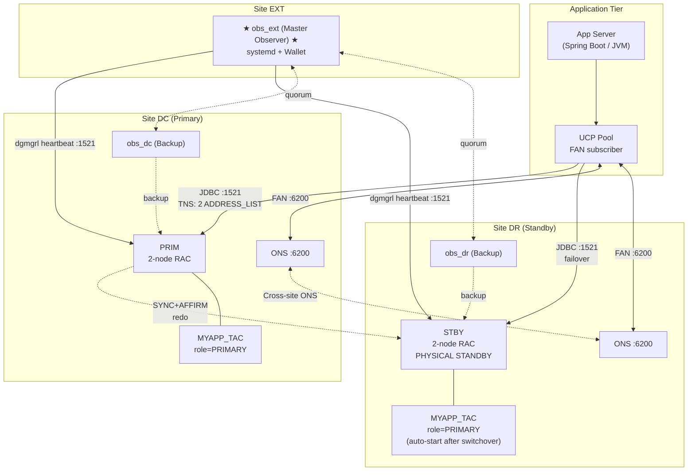
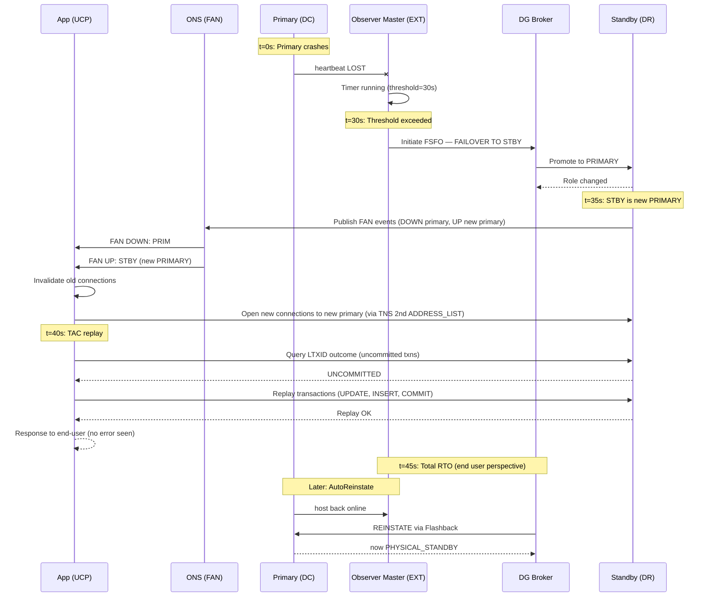

> 🇬🇧 English | [🇵🇱 Polski](./INTEGRATION-GUIDE_PL.md)

# 🔗 INTEGRATION-GUIDE.md — FSFO + TAC Integration


> How FSFO + TAC together deliver true zero-downtime failovers for OLTP applications.

**Author:** KCB Kris | **Date:** 2026-04-23 | **Version:** 1.0
**Related:** [README.md](../README.md) • [DESIGN.md](DESIGN.md) • [PLAN.md](PLAN.md) • [FSFO-GUIDE.md](FSFO-GUIDE.md) • [TAC-GUIDE.md](TAC-GUIDE.md)

---

## 📋 Table of Contents

1. [Why Both?](#1-why-both--dlaczego-obie)
2. [End-to-End Architecture](#2-end-to-end-architecture--architektura-end-to-end)
3. [Configuration Matrix](#3-configuration-matrix--macierz-konfiguracji)
4. [Failover Timeline](#4-failover-timeline--timeline-failovera)
5. [Implementation Order](#5-implementation-order--kolejność-wdrażania)
6. [Operational Runbook](#6-operational-runbook--runbook-operacyjny)
7. [Observer HA + TAC Integration](#7-observer-ha--tac-integration)
8. [Licensing Summary](#8-licensing-summary--podsumowanie-licencji)

---

## 1. Why Both?

### 1.1 The Zero-Downtime Stack

**FSFO** (Fast-Start Failover) — automatic **database** failover in ~30 seconds
**TAC** (Transparent Application Continuity) — automatic **transaction** replay, no application changes

Together:
- FSFO **detects** failure → triggers automatic switchover
- TAC **replays** in-flight transactions → applications do not see errors
- **Observer HA** **eliminates** single point of failure in the decision chain

### 1.2 What each mechanism covers

| Component | Scope | Auto-switches? | What it does |
|-----------|-------|----------------|--------------|
| **FSFO** | Database failover | ✅ (Observer decides) | Detect primary failure; switchover; reinstate |
| **TAC** | Application failover | ✅ (UCP handles) | Replay transactions; preserve session state |
| **FAN** | Event notification | ✅ (automatic) | Publish DOWN/UP events to UCP |
| **Observer HA** | FSFO decision HA | ✅ (quorum election) | 3 observers — someone always decides |
| **UCP** | Connection pool management | ✅ (subscribes to FAN) | Invalidate/recreate connections |

### 1.3 Without FSFO, without TAC, with both — comparison

| Configuration | RTO | RPO | Application errors | Manual ops? |
|--------------|-----|-----|--------------------|-------------|
| Data Guard + manual failover | minutes to hours | 0 (SYNC) | All sessions see errors | YES — DBA |
| DG + FSFO (no TAC) | ~30-45 s | 0 | Application sees `ORA-03113` or reconnect | NO for DB; YES for app |
| DG + TAC (manual failover) | minutes | 0 | Application does not see error (if TAC works) | YES — DBA |
| **DG + FSFO + TAC** (this project) | **≤ 45 s** | **0** | **NONE** (end-user does not see) | **NO** (fully automated) |

---

## 2. End-to-End Architecture

### 2.1 Combined FSFO + TAC Topology



### 2.2 What Happens During Failover — Component Interaction



### 2.3 Impact on RTO / RPO

| Metric | Value | Contributor |
|--------|-------|-------------|
| **RPO** | **0** | SYNC+AFFIRM transport; MaxAvailability protection |
| **Observer detection** | 0-30 s | `FastStartFailoverThreshold=30` |
| **FSFO execution** | ~5-10 s | Broker role change, open STBY as primary |
| **FAN propagation** | < 1 s | ONS push (cross-site) |
| **UCP reaction** | < 1 s | Pool invalidates bad connections |
| **TAC replay** | 1-5 s | Per-session replay w/ Transaction Guard |
| **Total RTO (typical)** | **~30-45 s** | End-user sees brief pause, no error |
| **Reinstate (background)** | ~2-5 min | Flashback + convert to standby |

---

## 3. Configuration Matrix

### 3.1 What to Configure Where

| Component | Where | Key Settings | Configured by |
|-----------|-------|--------------|----------------|
| **DG Broker** | PRIM + STBY (each RAC node) | `dg_broker_start=TRUE`, `dg_broker_config_file1/2` | DBA |
| **Static listener** | PRIM + STBY (each RAC node) | `listener.ora` with `PRIM_DGMGRL`/`STBY_DGMGRL` GLOBAL_DBNAME | DBA + Network |
| **Broker config** | PRIM (primary), broker syncs to STBY | `CREATE CONFIGURATION`, `ADD DATABASE`, `LogXptMode=SYNC` | DBA |
| **FSFO properties** | DG Broker only (one per config) | `FastStartFailoverThreshold`, `LagLimit`, `AutoReinstate` | DBA |
| **Observer** | 3 dedicated hosts (DC/DR/EXT) | systemd unit, wallet, `ADD OBSERVER` in broker | DBA + SysOps |
| **TAC Service** | PRIM + STBY (role-based) | `failover_type=TRANSACTION`, `commit_outcome=TRUE`, `session_state=DYNAMIC` | DBA |
| **ONS** | Each RAC node (DC + DR) | `srvctl modify ons -remoteservers` cross-site | DBA + Network |
| **UCP Pool** | Application server | `FastConnectionFailoverEnabled`, `ONSConfiguration`, `ConnectionFactoryClassName` | App team + DBA |
| **FAN** | Auto (part of DG + service) | `aq_ha_notifications=TRUE` on the service | DBA |
| **TNS aliases** | App servers + Observer hosts | 2× `ADDRESS_LIST` (DC+DR) + `FAILOVER=ON` | App + DBA |
| **Firewall** | Network layer | Ports 1521, 6200, 1522 bidirectional | Network |

### 3.2 Configuration Dependencies

```
┌──────────────────────────────────────────────────────────────┐
│                   Configuration order                         │
└──────────────────────────────────────────────────────────────┘

1. OS + Network setup (firewall, DNS, time sync)
          │
          ▼
2. Oracle software install (PRIM + STBY + 3× observer hosts)
          │
          ▼
3. DB instance on PRIM (primary role)
          │
          ▼
4. DB instance on STBY (standby from RMAN duplicate)
          │
          ▼
5. Data Guard manual config (log_archive_dest_X, SRL)
          │
          ▼
6. DG Broker enabled ─────────────────────┐
          │                               │
          ▼                               │
7. Broker CONFIGURATION + ADD DATABASE    │
          │                               │
          ▼                               │
8. Protection Mode = MAXAVAILABILITY      │
          │                               │
          ▼                               │
9. FSFO Properties ──────────────────────┘
          │
          ▼
10. Observer Wallets (3 hosts)
          │
          ▼
11. systemd units (3 hosts)
          │
          ▼
12. ADD OBSERVER + SET MASTEROBSERVER
          │
          ▼
13. ENABLE FAST_START FAILOVER
          │
          ▼
14. TAC Services (role-based) on PRIM + STBY
          │
          ▼
15. FAN / ONS cross-site
          │
          ▼
16. UCP configuration (app side)
          │
          ▼
17. End-to-end testing
          │
          ▼
18. Go-live + monitoring
```

---

## 4. Failover Timeline

### 4.1 Automatic Failover Event Sequence

| Time | Event | Component |
|------|-------|-----------|
| **t=0s** | Primary crash (instance/network/host) | Primary |
| t=0-1s | Heartbeat lost | Observer |
| t=1-30s | Observer waits (FastStartFailoverThreshold) | Observer |
| **t=30s** | Threshold exceeded, FSFO initiates | Observer |
| t=30-32s | `FAILOVER TO STBY` sent to Broker | Observer → Broker |
| t=32-35s | Broker promotes STBY to PRIMARY | Broker + STBY |
| t=35-36s | New PRIMARY opens | STBY (now PRIMARY) |
| t=36-37s | Services start on new PRIMARY (role-based) | srvctl + CRS |
| t=37-38s | FAN events published (DOWN old + UP new) | ONS |
| t=38-39s | UCP receives FAN events | App + ONS |
| t=39-40s | UCP invalidates old connections | App (UCP) |
| t=40-42s | UCP opens new connections to new primary | App (UCP) |
| t=42-45s | TAC replays in-flight transactions (per-session) | App + Transaction Guard |
| **t=45s** | **Application responds normally — end-user sees brief pause, no error** | — |
| t=45s+ | Background: AutoReinstate of old primary | Broker + old PRIM |

### 4.2 Timing Breakdown (Mermaid)

```mermaid
gantt
    dateFormat X
    axisFormat %s
    title End-to-end Failover Timeline

    section Detect
    Heartbeat lost (observer waits)     :0, 30

    section FSFO Execute
    Broker switchover to STBY           :30, 5
    New primary opens                   :35, 2

    section FAN
    Publish DOWN/UP events              :37, 1

    section UCP
    Invalidate bad connections          :38, 1
    Open new connections                :39, 2

    section TAC Replay
    Per-session transaction replay      :41, 4

    section End
    App responds (user sees short pause):45, 1
```



### 4.3 Comparison: With vs Without FSFO+TAC

| Step | Without FSFO | Without TAC | With FSFO + TAC |
|------|--------------|-------------|------------------|
| Detect | DBA paged (minutes) | N/A (automatic) | Observer 0-30s |
| Decide | DBA decision (minutes-hours) | N/A | Observer 30s |
| Execute | Manual `FAILOVER` commands | Auto | Auto ~5s |
| Reconnect app | Application restart (minutes) | Auto (UCP) | Auto <1s |
| Recover txns | Manual re-entry by user | Errors shown, user retries | Auto replay ~5s |
| **Total** | **30 min – 2 h** | **~60s (with errors)** | **~45s (no errors)** |

---

## 5. Implementation Order

Detailed schedule: [PLAN.md](PLAN.md).

**Short order:**

1. **Phase 0** (Week 1) — Diagnostics + license audit + network
2. **Phase 1** (Weeks 2-3) — DG Broker setup + manual switchover test
3. **Phase 2** (Weeks 4-5) — FSFO properties + 3× Observer deployment + auto-failover test
4. **Phase 3** (Week 6) — TAC services (role-based)
5. **Phase 4** (Weeks 7-9) — UCP integration + FAN cross-site + ONS firewall
6. **Phase 5** (Weeks 10-13) — Integration testing (10 test cases)
7. **Phase 6** (Ongoing) — Go-live + monitoring + quarterly drill

---

## 6. Operational Runbook

### 6.1 Planned Switchover (FSFO-aware)

A planned switchover with FSFO active — the broker performs it safely without triggering auto-failover.

```bash
# On the DBA laptop (with sqlconn.sh in PATH)

# Step 1: Pre-flight check
sqlconn.sh -s PRIM -f sql/fsfo_broker_status.sql
# Expected: SUCCESS, FSFO ENABLED, Observer connected

# Step 2: Switchover via dgmgrl
dgmgrl /@PRIM_ADMIN <<EOF
SHOW CONFIGURATION;
SWITCHOVER TO STBY;
SHOW CONFIGURATION;
SHOW FAST_START FAILOVER;
EOF

# Step 3: Verify Observer reconnected
dgmgrl /@STBY_ADMIN "SHOW OBSERVER"
# Master Observer: obs_ext Connected

# Step 4: Verify TAC services migrated
srvctl status service -d STBY -s MYAPP_TAC
# Should be running on STBY (now PRIMARY)

# Step 5: Check transport in the opposite direction
sqlconn.sh -s STBY -f sql/fsfo_broker_status.sql
# Apply lag on PRIM (now STBY) should be 0
```

**Effect for the application:** Drain → switch → services up; TAC replays in-flight txns. **The user sees a brief pause, no error.**

### 6.2 Emergency Failover (manual, when Observer is down)

**Scenario:** All 3 observers are down + PRIM is down. The broker shows `WARNING`, FSFO `DISABLED - Observer is not running`.

```bash
# On the DBA laptop, if PRIM cannot be recovered:

dgmgrl /@STBY_ADMIN <<EOF
SHOW CONFIGURATION;

-- Option A: Graceful (waits for applied redo)
FAILOVER TO STBY;

-- Option B: Immediate (CAUTION: may cause data loss if lag > 0)
-- FAILOVER TO STBY IMMEDIATE;

SHOW CONFIGURATION;
EOF

# After the failover:
# - STBY is the new PRIMARY
# - the old PRIM is in ORA-16661 (needs reinstate)

# When the old PRIM comes back (host up + DB in MOUNT):
dgmgrl /@STBY_ADMIN "REINSTATE DATABASE PRIM"
```

### 6.3 Reinstatement After Failover

**Auto (default — `AutoReinstate=TRUE`):**

The broker will detect the old primary online by itself and perform reinstate. Required: Flashback ON, FRA available.

**Manual (when AutoReinstate=FALSE or Flashback OFF):**

```bash
# 1. The old PRIM must be in startup mount
ssh oracle@prim-node1 "sqlplus / as sysdba <<< 'STARTUP MOUNT'"

# 2. Reinstate
dgmgrl /@STBY_ADMIN "REINSTATE DATABASE PRIM"

# 3. After a few minutes
dgmgrl /@STBY_ADMIN "SHOW DATABASE PRIM"
# Expected: role=PHYSICAL STANDBY, status=SUCCESS

# 4. (Optionally) switchback to the original topology
dgmgrl /@STBY_ADMIN "SWITCHOVER TO PRIM"
```

### 6.4 Observer Maintenance

**Scenario:** an observer host (e.g. obs_ext) needs to be patched without impact on FSFO.

**Option A — HA observers (preferred):**

```bash
# Step 1: Check the current master
dgmgrl /@PRIM_ADMIN "SHOW OBSERVER"
# Master Observer: obs_ext

# Step 2: Preemptively switch master to obs_dc
dgmgrl /@PRIM_ADMIN "SET MASTEROBSERVER TO obs_dc"
# obs_ext is now backup

# Step 3: Stop obs_ext for maintenance
ssh host-ext-obs "sudo systemctl stop dgmgrl-observer-ext"

# Step 4: Patch the host, restart OS, ...

# Step 5: Start obs_ext
ssh host-ext-obs "sudo systemctl start dgmgrl-observer-ext"

# Step 6: Verify it has joined as backup
dgmgrl /@PRIM_ADMIN "SHOW OBSERVER"

# Step 7 (optional): restore as master
dgmgrl /@PRIM_ADMIN "SET MASTEROBSERVER TO obs_ext"
```

**Option B — Temporary FSFO disable (when HA observers do not work):**

```bash
# Step 1: Disable FSFO
dgmgrl /@PRIM_ADMIN "DISABLE FAST_START FAILOVER"

# Step 2: Stop observer
ssh host-ext-obs "sudo systemctl stop dgmgrl-observer-ext"

# ... perform maintenance ...

# Step 3: Start observer
ssh host-ext-obs "sudo systemctl start dgmgrl-observer-ext"

# Step 4: Re-enable FSFO
dgmgrl /@PRIM_ADMIN "ENABLE FAST_START FAILOVER"

# CAUTION: While FSFO is disabled, auto-failover does not work!
```

### 6.5 Patching with FSFO Active

Rolling Oracle RU with zero downtime:

```bash
# Step 1: Pre-flight
dgmgrl /@PRIM_ADMIN "SHOW CONFIGURATION"
dgmgrl /@PRIM_ADMIN "SHOW FAST_START FAILOVER"
# Expected: SUCCESS, ENABLED

# Step 2: Patch STBY first
# - Stop STBY1, apply patch, startup mount
# - Repeat for STBY2
# The broker will resume redo apply automatically

# Step 3: Verify
dgmgrl /@PRIM_ADMIN "SHOW DATABASE STBY"
# Expected: SUCCESS

# Step 4: Switchover PRIM → STBY
# (FSFO stays ENABLED — broker uses the new primary as target)
dgmgrl /@PRIM_ADMIN "SWITCHOVER TO STBY"

# Step 5: Patch the old PRIM (now STBY)
# - Stop, patch, startup mount, repeat for node 2

# Step 6: Switchback
dgmgrl /@STBY_ADMIN "SWITCHOVER TO PRIM"

# Step 7: Verify end-to-end
sqlconn.sh -s PRIM -f sql/validate_environment.sql
```

### 6.6 Troubleshooting Checklist

| Check | Command | Expected |
|-------|---------|----------|
| Broker config sync | `dgmgrl "SHOW CONFIGURATION"` | `SUCCESS` |
| FSFO status | `dgmgrl "SHOW FAST_START FAILOVER"` | `ENABLED` |
| Observer alive | `dgmgrl "SHOW OBSERVER"` | Master + 2 backups connected |
| Redo transport | `SELECT * FROM v$dataguard_stats WHERE name='transport lag'` | < 5 s |
| Apply lag | as above with `name='apply lag'` | < 30 s (LagLimit) |
| TAC service config | `srvctl config service -d PRIM -s MYAPP_TAC` | `failover_type=TRANSACTION`, `commit_outcome=TRUE` |
| FAN events | `SELECT name, aq_ha_notifications FROM dba_services` | `TRUE` for MYAPP_TAC |
| ONS cross-site | `srvctl config ons` | `Remote servers: stby-nodes:6200` |
| Replay stats | `SELECT * FROM gv$replay_stat_summary` | `requests_replayed > 0` after tests |
| UCP FAN subscription | App logs with `oracle.ucp.log=FINE` | FAN events received |

---

## 7. Observer HA + TAC Integration

### 7.1 How 3-Observer HA Interacts with TAC Failover

With 3 observers in DC/DR/EXT, failover has two levels of resilience:

1. **DB-level FSFO** — the Observer master initiates failover
2. **Observer-level HA** — if the master goes down, a backup takes over

These two levels operate independently and do not interfere with TAC.

### 7.2 Interaction scenarios

| Scenario | Single Observer | 3 Observer HA | Impact on TAC |
|----------|-----------------|----------------|---------------|
| Observer host down during failover | FSFO hangs (no decision maker); manual failover required | Backup observer takes over within ≤ 60s; FSFO and TAC operate normally | No change (UCP does not notice the observer) |
| Rolling observer maintenance | FSFO must be disabled for the duration of maintenance | Standby observer takes over; FSFO stays ENABLED | No change |
| 1 Observer failure during a PRIM outage | Auto-failover may NOT happen; DBA forced | Rolling observer maintains HA; FSFO operates correctly | No impact if TAC is configured correctly |
| All 3 observers fail simultaneously | N/A (had no HA) | FSFO ENABLED but **does not work** (no decision maker); alert to on-call | TAC **works** — replay reacts to FAN events if the primary itself published DOWN |
| Network partition: Master isolated | Undefined | Backup takes over; master may return as backup | No change |

### 7.3 3-Observer Failover Timeline

**Scenario:** The master observer (obs_ext) goes down at t=0.

| Time | Observer Master (obs_ext) | Observer Backup (obs_dc) | Observer Backup (obs_dr) | Primary state |
|------|---------------------------|---------------------------|---------------------------|----------------|
| t=0s | Crash (process terminated) | Watching (backup mode) | Watching (backup mode) | Primary still alive |
| t=1-10s | Dead | Detects master absence | Detects master absence | Primary still alive |
| t=10s | Dead | Initiates quorum vote | Participates in vote | Primary still alive |
| t=15s | Dead | **Becomes Master** | Remains Backup | Primary still alive |
| t=30s | Dead | Broker updated: Master=obs_dc | — | Primary still alive |
| t=60s | systemd restarts obs_ext (`Restart=on-failure`) | Master | Backup | Primary still alive |
| t=90s | obs_ext reconnects as Backup | Still Master | Backup | Primary still alive |

**Key point:** During this window (t=0 to t=15s) **FSFO does not work** — if the primary fails in this window, auto-failover will not trigger. However, this is a very short window (~15s), much shorter than the observer MTBF.

### 7.4 Best practices for Observer HA

1. **Master in third-site (EXT)** — minimizes the probability of a simultaneous PRIM+master outage
2. **3 observers, not 2** — provides quorum during network partitions
3. **Distributed networks:** each observer has its own network path to both DBs
4. **Observer heartbeat monitoring:** alert when `last_ping > 60s`
5. **systemd `Restart=on-failure`:** auto-restart after a crash
6. **Do not use the same wallet on all 3 observers** — one compromised wallet = all observers compromised

---

## 8. Licensing Summary

### 8.1 Oracle 19c Feature Licensing

| Feature | License Required | Notes |
|---------|-------------------|-------|
| Data Guard | **Enterprise Edition (EE)** | Built-in to EE; no extra option |
| DG Broker | **Enterprise Edition (EE)** | Part of DG; no extra option |
| FSFO | **Enterprise Edition (EE)** | Part of DG Broker; no extra option |
| Observer | **Enterprise Edition (EE)** | Part of DG Broker; but on a separate host does not require an RDBMS license if only `dgmgrl` runs there |
| Active Data Guard | **EE + ADG Option (separate)** | Read-only standby + real-time apply + fast incremental backup on standby; required for read-only offload |
| TAC | **Enterprise Edition (EE)** | Built-in to 19c; no extra option |
| AC (older mechanism) | **EE + RAC/RAC One Node** | Historically required RAC One Node or RAC |
| UCP (Universal Connection Pool) | **Free** | No license required |
| FAN | **Built into EE** | Requires Oracle DBMS; UCP relies on FAN for events |
| RAC | **EE + RAC Option** | Real Application Clusters; required for 2-node clustering |
| Multitenant (PDB/CDB) | **EE** (up to 3 PDBs) or + Multitenant Option (>3 PDBs) | CDB is required in 19c+ |

### 8.2 Key Licensing Notes

- FSFO + TAC — no additional license beyond Enterprise Edition.
- Active Data Guard option is separate — required only if you want a read-only standby (MYAPP_RO service with real-time apply).
- Observer host may not require an RDBMS license if it runs only `dgmgrl` (light client install). Consult your Oracle rep for specific licensing.
- Diagnostic Pack + Tuning Pack required for ASH/AWR monitoring (used in `fsfo_monitor.sql` section 7).

### 8.3 Cost optimization

- **Observer hosts** — lightweight; 2 vCPU / 4 GB RAM is enough; do not license RDBMS if you do not run a local database
- **Standby licensing** — Oracle DBaaS models differ; a Data Guard standby requires the same license as the primary (EE + RAC + options)
- **Alternative:** Oracle Database Standard Edition High Availability (SEHA) — basic active-passive for smaller budgets, but **does not support FSFO or TAC**

### 8.4 References

- [Oracle Database Licensing Information User Manual](https://docs.oracle.com/en/database/oracle/oracle-database/19/dblic/)
- [MAA Best Practices — Licensing Guide](https://www.oracle.com/database/technologies/high-availability/maa.html)
- [Oracle Support Note 1938215.1 — Database Options and Features](https://support.oracle.com)

---

**Document generated:** 2026-04-23 | **Author:** KCB Kris | **Version:** 1.0
**Related:** [FSFO-GUIDE.md](FSFO-GUIDE.md) • [TAC-GUIDE.md](TAC-GUIDE.md) • [PLAN.md](PLAN.md) • [DESIGN.md](DESIGN.md)
