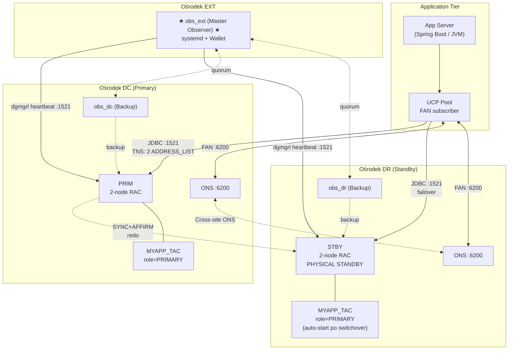
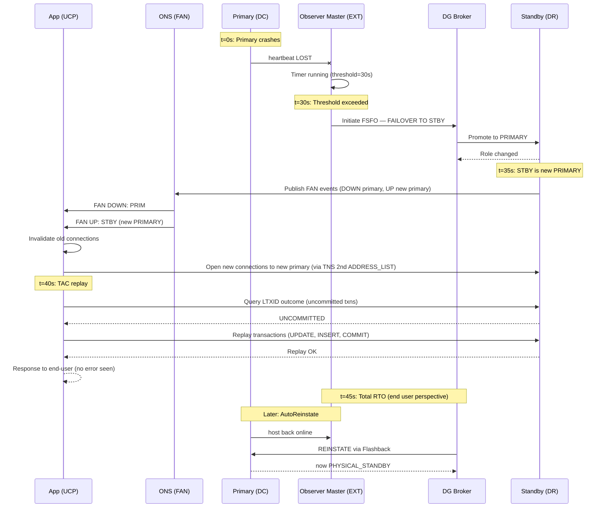

> [🇬🇧 English](./INTEGRATION-GUIDE.md) | 🇵🇱 Polski

# 🔗 INTEGRATION-GUIDE.md — FSFO + TAC Integration


> Jak FSFO + TAC razem dają prawdziwe zero-downtime failovers dla aplikacji OLTP.
> How FSFO + TAC together deliver true zero-downtime failovers for OLTP applications.

**Autor / Author:** KCB Kris | **Data / Date:** 2026-04-23 | **Wersja / Version:** 1.0
**Related:** [README.md](../README.md) • [DESIGN.md](DESIGN.md) • [PLAN.md](PLAN.md) • [FSFO-GUIDE.md](FSFO-GUIDE.md) • [TAC-GUIDE.md](TAC-GUIDE.md)

---

## 📋 Spis treści / Table of Contents

1. [Why Both? / Dlaczego obie?](#1-why-both--dlaczego-obie)
2. [End-to-End Architecture / Architektura end-to-end](#2-end-to-end-architecture--architektura-end-to-end)
3. [Configuration Matrix / Macierz konfiguracji](#3-configuration-matrix--macierz-konfiguracji)
4. [Failover Timeline / Timeline failovera](#4-failover-timeline--timeline-failovera)
5. [Implementation Order / Kolejność wdrażania](#5-implementation-order--kolejność-wdrażania)
6. [Operational Runbook](#6-operational-runbook--runbook-operacyjny)
7. [Observer HA + TAC Integration](#7-observer-ha--tac-integration)
8. [Licensing Summary / Podsumowanie licencji](#8-licensing-summary--podsumowanie-licencji)

---

## 1. Why Both? / Dlaczego obie?

### 1.1 The Zero-Downtime Stack

**FSFO** (Fast-Start Failover) — automatic **database** failover w ~30 sekund
**TAC** (Transparent Application Continuity) — automatic **transaction** replay, zero zmian w aplikacji

Razem:
- FSFO **detects** failure → triggers automatic switchover
- TAC **replays** in-flight transactions → aplikacje nie widzą błędów
- **Observer HA** **eliminates** single point of failure w łańcuchu decyzyjnym

### 1.2 Co pokrywa każdy mechanizm / What each mechanism covers

| Component | Zakres / Scope | Auto-switches? | Co robi |
|-----------|----------------|----------------|---------|
| **FSFO** | Database failover | ✅ (Observer decides) | Detect primary failure; switchover; reinstate |
| **TAC** | Application failover | ✅ (UCP handles) | Replay transactions; preserve session state |
| **FAN** | Event notification | ✅ (automatic) | Publish DOWN/UP events do UCP |
| **Observer HA** | FSFO decision HA | ✅ (quorum election) | 3 observery — zawsze ktoś decyduje |
| **UCP** | Connection pool management | ✅ (subscribes to FAN) | Invalidate/recreate connections |

### 1.3 Bez FSFO, bez TAC, z oboma — porównanie

| Konfiguracja | RTO | RPO | Application errors | Manual ops? |
|--------------|-----|-----|--------------------|-------------|
| Data Guard + manual failover | minuty do godzin | 0 (SYNC) | Wszystkie sesje widzą błąd | TAK — DBA |
| DG + FSFO (bez TAC) | ~30-45 s | 0 | Aplikacja widzi `ORA-03113` lub reconnect | NIE dla DB; TAK dla app |
| DG + TAC (manual failover) | minuty | 0 | Aplikacja nie widzi błędu (jeśli TAC działa) | TAK — DBA |
| **DG + FSFO + TAC** (this project) | **≤ 45 s** | **0** | **NONE** (end-user nie widzi) | **NIE** (fully automated) |

---

## 2. End-to-End Architecture / Architektura end-to-end

### 2.1 Combined FSFO + TAC Topology



### 2.2 What Happens During Failover — Component Interaction



### 2.3 Impact on RTO / RPO

| Metric | Value | Contributor |
|--------|-------|-------------|
| **RPO** | **0** | SYNC+AFFIRM transport; MaxAvailability protection |
| **Observer detection** | 0-30 s | `FastStartFailoverThreshold=30` |
| **FSFO execution** | ~5-10 s | Broker role change, open STBY jako primary |
| **FAN propagation** | < 1 s | ONS push (cross-site) |
| **UCP reaction** | < 1 s | Pool invalidates bad connections |
| **TAC replay** | 1-5 s | Per-session replay w/ Transaction Guard |
| **Total RTO (typical)** | **~30-45 s** | End-user sees brief pause, no error |
| **Reinstate (background)** | ~2-5 min | Flashback + convert to standby |

---

## 3. Configuration Matrix / Macierz konfiguracji

### 3.1 What to Configure Where / Co konfigurować gdzie

| Component | Where | Key Settings | Configured by |
|-----------|-------|--------------|----------------|
| **DG Broker** | PRIM + STBY (każdy node RAC) | `dg_broker_start=TRUE`, `dg_broker_config_file1/2` | DBA |
| **Static listener** | PRIM + STBY (każdy node RAC) | `listener.ora` z `PRIM_DGMGRL`/`STBY_DGMGRL` GLOBAL_DBNAME | DBA + Network |
| **Broker config** | PRIM (primary), broker sync'uje do STBY | `CREATE CONFIGURATION`, `ADD DATABASE`, `LogXptMode=SYNC` | DBA |
| **FSFO properties** | DG Broker only (jeden per config) | `FastStartFailoverThreshold`, `LagLimit`, `AutoReinstate` | DBA |
| **Observer** | 3 dedykowane hosty (DC/DR/EXT) | systemd unit, wallet, `ADD OBSERVER` w broker | DBA + SysOps |
| **TAC Service** | PRIM + STBY (role-based) | `failover_type=TRANSACTION`, `commit_outcome=TRUE`, `session_state=DYNAMIC` | DBA |
| **ONS** | Każdy RAC node (DC + DR) | `srvctl modify ons -remoteservers` cross-site | DBA + Network |
| **UCP Pool** | Application server | `FastConnectionFailoverEnabled`, `ONSConfiguration`, `ConnectionFactoryClassName` | App team + DBA |
| **FAN** | Auto (część DG + service) | `aq_ha_notifications=TRUE` na service | DBA |
| **TNS aliases** | App servers + Observer hosts | 2× `ADDRESS_LIST` (DC+DR) + `FAILOVER=ON` | App + DBA |
| **Firewall** | Network layer | Porty 1521, 6200, 1522 bidirectional | Network |

### 3.2 Configuration Dependencies / Zależności konfiguracji

```
┌──────────────────────────────────────────────────────────────┐
│                   Kolejność konfiguracji                      │
└──────────────────────────────────────────────────────────────┘

1. OS + Network setup (firewall, DNS, time sync)
          │
          ▼
2. Oracle software install (PRIM + STBY + 3× observer hosts)
          │
          ▼
3. DB instance on PRIM (primary role)
          │
          ▼
4. DB instance on STBY (standby from RMAN duplicate)
          │
          ▼
5. Data Guard manual config (log_archive_dest_X, SRL)
          │
          ▼
6. DG Broker enabled ─────────────────────┐
          │                               │
          ▼                               │
7. Broker CONFIGURATION + ADD DATABASE    │
          │                               │
          ▼                               │
8. Protection Mode = MAXAVAILABILITY      │
          │                               │
          ▼                               │
9. FSFO Properties ──────────────────────┘
          │
          ▼
10. Observer Wallets (3 hosts)
          │
          ▼
11. systemd units (3 hosts)
          │
          ▼
12. ADD OBSERVER + SET MASTEROBSERVER
          │
          ▼
13. ENABLE FAST_START FAILOVER
          │
          ▼
14. TAC Services (role-based) na PRIM + STBY
          │
          ▼
15. FAN / ONS cross-site
          │
          ▼
16. UCP configuration (app side)
          │
          ▼
17. End-to-end testing
          │
          ▼
18. Go-live + monitoring
```

---

## 4. Failover Timeline / Timeline failovera

### 4.1 Automatic Failover Event Sequence

| Time | Event [EN] | Zdarzenie [PL] | Component |
|------|------------|----------------|-----------|
| **t=0s** | Primary crash (instance/network/host) | Primary uległ awarii | Primary |
| t=0-1s | Heartbeat lost | Heartbeat utracony | Observer |
| t=1-30s | Observer waits (FastStartFailoverThreshold) | Observer czeka (threshold) | Observer |
| **t=30s** | Threshold exceeded, FSFO initiates | Threshold przekroczony, FSFO inicjuje | Observer |
| t=30-32s | `FAILOVER TO STBY` sent to Broker | `FAILOVER TO STBY` wysłane do Brokera | Observer → Broker |
| t=32-35s | Broker promotes STBY to PRIMARY | Broker promuje STBY do PRIMARY | Broker + STBY |
| t=35-36s | New PRIMARY opens | Nowy PRIMARY otwiera się | STBY (now PRIMARY) |
| t=36-37s | Services start on new PRIMARY (role-based) | Serwisy startują na nowym PRIMARY | srvctl + CRS |
| t=37-38s | FAN events published (DOWN old + UP new) | Eventy FAN publikowane | ONS |
| t=38-39s | UCP receives FAN events | UCP otrzymuje eventy FAN | App + ONS |
| t=39-40s | UCP invalidates old connections | UCP invaliduje stare połączenia | App (UCP) |
| t=40-42s | UCP opens new connections to new primary | UCP otwiera nowe połączenia | App (UCP) |
| t=42-45s | TAC replays in-flight transactions (per-session) | TAC odtwarza transakcje w locie | App + Transaction Guard |
| **t=45s** | **Application response normally — end-user sees brief pause, no error** | **Aplikacja odpowiada normalnie — user widzi krótką pauzę, bez błędu** | — |
| t=45s+ | Background: AutoReinstate of old primary | W tle: AutoReinstate starego primary | Broker + old PRIM |

### 4.2 Timing Breakdown (Mermaid)

```mermaid
gantt
    dateFormat X
    axisFormat %s
    title End-to-end Failover Timeline

    section Detect
    Heartbeat lost (observer waits)     :0, 30

    section FSFO Execute
    Broker switchover to STBY           :30, 5
    New primary opens                   :35, 2

    section FAN
    Publish DOWN/UP events              :37, 1

    section UCP
    Invalidate bad connections          :38, 1
    Open new connections                :39, 2

    section TAC Replay
    Per-session transaction replay      :41, 4

    section End
    App responds (user sees short pause):45, 1
```



### 4.3 Comparison: With vs Without FSFO+TAC

| Step | Without FSFO | Without TAC | With FSFO + TAC |
|------|--------------|-------------|------------------|
| Detect | DBA paged (minuty) | N/A (automatic) | Observer 0-30s |
| Decide | DBA decyzja (minuty-godziny) | N/A | Observer 30s |
| Execute | Manual `FAILOVER` polecenia | Auto | Auto ~5s |
| Reconnect app | Application restart (minuty) | Auto (UCP) | Auto <1s |
| Recover txns | Manual re-entry by user | Errors shown, user retries | Auto replay ~5s |
| **Total** | **30 min – 2 h** | **~60s (z errorami)** | **~45s (bez errorów)** |

---

## 5. Implementation Order / Kolejność wdrażania

Szczegółowy harmonogram: [PLAN.md](PLAN.md).

**Skrócona kolejność:**

1. **Phase 0** (Week 1) — Diagnostyka + audyt licencji + sieci
2. **Phase 1** (Weeks 2-3) — DG Broker setup + manual switchover test
3. **Phase 2** (Weeks 4-5) — FSFO properties + 3× Observer deployment + auto-failover test
4. **Phase 3** (Week 6) — TAC services (role-based)
5. **Phase 4** (Weeks 7-9) — UCP integracja + FAN cross-site + ONS firewall
6. **Phase 5** (Weeks 10-13) — Integration testing (10 test cases)
7. **Phase 6** (Ongoing) — Go-live + monitoring + kwartalny drill

---

## 6. Operational Runbook / Runbook operacyjny

### 6.1 Planned Switchover (FSFO-aware)

Planowany switchover z FSFO aktywnym — broker robi to bezpiecznie bez wywoływania auto-failover.

```bash
# Na laptopie DBA (z sqlconn.sh w PATH)

# Krok 1: Pre-flight check
sqlconn.sh -s PRIM -f sql/fsfo_broker_status.sql
# Spodziewane: SUCCESS, FSFO ENABLED, Observer connected

# Krok 2: Switchover przez dgmgrl
dgmgrl /@PRIM_ADMIN <<EOF
SHOW CONFIGURATION;
SWITCHOVER TO STBY;
SHOW CONFIGURATION;
SHOW FAST_START FAILOVER;
EOF

# Krok 3: Verify Observer reconnected
dgmgrl /@STBY_ADMIN "SHOW OBSERVER"
# Master Observer: obs_ext Connected

# Krok 4: Verify TAC services migrated
srvctl status service -d STBY -s MYAPP_TAC
# Should be running on STBY (teraz PRIMARY)

# Krok 5: Check transport w drugą stronę
sqlconn.sh -s STBY -f sql/fsfo_broker_status.sql
# Apply lag na PRIM (teraz STBY) powinien być 0
```

**Efekt dla aplikacji:** Drain → switch → services up; TAC replay'uje in-flight txns. **User widzi krótką pauzę, bez błędu.**

### 6.2 Emergency Failover (manual, gdy Observer down)

**Scenariusz:** Wszystkie 3 observery padły + PRIM padł. Broker widzi `WARNING`, FSFO `DISABLED - Observer is not running`.

```bash
# Na laptopie DBA, jeśli PRIM nie da się przywrócić:

dgmgrl /@STBY_ADMIN <<EOF
SHOW CONFIGURATION;

-- Option A: Graceful (czeka na applied redo)
FAILOVER TO STBY;

-- Option B: Immediate (UWAGA: może być data loss jeśli lag > 0)
-- FAILOVER TO STBY IMMEDIATE;

SHOW CONFIGURATION;
EOF

# Po failoverze:
# - STBY jest nowym PRIMARY
# - stary PRIM w stanie ORA-16661 (needs reinstate)

# Gdy stary PRIM wróci (host up + DB w MOUNT):
dgmgrl /@STBY_ADMIN "REINSTATE DATABASE PRIM"
```

### 6.3 Reinstatement After Failover

**Auto (domyślnie — `AutoReinstate=TRUE`):**

Broker sam wykryje stary primary online i zrobi reinstate. Wymagane: Flashback ON, FRA dostępna.

**Manual (gdy AutoReinstate=FALSE lub Flashback OFF):**

```bash
# 1. Stary PRIM musi być startup mount
ssh oracle@prim-node1 "sqlplus / as sysdba <<< 'STARTUP MOUNT'"

# 2. Reinstate
dgmgrl /@STBY_ADMIN "REINSTATE DATABASE PRIM"

# 3. Po kilku minutach
dgmgrl /@STBY_ADMIN "SHOW DATABASE PRIM"
# Expected: role=PHYSICAL STANDBY, status=SUCCESS

# 4. (Opcjonalnie) switchback do oryginalnej topologii
dgmgrl /@STBY_ADMIN "SWITCHOVER TO PRIM"
```

### 6.4 Observer Maintenance

**Scenariusz:** trzeba zpatchować host observera (np. obs_ext) bez wpływu na FSFO.

**Opcja A — HA observers (preferowana):**

```bash
# Krok 1: Check obecny master
dgmgrl /@PRIM_ADMIN "SHOW OBSERVER"
# Master Observer: obs_ext

# Krok 2: Preemptively switch master na obs_dc
dgmgrl /@PRIM_ADMIN "SET MASTEROBSERVER TO obs_dc"
# obs_ext teraz backup

# Krok 3: Stop obs_ext dla maintenance
ssh host-ext-obs "sudo systemctl stop dgmgrl-observer-ext"

# Krok 4: Patch host, restart OS, ...

# Krok 5: Start obs_ext
ssh host-ext-obs "sudo systemctl start dgmgrl-observer-ext"

# Krok 6: Sprawdź że dołączył jako backup
dgmgrl /@PRIM_ADMIN "SHOW OBSERVER"

# Krok 7 (opcjonalnie): przywróć jako master
dgmgrl /@PRIM_ADMIN "SET MASTEROBSERVER TO obs_ext"
```

**Opcja B — Temporary FSFO disable (gdy HA observers nie działa):**

```bash
# Krok 1: Disable FSFO
dgmgrl /@PRIM_ADMIN "DISABLE FAST_START FAILOVER"

# Krok 2: Stop observer
ssh host-ext-obs "sudo systemctl stop dgmgrl-observer-ext"

# ... perform maintenance ...

# Krok 3: Start observer
ssh host-ext-obs "sudo systemctl start dgmgrl-observer-ext"

# Krok 4: Re-enable FSFO
dgmgrl /@PRIM_ADMIN "ENABLE FAST_START FAILOVER"

# UWAGA: Podczas disable FSFO, auto-failover nie działa!
```

### 6.5 Patching with FSFO Active

Rolling Oracle RU z zero downtime:

```bash
# Krok 1: Pre-flight
dgmgrl /@PRIM_ADMIN "SHOW CONFIGURATION"
dgmgrl /@PRIM_ADMIN "SHOW FAST_START FAILOVER"
# Expected: SUCCESS, ENABLED

# Krok 2: Patch STBY first
# - Stop STBY1, apply patch, startup mount
# - Repeat dla STBY2
# Broker wznowi apply redo automatycznie

# Krok 3: Verify
dgmgrl /@PRIM_ADMIN "SHOW DATABASE STBY"
# Expected: SUCCESS

# Krok 4: Switchover PRIM → STBY
# (FSFO zostaje ENABLED — broker używa nowego primary jako target)
dgmgrl /@PRIM_ADMIN "SWITCHOVER TO STBY"

# Krok 5: Patch old PRIM (teraz STBY)
# - Stop, patch, startup mount, repeat dla node 2

# Krok 6: Switchback
dgmgrl /@STBY_ADMIN "SWITCHOVER TO PRIM"

# Krok 7: Verify end-to-end
sqlconn.sh -s PRIM -f sql/validate_environment.sql
```

### 6.6 Troubleshooting Checklist

| Check | Command | Expected |
|-------|---------|----------|
| Broker config sync | `dgmgrl "SHOW CONFIGURATION"` | `SUCCESS` |
| FSFO status | `dgmgrl "SHOW FAST_START FAILOVER"` | `ENABLED` |
| Observer alive | `dgmgrl "SHOW OBSERVER"` | Master + 2 backups connected |
| Redo transport | `SELECT * FROM v$dataguard_stats WHERE name='transport lag'` | < 5 s |
| Apply lag | jw. with `name='apply lag'` | < 30 s (LagLimit) |
| TAC service config | `srvctl config service -d PRIM -s MYAPP_TAC` | `failover_type=TRANSACTION`, `commit_outcome=TRUE` |
| FAN events | `SELECT name, aq_ha_notifications FROM dba_services` | `TRUE` dla MYAPP_TAC |
| ONS cross-site | `srvctl config ons` | `Remote servers: stby-nodes:6200` |
| Replay stats | `SELECT * FROM gv$replay_stat_summary` | `requests_replayed > 0` po testach |
| UCP FAN subscription | App logs with `oracle.ucp.log=FINE` | FAN events received |

---

## 7. Observer HA + TAC Integration

### 7.1 [EN] How 3-Observer HA Interacts with TAC Failover

Przy 3 observerach w DC/DR/EXT, failover ma dwa poziomy resilience:

1. **DB-level FSFO** — Observer master inicjuje failover
2. **Observer-level HA** — jeśli master pada, backup przejmuje rolę

Te dwa poziomy działają niezależnie i nie interferują z TAC.

### 7.2 Scenariusze interakcji

| Scenariusz | Single Observer | 3 Observer HA | Impact on TAC |
|------------|------------------|----------------|---------------|
| Observer host down podczas failovera | FSFO zawiesza się (brak decision maker); manual failover wymagany | Backup observer przejmuje w ≤ 60s; FSFO i TAC działają normalnie | Brak zmiany (UCP nie zauważa observer'a) |
| Rolling observer maintenance | FSFO trzeba wyłączyć na czas maintenance | Stay observer przejmuje; FSFO zostaje ENABLED | Brak zmiany |
| 1 Observer failure w trakcie awarii PRIM | Auto-failover może się NIE zdarzyć; DBA wymuszany | Rollback observer maintains HA; FSFO operates correctly | Brak wpływu jeśli TAC poprawnie configured |
| Wszystkie 3 observery padają równocześnie | N/A (nie miał HA) | FSFO ENABLED ale **nie działa** (brak decision makera); alert do on-call | TAC **działa** — replay reagent na FAN events jeśli primary sam upublicznił DOWN |
| Network partition: Master izolowany | Niezdefiniowany | Backup przejmuje; master może wrócić jako backup | Brak zmiany |

### 7.3 3-Observer Failover Timeline

**Scenariusz:** Master observer (obs_ext) pada w czasie t=0.

| Time | Observer Master (obs_ext) | Observer Backup (obs_dc) | Observer Backup (obs_dr) | Primary state |
|------|---------------------------|---------------------------|---------------------------|----------------|
| t=0s | Crash (process terminated) | Watching (backup mode) | Watching (backup mode) | Primary still alive |
| t=1-10s | Dead | Detects master absence | Detects master absence | Primary still alive |
| t=10s | Dead | Initiates quorum vote | Participates in vote | Primary still alive |
| t=15s | Dead | **Becomes Master** | Remains Backup | Primary still alive |
| t=30s | Dead | Broker updated: Master=obs_dc | — | Primary still alive |
| t=60s | systemd restarts obs_ext (`Restart=on-failure`) | Master | Backup | Primary still alive |
| t=90s | obs_ext reconnects as Backup | Still Master | Backup | Primary still alive |

**Kluczowe:** W tym okresie (t=0 do t=15s) **FSFO nie działa** — jeśli primary padnie w tym oknie, auto-failover nie zadziała. Jest to jednak bardzo krótkie okno (~15s), dużo krótsze niż MTBF observera.

### 7.4 Best practices dla Observer HA

1. **Master w third-site (EXT)** — minimalizuje prawdopodobieństwo równoczesnej awarii PRIM+master
2. **3 observery, nie 2** — zapewnia quorum przy partycjach sieciowych
3. **Rozproszone sieci:** każdy observer ma własną drogę sieciową do obu DB
4. **Monitoring heartbeatów observer'a:** alert gdy `last_ping > 60s`
5. **systemd `Restart=on-failure`:** auto-restart po crashu
6. **Nie używaj tego samego wallet'u na wszystkich 3 observerach** — jeden skompromitowany wallet = wszystkie observery skompromitowane

---

## 8. Licensing Summary / Podsumowanie licencji

### 8.1 Oracle 19c Feature Licensing

| Feature | License Required | Notes [EN] | Uwagi [PL] |
|---------|-------------------|-------------|-------------|
| Data Guard | **Enterprise Edition (EE)** | Built-in to EE; no extra option | Wbudowane w EE; brak dodatkowej opcji |
| DG Broker | **Enterprise Edition (EE)** | Part of DG; no extra option | Część DG; brak opcji |
| FSFO | **Enterprise Edition (EE)** | Part of DG Broker; no extra option | Część DG Broker; brak opcji |
| Observer | **Enterprise Edition (EE)** | Part of DG Broker; ale na oddzielnym hoście nie wymaga licencji RDBMS | Bez licencji na hoście, jeśli tylko `dgmgrl` |
| Active Data Guard | **EE + ADG Option (separate)** | Read-only standby + real-time apply + fast incremental backup on standby | Opcja dodatkowa; wymagana dla read-only offload |
| TAC | **Enterprise Edition (EE)** | Built-in to 19c; no extra option | Wbudowane w 19c; brak opcji |
| AC (starszy mechanizm) | **EE + RAC/RAC One Node** | Historycznie wymagał RAC One Node lub RAC | — |
| UCP (Universal Connection Pool) | **Free** | No license required | Brak licencji wymaganej |
| FAN | **Built into EE** | Requires Oracle DBMS | UCP polega na FAN dla events |
| RAC | **EE + RAC Option** | Real Application Clusters | Wymagane dla 2-node clustering |
| Multitenant (PDB/CDB) | **EE** (up to 3 PDBs) lub + Multitenant Option (>3 PDBs) | CDB jest wymagany w 19c+ | — |

### 8.2 Key Licensing Notes

**[EN]**
- FSFO + TAC — no additional license beyond Enterprise Edition.
- Active Data Guard option is separate — required only if you want read-only standby (MYAPP_RO service with real-time apply).
- Observer host may not require RDBMS license if it runs only `dgmgrl` (light client install). Consult Oracle rep for specific licensing.
- Diagnostic Pack + Tuning Pack required for ASH/AWR monitoring (used in `fsfo_monitor.sql` section 7).

**[PL]**
- FSFO + TAC — bez dodatkowej licencji poza Enterprise Edition.
- Opcja Active Data Guard jest oddzielna — wymagana tylko jeśli chcemy read-only standby (usługa MYAPP_RO z real-time apply).
- Host Observer może nie wymagać licencji RDBMS, jeśli uruchamia tylko `dgmgrl` (lightweight client install). Skonsultuj z Oracle rep dla konkretnego licensingu.
- Diagnostic Pack + Tuning Pack wymagane dla monitoringu ASH/AWR (użyte w `fsfo_monitor.sql` sekcja 7).

### 8.3 Cost optimization

- **Observer hosts** — lightweight; 2 vCPU / 4 GB RAM wystarczy; nie licencjonuj RDBMS jeśli nie uruchamiasz lokalnej bazy
- **Standby licensing** — Oracle Dbaas modele różnią się; standby w Data Guard wymaga tej samej licencji co primary (EE + RAC + opcje)
- **Alternative:** Oracle Database Standard Edition High Availability (SEHA) — basic active-passive dla mniejszych budżetów, ale **nie wspiera FSFO ani TAC**

### 8.4 References / Referencje

- [Oracle Database Licensing Information User Manual](https://docs.oracle.com/en/database/oracle/oracle-database/19/dblic/)
- [MAA Best Practices — Licensing Guide](https://www.oracle.com/database/technologies/high-availability/maa.html)
- [Oracle Support Note 1938215.1 — Database Options and Features](https://support.oracle.com)

---

**Document generated:** 2026-04-23 | **Author:** KCB Kris | **Version:** 1.0
**Related:** [FSFO-GUIDE.md](FSFO-GUIDE.md) • [TAC-GUIDE.md](TAC-GUIDE.md) • [PLAN.md](PLAN.md) • [DESIGN.md](DESIGN.md)
