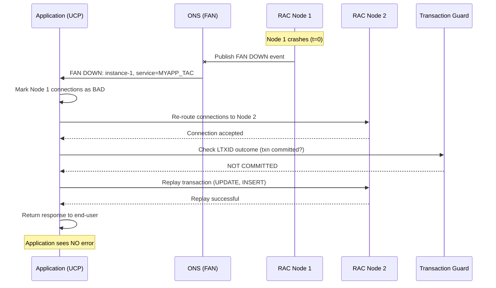

> 🇬🇧 English | [🇵🇱 Polski](./TAC-GUIDE_PL.md)

# 🔁 TAC-GUIDE.md — Transparent Application Continuity for Oracle 19c


> Complete deployment guide for Transparent Application Continuity — from prerequisites to monitoring.

**Author:** KCB Kris | **Date:** 2026-04-23 | **Version:** 1.0
**Related:** [README.md](../README.md) • [DESIGN.md](DESIGN.md) • [PLAN.md](PLAN.md) • [FSFO-GUIDE.md](FSFO-GUIDE.md) • [INTEGRATION-GUIDE.md](INTEGRATION-GUIDE.md)

---

## 📋 Table of Contents

1. [Introduction](#1-wprowadzenie--introduction)
2. [Architecture](#2-architektura--architecture)
3. [Prerequisites](#3-wymagania-wstępne--prerequisites)
4. [Service Configuration](#4-konfiguracja-service--service-configuration)
5. [UCP Configuration](#5-konfiguracja-ucp--ucp-configuration)
6. [FAN & ONS Setup](#6-fan--ons-setup)
7. [Transaction Guard](#7-transaction-guard)
8. [Testing](#8-testing--testowanie)
9. [Monitoring](#9-monitoring--monitorowanie)
10. [Troubleshooting & Best Practices](#10-troubleshooting--best-practices)

---

## 1. Introduction

### 1.1 What is TAC?

**Transparent Application Continuity (TAC)** is Oracle's feature (introduced in 19c) that **automatically replays in-flight transactions** after a database outage, without requiring any application code changes. TAC is the evolution of **Application Continuity (AC)** — AC required application-level changes (request boundaries, mutable object registration), while TAC handles everything transparently.

**Combined with FSFO, TAC enables true zero-downtime failovers** for OLTP applications.

### 1.2 TAC summary

**Transparent Application Continuity (TAC)** is an Oracle feature (introduced in 19c) that **automatically replays in-flight transactions** after a database outage — with no application code changes required. TAC is the evolution of **Application Continuity (AC)** — AC required application-side changes (request boundaries, mutable object registration); TAC does everything transparently.

**Combined with FSFO, TAC enables true zero-downtime failovers** for OLTP applications.

### 1.3 TAC vs AC vs Basic Failover

| Feature | Basic Failover (TAF) | Application Continuity (AC) | Transparent AC (TAC) |
|---------|----------------------|------------------------------|----------------------|
| Introduced | 8i | 12c | **19c** |
| Transaction replay | ❌ | ✅ | ✅ |
| Automatic request boundaries | ❌ | ❌ (manual) | ✅ (automatic) |
| Mutable objects handling | ❌ | Manual registration | Automatic |
| Session state preservation | ❌ | Partial (STATIC) | Full (DYNAMIC) |
| Changes to app code | — | Required | **None** |
| Pool integration | Not integrated | UCP only | UCP (recommended), some drivers |
| DML replay (UPDATE/INSERT) | ❌ | ✅ | ✅ |

### 1.4 Key 19c Enhancements

| Enhancement | Reason | Impact on TAC |
|-------------|--------|---------------|
| Automatic Request Boundaries | No app involvement — 19c detects end of request | Zero code changes required |
| Automatic Mutable Object Handling | SYSDATE, SYSTIMESTAMP, sequences auto-captured | No `DBMS_APP_CONT.REGISTER_CLIENT` for standard objects |
| Dynamic Session State | NLS, PL/SQL package vars, temp tables preserved | Replay works for stateful sessions |
| Multi-Instance Redo Apply (MIRA) | Faster failover via parallel redo apply on STBY | Shorter total RTO (FSFO + replay) |
| Active DG Read-only + TAC | Offload read-only on standby with replay | Scale reads without losing TAC on primary |

### 1.5 Industry Trends 2024-2026

| Trend | Impact on TAC |
|-------|---------------|
| Zero-downtime SLA (banks, fintech) | TAC = requirement; RTO < 1 s for applications |
| Connection pooling everywhere | UCP adoption is growing; HikariCP users migrate to UCP |
| Microservices + JDBC | Each service has its own pool — TAC per-service granularity |
| Active Data Guard as primary-or-standby | TAC works on both sides; real-time apply + replay |
| Cloud parity (OCI, Exadata Cloud) | TAC pre-configured in Autonomous DB; on-premise catching up |
| Observability / OpenTelemetry | Oracle adds trace-context for TAC replays (Oracle 23ai) |

---

## 2. Architecture

### 2.1 TAC Component Architecture

TAC spans four tiers:

1. **Application Tier** — Java app using UCP connection pool
2. **Network Tier** — SCAN listener (`:1521`) + ONS (`:6200`) for FAN events
3. **Database Tier** — RAC primary with TAC-enabled services (`failover_type=TRANSACTION`)
4. **Data Guard Tier** — Standby with mirror service configuration (role-based)

### 2.2 TAC Component Architecture (overview)

TAC spans four tiers:

1. **Application tier** — a Java application using a UCP connection pool
2. **Network tier** — SCAN listener (`:1521`) + ONS (`:6200`) for FAN events
3. **Database tier** — RAC primary with TAC services enabled
4. **Data Guard tier** — Standby with a mirrored configuration (role-based)

```
┌─────────────────────────────────────────────────────────────────┐
│                        APPLICATION TIER                          │
│                                                                  │
│   ┌──────────────────┐       ┌────────────────────┐              │
│   │  App / JVM       │ ────▶ │  UCP Pool          │              │
│   │                  │       │  (FAN Listener via │              │
│   │                  │       │   ONS subscriber)  │              │
│   └──────────────────┘       └─────────┬──────────┘              │
└─────────────────────────────────────────┼────────────────────────┘
                                          │
                                          ▼
┌─────────────────────────────────────────────────────────────────┐
│                         NETWORK TIER                             │
│                                                                  │
│   SCAN Listener (:1521)  —  JDBC connections                     │
│   ONS Port       (:6200)  —  FAN events (DOWN / UP / PLANNED)    │
└─────────────────────┬───────────────────┬───────────────────────┘
                      │                   │
                      ▼                   ▼
       ┌─────────────────────────┐   ┌─────────────────────────┐
       │      DATABASE TIER      │   │      STANDBY TIER       │
       │                         │   │                         │
       │      RAC PRIMARY        │ ─▶│      RAC STANDBY        │
       │      (PRIM @ DC)        │   │      (STBY @ DR)        │
       │                         │   │                         │
       │  Instance 1             │   │  Instance 1             │
       │  MYAPP_TAC service      │   │  MYAPP_TAC service      │
       │  (role = PRIMARY)       │   │  (role = PHYSICAL_      │
       │                         │   │          STANDBY)       │
       │  Transaction Guard      │   │                         │
       │  LTXID tracking         │   │  Multi-Instance         │
       │                         │   │  Redo Apply (MIRA)      │
       │  Instance 2             │   │                         │
       │  MYAPP_TAC service      │   │  Instance 2             │
       │                         │   │  MYAPP_TAC service      │
       └─────────────────────────┘   └─────────────────────────┘
              (redo transport: SYNC + AFFIRM, PRIMARY ──▶ STANDBY)
```

### 2.3 FAN Event Flow During Failover



### 2.4 ONS Topology for RAC + DG

**Critical:** ONS must be configured **cross-site** so that after a switchover/failover FAN events are delivered immediately to the UCP client.

```
PRIMARY SITE (DC)                         STANDBY SITE (DR)
┌──────────────────┐                     ┌──────────────────┐
│ Node 1 ONS (:6200)◄────────────────────►Node 1 ONS (:6200)│
│ Node 2 ONS (:6200)◄────────────────────►Node 2 ONS (:6200)│
└──────────────────┘                     └──────────────────┘
         ▲                                        ▲
         │                                        │
    FAN events                              FAN events
    (push to UCP)                           (push to UCP)
         │                                        │
         └────────┬───────────────────┬───────────┘
                  │                   │
                  ▼                   ▼
          ┌───────────────────────────────┐
          │     APPLICATION TIER          │
          │   UCP Pool                    │
          │   (subscribes to all 4 ONS)   │
          └───────────────────────────────┘
```

**Cross-site ONS configuration:** § 6.2.

---

## 3. Prerequisites

### 3.1 Database Tier

| # | Requirement | Command / Check |
|---|-------------|-----------------|
| 1 | Oracle 19c+ EE | `SELECT banner_full FROM v$version;` |
| 2 | Force logging enabled | `SELECT force_logging FROM v$database;` → `YES` |
| 3 | Flashback enabled (for reinstate) | `SELECT flashback_on FROM v$database;` → `YES` |
| 4 | `COMMIT_OUTCOME=TRUE` on service | `SELECT commit_outcome FROM dba_services;` |
| 5 | `RETENTION_TIMEOUT` set (seconds) | `SELECT retention_timeout FROM dba_services;` |
| 6 | SRL (Standby Redo Logs) | `SELECT COUNT(*) FROM v$standby_log;` ≥ N+1 |
| 7 | DG Broker started | `SELECT value FROM v$parameter WHERE name='dg_broker_start';` |
| 8 | AQ Notifications enabled | `SELECT aq_ha_notifications FROM dba_services;` |

### 3.2 Client Tier

| # | Requirement | Notes |
|---|-------------|-------|
| 1 | JDBC 19c+ | `ojdbc11.jar` (Java 11+) or `ojdbc8.jar` (Java 8) |
| 2 | UCP 19c+ | `ucp.jar` (from the same release as JDBC) |
| 3 | ONS client library | `ons.jar` (bundled with UCP) |
| 4 | Oracle Instant Client (for OCI) | Optional — only for JDBC OCI |
| 5 | Oracle Wallet (optional) | For SSL / strong authentication |

#### JDBC Thin vs OCI Comparison

| Feature | JDBC Thin | JDBC OCI |
|---------|-----------|----------|
| UCP Support | Full | Full |
| FAN Support | Via ONS (remote OMS) | Via ONS (local or remote) |
| Connection time | Fast | Faster (shared memory) |
| Deployment | Pure Java, no client | Requires Oracle Instant Client |
| Recommended for TAC | **Preferred** (simpler deployment) | OK (better performance, but requires IC) |

### 3.3 Application Tier

| # | Requirement | Notes |
|---|-------------|-------|
| 1 | Use the UCP connection pool | HikariCP/DBCP **do not fully support** TAC |
| 2 | No DDL inside the transaction | `CREATE`, `ALTER`, `DROP` — non-replayable |
| 3 | No external calls inside the transaction | REST, JMS, UTL_HTTP outside the transaction |
| 4 | Mutable objects registered (for custom ones) | Standard ones (SYSDATE, sequences) auto; custom via `DBMS_APP_CONT` |
| 5 | `session_state_consistency=DYNAMIC` | Preserves the full session state |

### 3.4 Network Tier

| # | Requirement | Port | Notes |
|---|-------------|------|-------|
| 1 | SCAN Listener | 1521 | For discovery + connection |
| 2 | ONS Port | 6200 | For FAN events (between RAC + cross-site) |
| 3 | VIP addresses | N/A | For failover at the RAC level |
| 4 | DNS for SCAN | N/A | SCAN resolves to 3 VIPs (per RAC) |
| 5 | Cross-site firewall (ONS) | 6200 bidirectional | PRIM↔STBY for FAN after switchover |

### 3.5 Diagnostic script

Before Phase 3, run:

```bash
sqlconn.sh -s PRIM -f sql/validate_environment.sql -o reports/PRIM_env.txt
```

`validate_environment.sql` performs **12 checks** for FSFO+TAC (details in [sql/validate_environment.sql](../sql/validate_environment.sql)).

---

## 4. Service Configuration

### 4.1 TAC Service Attributes

| Attribute | Value | Description |
|-----------|-------|-------------|
| `failover_type` | `TRANSACTION` | Enable transaction replay |
| `failover_method` | `NONE` | (TAC does not use the TAF method) |
| `failover_retries` | `30` | Number of reconnect attempts |
| `failover_delay` | `10` | Seconds between retries |
| `commit_outcome` | `TRUE` | Track commit outcomes (Transaction Guard) |
| `retention_timeout` | `86400` | Seconds to keep commit outcome (24h) |
| `replay_initiation_timeout` | `900` | Max seconds before replay starts |
| `session_state_consistency` | `DYNAMIC` | Preserve full session state |
| `drain_timeout` | `300` | Graceful drain before service stop |
| `aq_ha_notifications` | `TRUE` | Enable FAN notifications |
| `clb_goal` | `SHORT` | Connection load balancing — short duration |
| `notification` | `TRUE` | FAN enabled on the service |

### 4.2 Configuration via srvctl (RAC)

```bash
# === Create a new TAC service ===

srvctl add service -d PRIM -s MYAPP_TAC \
  -preferred PRIM1,PRIM2 \
  -failovertype TRANSACTION \
  -failoverretry 30 \
  -failoverdelay 10 \
  -replay_init_time 900 \
  -commit_outcome TRUE \
  -retention 86400 \
  -session_state DYNAMIC \
  -drain_timeout 300 \
  -stopoption IMMEDIATE \
  -role PRIMARY \
  -notification TRUE \
  -clbgoal SHORT

# === Start the service ===
srvctl start service -d PRIM -s MYAPP_TAC

# === Modify an existing service ===
srvctl modify service -d PRIM -s MYAPP_EXISTING \
  -failovertype TRANSACTION \
  -commit_outcome TRUE \
  -session_state DYNAMIC
```

### 4.3 Configuration via DBMS_SERVICE (Non-RAC / alternative)

```sql
-- [EN] Modify service attributes for TAC (Single Instance or alternative to srvctl)
-- [PL] Modyfikuj atrybuty service dla TAC (Single Instance lub alternatywa do srvctl)

BEGIN
  DBMS_SERVICE.MODIFY_SERVICE(
    service_name              => 'MYAPP_TAC',
    failover_method           => 'NONE',
    failover_type             => 'TRANSACTION',
    failover_retries          => 30,
    failover_delay            => 10,
    clb_goal                  => DBMS_SERVICE.CLB_GOAL_SHORT,
    aq_ha_notifications       => TRUE,
    commit_outcome            => TRUE,
    retention_timeout         => 86400,
    replay_initiation_timeout => 900,
    session_state_consistency => 'DYNAMIC',
    drain_timeout             => 300
  );
END;
/
```

### 4.4 Role-based Service for DG Switchover

**Key best practice:** Role-based services **automatically start only on the database in the appropriate role**. After a switchover the service migrates without manual intervention.

```bash
# === Service for PRIMARY role (RW) ===
# Starts only when the database has the PRIMARY role

srvctl add service -d PRIM -s MYAPP_TAC \
  -preferred PRIM1,PRIM2 \
  -role PRIMARY \
  -failovertype TRANSACTION \
  -commit_outcome TRUE \
  -session_state DYNAMIC \
  -notification TRUE

# === Service for STANDBY role (RO, if ADG) ===
# Starts only on PHYSICAL_STANDBY

srvctl add service -d PRIM -s MYAPP_RO \
  -preferred PRIM1 \
  -role PHYSICAL_STANDBY \
  -failovertype SELECT \
  -notification TRUE

# On STBY, mirror analogously:
srvctl add service -d STBY -s MYAPP_TAC \
  -preferred STBY1,STBY2 \
  -role PRIMARY \
  -failovertype TRANSACTION \
  -commit_outcome TRUE \
  -session_state DYNAMIC

srvctl add service -d STBY -s MYAPP_RO \
  -preferred STBY1 \
  -role PHYSICAL_STANDBY \
  -failovertype SELECT
```

### 4.5 Service Configuration Verification

```bash
# Verify configured TAC services
srvctl config service -d PRIM -s MYAPP_TAC

# Expected output includes:
# Management policy: AUTOMATIC
# Service role: PRIMARY
# Failover type: TRANSACTION
# Failover method:
# Failover retries: 30
# Failover delay: 10
# Failover restore: NONE
# Commit Outcome: true
# Retention: 86400 seconds
# Replay Initiation Time: 900 seconds
# Drain timeout: 300
# Stop option: IMMEDIATE
# Session State Consistency: DYNAMIC
# ...
```

From SQL:

```sql
SELECT name,
       failover_type        AS typ_failover,
       failover_method      AS metoda_failover,
       failover_retries     AS liczba_prob,
       commit_outcome       AS commit_outcome,
       retention_timeout    AS retencja_sek,
       session_state_consistency AS consistency_sesji,
       drain_timeout        AS drain_sek,
       aq_ha_notifications  AS fan_wlaczone
FROM   dba_services
WHERE  name = 'MYAPP_TAC';
```

### 4.6 Automation Script

Use [bash/tac_deploy.sh](../bash/tac_deploy.sh):

```bash
bash/tac_deploy.sh -s PRIM -d    # dry-run, show commands
bash/tac_deploy.sh -s PRIM       # actual deployment
```

---

## 5. UCP Configuration

### 5.1 Java UCP Pool Configuration

```java
import oracle.ucp.jdbc.PoolDataSourceFactory;
import oracle.ucp.jdbc.PoolDataSource;

// [EN] Create UCP data source with TAC support
// [PL] Utwórz UCP data source z obsługą TAC

PoolDataSource pds = PoolDataSourceFactory.getPoolDataSource();

// CRITICAL: this factory class enables replay support
pds.setConnectionFactoryClassName("oracle.jdbc.replay.OracleDataSourceImpl");

// Connection details
pds.setURL("jdbc:oracle:thin:@MYAPP_TAC");   // alias from tnsnames.ora
pds.setUser("appuser");
pds.setPassword(System.getenv("DB_PASSWORD"));   // never hardcode

// Pool sizing
pds.setInitialPoolSize(5);
pds.setMinPoolSize(5);
pds.setMaxPoolSize(50);

// Timeouts
pds.setConnectionWaitTimeout(10);                 // max wait for connection (sec)
pds.setInactiveConnectionTimeout(300);            // idle connection timeout
pds.setMaxConnectionReuseTime(600);               // recycle after 10 min (for load balancing)

// === FAN / Fast Connection Failover ===
pds.setFastConnectionFailoverEnabled(true);
pds.setONSConfiguration(
  "nodes=scan-dc:6200,scan-dr:6200"              // cross-site ONS
);

// === Validation ===
pds.setValidateConnectionOnBorrow(true);          // test before borrowing
pds.setSQLForValidateConnection("SELECT 1 FROM dual");

// === TAC-specific (optional) ===
pds.setConnectionProperty("oracle.jdbc.implicitStatementCacheSize", "25");
pds.setSecondsToTrustIdleConnection(30);

// Get a connection (transactions are replayed automatically)
Connection conn = pds.getConnection();
```

### 5.2 TNS String Template

```
MYAPP_TAC =
  (DESCRIPTION =
    (CONNECT_TIMEOUT = 5)
    (TRANSPORT_CONNECT_TIMEOUT = 3)
    (RETRY_COUNT = 3)
    (RETRY_DELAY = 1)
    (FAILOVER = ON)
    (ADDRESS_LIST =
      (LOAD_BALANCE = ON)
      (ADDRESS = (PROTOCOL = TCP)(HOST = scan-dc.corp.local)(PORT = 1521))
    )
    (ADDRESS_LIST =
      (LOAD_BALANCE = ON)
      (ADDRESS = (PROTOCOL = TCP)(HOST = scan-dr.corp.local)(PORT = 1521))
    )
    (CONNECT_DATA =
      (SERVICE_NAME = MYAPP_TAC)
    )
  )
```

**KEY:** Two `ADDRESS_LIST` blocks with `FAILOVER=ON` allow automatic reconnection to the standby after a switchover.

### 5.3 Spring Boot Configuration Example

**`application.yml`:**

```yaml
spring:
  datasource:
    type: oracle.ucp.jdbc.PoolDataSourceImpl
    oracleucp:
      connection-factory-class-name: oracle.jdbc.replay.OracleDataSourceImpl
      url: jdbc:oracle:thin:@MYAPP_TAC
      user: appuser
      password: ${DB_PASSWORD}
      initial-pool-size: 5
      min-pool-size: 5
      max-pool-size: 50
      connection-wait-timeout: 10
      inactive-connection-timeout: 300
      max-connection-reuse-time: 600
      validate-connection-on-borrow: true
      fast-connection-failover-enabled: true
      ons-configuration: nodes=scan-dc:6200,scan-dr:6200
```

**`pom.xml`:**

```xml
<dependency>
  <groupId>com.oracle.database.jdbc</groupId>
  <artifactId>ojdbc11</artifactId>
  <version>19.22.0.0</version>
</dependency>
<dependency>
  <groupId>com.oracle.database.jdbc</groupId>
  <artifactId>ucp11</artifactId>
  <version>19.22.0.0</version>
</dependency>
<dependency>
  <groupId>com.oracle.database.ons</groupId>
  <artifactId>ons</artifactId>
  <version>19.22.0.0</version>
</dependency>
```

### 5.4 Connection Properties Matrix

| Property | Value | Required for TAC | Description |
|----------|-------|-------------------|-------------|
| `FastConnectionFailoverEnabled` | `true` | **YES** | Enable FAN-based fast failover |
| `ONSConfiguration` | `nodes=host1:6200,host2:6200` | **YES** | ONS endpoints for FAN |
| `ValidateConnectionOnBorrow` | `true` | Recommended | Validate before borrowing |
| `ConnectionFactoryClassName` | `oracle.jdbc.replay.OracleDataSourceImpl` | **YES for replay** | The standard factory does not support TAC |
| `ConnectionWaitTimeout` | `10` | Recommended | Max wait for connection |
| `MaxConnectionReuseTime` | `600` | Recommended | Force pool recycle for balancing |
| `InitialPoolSize` | `5` | Recommended | Preload connections |

---

### 5.5 Other drivers (reference)

This project configures TAC for the **Java + UCP** stack (§ 5.1–5.4). If another stack is later required, the table below lists minimum driver versions supporting TAC/AC. Detailed configuration — Oracle's own docs; not duplicated here.

| Driver / Stack | Min. version | TAC/AC support | Notes |
|---|---|---|---|
| **JDBC Thin + UCP** | ojdbc8 19.3, UCP 19.x | Full TAC + FAN | **Recommended stack** — described in § 5.1–5.4 |
| **JDBC + HikariCP** | — | **No FAN integration** | Do not use with TAC — switch to UCP |
| **ODP.NET Managed** | 19.3 | Full TAC + FAN | `OracleConfiguration.FanEnabled = true` + `OnsConfiguration` |
| **ODP.NET Unmanaged** | 19.3 | Full TAC + FAN | Requires Oracle Client on the system |
| **python-oracledb** | 2.0 (thin) / 1.x (thick) | Thick: full; Thin: limited (no replay <2.0) | For full TAC, consider thick mode |
| **cx_Oracle** | 8.0+ (thick only) | Full TAC | Deprecated — migrate to `python-oracledb` |
| **node-oracledb** | 6.x (thick) | Full TAC | Thin mode (5.x) does not support replay |
| **OCI / Instant Client** | 19c+ | Base FAN; replay handled at higher layers | Foundation for thick-mode languages |

**Key limitation:** HikariCP (very popular in Spring Boot) **does not integrate with Oracle FAN**. For TAC in Spring Boot we use UCP (see § 5.3). For a legacy application that cannot migrate, we apply a fallback: FAN-based reconnect via ONS + `retry_count`/`retry_delay` in TNS, without mid-transaction replay.

**When to expand this section:** if a new application on .NET/Python/Node.js enters the portfolio and requires TAC — we will write a per-driver section with pool configuration and code examples (modeled on § 5.1–5.3).

---

## 6. FAN & ONS Setup

### 6.1 What is FAN?

**Fast Application Notification (FAN)** publishes events when the state of a database/service changes. UCP subscribes to those events through **ONS (Oracle Notification Service)** and reacts immediately — without waiting for a TCP timeout.

**FAN Event Types:**

| Event | Trigger | UCP Action |
|-------|---------|------------|
| `DOWN` | Instance crash, network failure | Immediate termination of bad connections |
| `UP` | Instance restart, service recovery | Open new connections to the recovered instance |
| `PLANNED_DOWN` | `srvctl stop`, rolling patch | Graceful session drain (drain_timeout) |

### 6.2 ONS Configuration

```bash
# On every RAC node (PRIM1, PRIM2, STBY1, STBY2)

# Check ONS status
srvctl status ons

# Start it if it is not running
srvctl start ons

# === KEY: Cross-site ONS ===
# On PRIM: add STBY as remote ONS
srvctl modify ons \
  -remoteservers stby-node1.corp.local:6200,stby-node2.corp.local:6200

# On STBY: add PRIM as remote ONS
srvctl modify ons \
  -remoteservers prim-node1.corp.local:6200,prim-node2.corp.local:6200

# Restart ONS
srvctl stop ons
srvctl start ons

# Verify
srvctl config ons
```

### 6.3 ONS Client Configuration (ons.config)

If the application does NOT have access to the Oracle Instant Client with `ons.jar`, an `ons.config` file can be used:

```
# Location: $ORACLE_HOME/opmn/conf/ons.config (cluster)
# Or: on the application side in the classpath

localhost=6100
remoteport=6200
nodes=scan-dc.corp.local:6200,scan-dr.corp.local:6200
```

### 6.4 Firewall Rules

| Source | Destination | Port | Protocol | Purpose |
|--------|-------------|------|----------|---------|
| App servers | RAC SCAN (DC, DR) | 1521 | TCP | Database connections |
| App servers | RAC nodes | 6200 | TCP | ONS / FAN events |
| RAC nodes (DC) | RAC nodes (DC) | 6200 | TCP | Inter-node ONS |
| RAC nodes (DR) | RAC nodes (DR) | 6200 | TCP | Inter-node ONS |
| **PRIM RAC** | **STBY RAC** | **6200** | **TCP** | **Cross-site ONS** |
| **STBY RAC** | **PRIM RAC** | **6200** | **TCP** | **Cross-site ONS** |
| PRIM RAC | STBY RAC | 1521 | TCP | Redo transport |
| STBY RAC | PRIM RAC | 1521 | TCP | Failover traffic |

**All directions in pairs are required** — a single firewall block stops FAN events.

### 6.5 Verify FAN Events

```sql
-- [EN] Check if FAN notifications enabled on service
-- [PL] Sprawdź czy FAN włączone na service

SELECT name AS nazwa_serwisu,
       aq_ha_notifications AS fan_wlaczone
FROM   dba_services
WHERE  name NOT LIKE 'SYS%'
ORDER  BY name;

-- Expected: TRUE for MYAPP_TAC

-- [EN] Check remote_listener and local_listener
-- [PL] Sprawdź remote_listener i local_listener

SHOW PARAMETER remote_listener;
SHOW PARAMETER local_listener;

-- remote_listener must point at SCAN
```

**Test FAN events from UCP logs (application):**

```bash
# In the application's log4j.properties / logback.xml
log4j.logger.oracle.ucp=FINE

# In application logs look for:
# FAN Event Received: DOWN instance=PRIM1, service=MYAPP_TAC
# FAN Event Received: UP instance=PRIM1, service=MYAPP_TAC
```

---

## 7. Transaction Guard

### 7.1 What is Transaction Guard?

**Transaction Guard (TG)** is the Oracle protocol for reliably determining the **commit outcome** — whether a transaction was **COMMITTED** or rolled back — when the application lost its connection in the middle of `COMMIT`. Without TG, the application does not know whether its `UPDATE ... COMMIT` actually went through.

### 7.2 How TG Works

1. **Application receives an LTXID** (Logical Transaction ID) on session open
2. The application executes DML + `COMMIT`
3. If the connection drops before the `COMMIT` ACK is received:
   - The application (via UCP) calls `DBMS_APP_CONT.GET_LTXID_OUTCOME(ltxid)`
   - It returns: `COMMITTED` (transaction succeeded) or `UNCOMMITTED` (safe to replay)
4. If `UNCOMMITTED` → TAC replays all operations since the last successful commit

### 7.3 LTXID and Commit Outcome Tracking

```sql
-- [EN] Verify COMMIT_OUTCOME=TRUE on service
-- [PL] Zweryfikuj że COMMIT_OUTCOME=TRUE na service

SELECT name,
       commit_outcome,
       retention_timeout
FROM   dba_services
WHERE  name = 'MYAPP_TAC';

-- Expected:
-- COMMIT_OUTCOME = TRUE
-- RETENTION_TIMEOUT = 86400 (24h)

-- [EN] Check Transaction Guard package exists and is valid
-- [PL] Sprawdź czy pakiet Transaction Guard istnieje i działa

SELECT object_name, object_type, status
FROM   dba_objects
WHERE  object_name = 'DBMS_APP_CONT'
  AND  object_type IN ('PACKAGE', 'PACKAGE BODY');

-- Expected: VALID for both

-- [EN] Check LTXID table size (grows with retention_timeout)
-- [PL] Sprawdź rozmiar tabeli LTXID

SELECT segment_name,
       ROUND(bytes/1024/1024, 2) AS mb
FROM   dba_segments
WHERE  segment_name LIKE '%LTXID%'
ORDER  BY bytes DESC;
```

### 7.4 Mutable Objects

**Mutable objects** — values that change between the original execution and the replay. TAC must "freeze" them so that the replay yields the same result.

| Mutable Object | TAC 19c Handling | Notes |
|----------------|------------------|-------|
| `SYSDATE` | Auto-captured | Same value on replay |
| `SYSTIMESTAMP` | Auto-captured | Same value on replay |
| `CURRENT_TIMESTAMP` | Auto-captured | Same as above |
| `SYS_GUID()` | Auto-captured | Same GUID on replay |
| Sequences (`NEXTVAL`) | Auto-captured | Same value on replay |
| `DBMS_RANDOM` | **Requires registration** | `DBMS_APP_CONT.REGISTER_CLIENT` |
| User-defined PL/SQL functions with state | **Requires registration** | Same as above |

**Registering custom mutable objects:**

```sql
-- [EN] Register application-specific mutable function
-- [PL] Zarejestruj application-specific mutable function

BEGIN
  DBMS_APP_CONT.REGISTER_CLIENT(
    client_name => 'myapp',
    function_name => 'get_next_order_id',
    side_effect_free => FALSE
  );
END;
/
```

### 7.5 Non-replayable Operations

| Operation | Why Not Replayable | Workaround |
|-----------|--------------------|-----------|
| `ALTER SESSION` inside a transaction | Session state diverges | Move it before the transaction |
| External calls (REST, JMS, UTL_HTTP) | Side effects | XA or compensating transaction |
| `DBMS_PIPE`, `DBMS_ALERT` | External messaging | Move outside the transaction |
| `UTL_SMTP`, `UTL_FILE` | External I/O | Move outside the transaction |
| DDL (`CREATE`, `ALTER`) | Auto-commit | Separate from the DML transaction |
| Multiple COMMITs in a PL/SQL loop | Multiple commit boundaries | Redesign as a single transaction |

**Detection:** the alert log shows `ORA-xxxx: session lost during replay due to non-replayable operation`.

---

## 8. Testing

### 8.1 Test Scenarios

| # | Scenario | How to simulate |
|---|----------|-----------------|
| T-1 | RAC instance failure | `ssh prim-node1 "shutdown abort"` |
| T-2 | Network partition | `iptables -A INPUT -s prim-node1 -j DROP` |
| T-3 | Service relocation | `srvctl relocate service -d PRIM -s MYAPP_TAC -i PRIM1 -t PRIM2` |
| T-4 | DG switchover | `dgmgrl> SWITCHOVER TO STBY` |
| T-5 | Planned maintenance (drain) | `srvctl stop service -d PRIM -s MYAPP_TAC -drain_timeout 300` |
| T-6 | Kill session | `ALTER SYSTEM KILL SESSION 'sid,serial#' IMMEDIATE;` |

### 8.2 Verification Steps

```sql
-- [EN] After killing instance, check for replayed sessions
-- [PL] Po zabiciu instancji, sprawdź czy sesje są odtwarzane

SELECT inst_id,
       sid,
       serial#,
       service_name    AS nazwa_serwisu,
       username        AS uzytkownik,
       failed_over     AS failover_wykonany,
       failover_type   AS typ_failover
FROM   gv$session
WHERE  failed_over = 'YES';

-- [EN] Check replay statistics (global)
-- [PL] Sprawdź statystyki replay (globalnie)

SELECT inst_id,
       requests_total      AS wszystkie_prosby,
       requests_replayed   AS replay_sukces,
       requests_failed     AS replay_bledy,
       CASE
         WHEN requests_total > 0
         THEN ROUND(requests_replayed * 100 / requests_total, 1)
         ELSE 0
       END                 AS pct_sukcesu
FROM   gv$replay_stat_summary
ORDER  BY inst_id;
```

### 8.3 Test Checklist

**Pre-test:**
- [ ] Service has `failover_type=TRANSACTION`
- [ ] UCP pool has `FastConnectionFailoverEnabled=true`
- [ ] `ConnectionFactoryClassName=oracle.jdbc.replay.OracleDataSourceImpl`
- [ ] Application running and executing transactions

**Test 1 (RAC instance crash):**
- [ ] `ssh prim-node1 "shutdown abort"`
- [ ] Application: **NO errors** (a brief pause is acceptable)
- [ ] `gv$session.failed_over = 'YES'` for some sessions

**Test 2 (DG switchover):**
- [ ] `dgmgrl> SWITCHOVER TO STBY`
- [ ] Application: max 1-5 s pause, then continues
- [ ] `gv$replay_stat_summary.requests_replayed > 0`

**Test 3 (Planned drain):**
- [ ] `srvctl stop service -d PRIM -s MYAPP_TAC -i PRIM1 -drain_timeout 300`
- [ ] Application: zero errors; new connections go to PRIM2
- [ ] After drain, all connections are on PRIM2

**Post-test:**
- [ ] No data loss (check end-to-end transaction counter)
- [ ] No duplicate transactions
- [ ] Alert log: no `ORA-3113` (end-of-file)

---

## 9. Monitoring

### 9.1 Key Views

| View | Purpose |
|------|---------|
| `GV$REPLAY_STAT_SUMMARY` | TAC replay statistics per instance |
| `DBA_SERVICES` | Service configuration attributes |
| `GV$SESSION` | Session replay status (failed_over) |
| `V$SESSION_CONNECT_INFO` | Client driver versions |
| `GV$DIAG_ALERT_EXT` | Alert log (TAC-related errors) |
| `DBA_CONN_FAILURES` | Connection failure tracking |

### 9.2 Monitoring Queries

```sql
-- [EN] TAC Replay success rate (run periodically)
-- [PL] Współczynnik sukcesu replay TAC (uruchamiać okresowo)

SELECT inst_id,
       requests_total          AS wszystkie_prosby,
       requests_replayed       AS replay_sukces,
       requests_failed         AS replay_bledy,
       CASE
         WHEN requests_total > 0
         THEN ROUND(requests_replayed * 100 / requests_total, 1)
         ELSE 0
       END                     AS pct_sukcesu,
       SYSDATE                 AS czas_odczytu
FROM   gv$replay_stat_summary;

-- [EN] Current TAC session count per service
-- [PL] Bieżąca liczba sesji TAC per service

SELECT service_name,
       COUNT(*)                AS liczba_sesji,
       SUM(CASE WHEN failover_type IS NOT NULL THEN 1 ELSE 0 END) AS sesje_z_failoverem,
       SUM(CASE WHEN failed_over = 'YES' THEN 1 ELSE 0 END)       AS sesje_po_failoverze
FROM   gv$session
WHERE  type = 'USER'
  AND  service_name IS NOT NULL
GROUP  BY service_name
ORDER  BY service_name;

-- [EN] Recent TAC-related alerts from alert log
-- [PL] Ostatnie alerty TAC z alert log

SELECT inst_id,
       originating_timestamp   AS czas,
       message_text            AS komunikat
FROM   gv$diag_alert_ext
WHERE  message_text LIKE '%TAC%'
   OR  message_text LIKE '%replay%'
   OR  message_text LIKE '%LTXID%'
ORDER  BY originating_timestamp DESC
FETCH  FIRST 50 ROWS ONLY;
```

### 9.3 Automated Monitoring Script

Run section 7 of [sql/fsfo_monitor.sql](../sql/fsfo_monitor.sql) every hour:

```bash
# crontab (on a host with sqlconn.sh in PATH)
0 * * * * sqlconn.sh -s PRIM -f sql/fsfo_monitor.sql -o /var/log/tac_mon_$(date +%Y%m%d_%H%M).txt
```

**Threshold alerts:** see [DESIGN § 7.4](DESIGN.md#74-tac-replay-success-rate).

---

## 10. Troubleshooting & Best Practices

### 10.1 Common Issues

| Problem | Possible Cause | Solution |
|---------|----------------|----------|
| Replay fails | Mutable state lost / non-replayable operation | Update `DBMS_APP_CONT.REGISTER_CLIENT`; review app code |
| Session state lost | Connection not preserved | Use UCP pool; avoid session-level state |
| Slow replay | Long query during replay | Tune replay-heavy workload; monitor `GV$SESSION` |
| Client does not see failover | FAN events not arriving | Check ONS connectivity; verify `nodes=` in `tnsnames.ora` |
| `ORA-03113` error | Missing `COMMIT_OUTCOME=TRUE` | `srvctl modify service ... -commit_outcome TRUE` |
| `ORA-25408` | Replay not available — upgrade JDBC | Upgrade JDBC to 19c; verify TAC-capable driver |
| FAN events "in a loop" | Service flapping | Check node stability; pool recycle time may be too short |

### 10.2 ORA Error Reference

| Error | Meaning | Action |
|-------|---------|--------|
| `ORA-25408` | Cannot safely replay call | Upgrade JDBC; verify the app does not call non-replayable ops |
| `ORA-00903` | Invalid table or view in replay | Check dynamic SQL; avoid DDL in transactions |
| `ORA-03113` | End-of-file on communication channel | `COMMIT_OUTCOME=TRUE` required; check on the service |
| `ORA-03114` | Not connected to Oracle | Connection invalidated — TAC should reconnect via the pool |
| `ORA-01041` | Internal error. hostdef extension doesn't exist | JDBC bug; upgrade JDBC driver |

### 10.3 Best Practices

**Database Configuration:**

1. **Always** `session_state_consistency=DYNAMIC` — preserves the full session state during replay
2. **Always** `commit_outcome=TRUE` — without it Transaction Guard does not work
3. **Drain gracefully** — `drain_timeout=300` (5 min) for planned operations
4. **Use SRL on STBY** — real-time apply is required for TAC + MIRA (multi-instance redo apply in 19c)

**Application Design:**

5. **UCP only** — HikariCP/DBCP do not fully support TAC
6. **No session-level cache** outside the pool — state must be replayable
7. **No DDL inside the transaction** — `CREATE/ALTER/DROP` auto-commit and are not replayable
8. **No external calls** (REST, JMS, UTL_HTTP) inside the transaction — non-replayable side effects
9. **Register custom mutable objects** via `DBMS_APP_CONT.REGISTER_CLIENT`

**Operational:**

10. **Monitor `GV$REPLAY_STAT_SUMMARY.requests_failed`** — signals app design issues
11. **Test drain** before production — `srvctl stop service -drain_timeout` should not produce application errors
12. **Audit logs** — rotation every 5 min; 90-day retention; AWR/ASH for replay tuning
13. **Network monitoring** — cross-site ONS port 6200 must always be open, with alerting on blocks

### 10.4 References

- [Transparent Application Continuity Technical Brief (Oracle White Paper)](https://www.oracle.com/a/tech/docs/tac-technical-brief.pdf)
- [Oracle MAA Application Continuity Best Practices](https://docs.oracle.com/en/database/oracle/oracle-database/19/dgbkr/)
- [UCP Developer's Guide 19c](https://docs.oracle.com/en/database/oracle/oracle-database/19/jjucp/)
- [MOS Note 2195896.1 — TAC Troubleshooting Guide]
- [MOS Note 1941880.1 — Configuring Application Continuity]

---

**Document generated:** 2026-04-23 | **Author:** KCB Kris | **Version:** 1.0
**Related:** [FSFO-GUIDE.md](FSFO-GUIDE.md) • [INTEGRATION-GUIDE.md](INTEGRATION-GUIDE.md) • [PLAN.md](PLAN.md) • [DESIGN.md](DESIGN.md)
