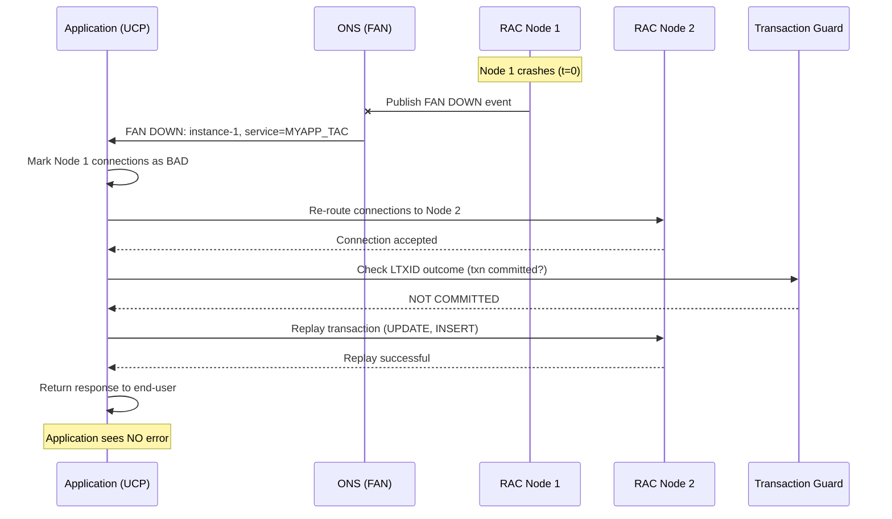

> [🇬🇧 English](./TAC-GUIDE.md) | 🇵🇱 Polski

# 🔁 TAC-GUIDE.md — Transparent Application Continuity dla Oracle 19c


> Kompletny poradnik wdrożeniowy Transparent Application Continuity — od prerekwizytów po monitoring.
> Complete deployment guide for Transparent Application Continuity — from prerequisites to monitoring.

**Autor / Author:** KCB Kris | **Data / Date:** 2026-04-23 | **Wersja / Version:** 1.0
**Related:** [README.md](../README.md) • [DESIGN.md](DESIGN.md) • [PLAN.md](PLAN.md) • [FSFO-GUIDE.md](FSFO-GUIDE.md) • [INTEGRATION-GUIDE.md](INTEGRATION-GUIDE.md)

---

## 📋 Spis treści / Table of Contents

1. [Wprowadzenie / Introduction](#1-wprowadzenie--introduction)
2. [Architektura / Architecture](#2-architektura--architecture)
3. [Wymagania wstępne / Prerequisites](#3-wymagania-wstępne--prerequisites)
4. [Konfiguracja Service / Service Configuration](#4-konfiguracja-service--service-configuration)
5. [Konfiguracja UCP / UCP Configuration](#5-konfiguracja-ucp--ucp-configuration)
6. [FAN & ONS Setup](#6-fan--ons-setup)
7. [Transaction Guard](#7-transaction-guard)
8. [Testing / Testowanie](#8-testing--testowanie)
9. [Monitoring / Monitorowanie](#9-monitoring--monitorowanie)
10. [Troubleshooting & Best Practices](#10-troubleshooting--best-practices)

---

## 1. Wprowadzenie / Introduction

### 1.1 [EN] What is TAC?

**Transparent Application Continuity (TAC)** is Oracle's feature (introduced in 19c) that **automatically replays in-flight transactions** after a database outage, without requiring any application code changes. TAC is the evolution of **Application Continuity (AC)** — AC required application-level changes (request boundaries, mutable object registration), while TAC handles everything transparently.

**Combined with FSFO, TAC enables true zero-downtime failovers** for OLTP applications.

### 1.2 [PL] Czym jest TAC?

**Transparent Application Continuity (TAC)** to funkcja Oracle (wprowadzona w 19c), która **automatycznie odtwarza transakcje w locie** po awarii bazy danych — bez konieczności wprowadzania zmian w kodzie aplikacji. TAC to ewolucja **Application Continuity (AC)** — AC wymagało zmian w aplikacji (request boundaries, rejestracja mutable objects), TAC robi wszystko transparentnie.

**Połączony z FSFO, TAC umożliwia prawdziwe zero-downtime failovers** dla aplikacji OLTP.

### 1.3 TAC vs AC vs Basic Failover

| Feature | Basic Failover (TAF) | Application Continuity (AC) | Transparent AC (TAC) |
|---------|----------------------|------------------------------|----------------------|
| Wprowadzone / Introduced | 8i | 12c | **19c** |
| Replay transakcji | ❌ | ✅ | ✅ |
| Automatic request boundaries | ❌ | ❌ (manual) | ✅ (automatic) |
| Mutable objects handling | ❌ | Manual registration | Automatic |
| Session state preservation | ❌ | Partial (STATIC) | Full (DYNAMIC) |
| Changes to app code | — | Required | **None** |
| Pool integration | Not integrated | UCP only | UCP (recommended), some drivers |
| DML replay (UPDATE/INSERT) | ❌ | ✅ | ✅ |

### 1.4 Key 19c Enhancements

| Enhancement | Reason [EN] | Impact on TAC |
|-------------|-------------|---------------|
| Automatic Request Boundaries | No app involvement — 19c detects end of request | Zero code changes required |
| Automatic Mutable Object Handling | SYSDATE, SYSTIMESTAMP, sequences auto-captured | No `DBMS_APP_CONT.REGISTER_CLIENT` for standard objects |
| Dynamic Session State | NLS, PL/SQL package vars, temp tables preserved | Replay works for stateful sessions |
| Multi-Instance Redo Apply (MIRA) | Faster failover via parallel redo apply on STBY | Shorter total RTO (FSFO + replay) |
| Active DG Read-only + TAC | Offload read-only on standby with replay | Scale reads without losing TAC on primary |

### 1.5 Industry Trends 2024-2026 / Trendy branżowe

| Trend | Wpływ na TAC |
|-------|--------------|
| Zero-downtime SLA (banki, fintech) | TAC = wymaganie; RTO < 1 s dla aplikacji |
| Connection pooling wszędzie | UCP adoption rośnie; HikariCP użytkownicy migrują do UCP |
| Microservices + JDBC | Każdy service ma własny pool — TAC per-service granularność |
| Active Data Guard as primary-or-standby | TAC działa na obu stronach; real-time apply + replay |
| Cloud parity (OCI, Exadata Cloud) | TAC pre-configured w Autonomous DB; on-premise dogania |
| Observability / OpenTelemetry | Oracle dodaje trace-context dla TAC replays (Oracle 23ai) |

---

## 2. Architektura / Architecture

### 2.1 [EN] TAC Component Architecture

TAC spans four tiers:

1. **Application Tier** — Java app using UCP connection pool
2. **Network Tier** — SCAN listener (`:1521`) + ONS (`:6200`) for FAN events
3. **Database Tier** — RAC primary with TAC-enabled services (`failover_type=TRANSACTION`)
4. **Data Guard Tier** — Standby with mirror service configuration (role-based)

### 2.2 [PL] TAC Component Architecture

TAC obejmuje cztery warstwy:

1. **Warstwa aplikacji** — aplikacja Java używająca UCP connection pool
2. **Warstwa sieci** — SCAN listener (`:1521`) + ONS (`:6200`) dla eventów FAN
3. **Warstwa bazy danych** — RAC primary z włączonymi TAC services
4. **Warstwa Data Guard** — Standby z lustrzaną konfiguracją (role-based)

```
┌─────────────────────────────────────────────────────────────────┐
│                        APPLICATION TIER                          │
│                                                                  │
│   ┌──────────────────┐       ┌────────────────────┐              │
│   │  App / JVM       │ ────▶ │  UCP Pool          │              │
│   │                  │       │  (FAN Listener via │              │
│   │                  │       │   ONS subscriber)  │              │
│   └──────────────────┘       └─────────┬──────────┘              │
└─────────────────────────────────────────┼────────────────────────┘
                                          │
                                          ▼
┌─────────────────────────────────────────────────────────────────┐
│                         NETWORK TIER                             │
│                                                                  │
│   SCAN Listener (:1521)  —  JDBC connections                     │
│   ONS Port       (:6200)  —  FAN events (DOWN / UP / PLANNED)    │
└─────────────────────┬───────────────────┬───────────────────────┘
                      │                   │
                      ▼                   ▼
       ┌─────────────────────────┐   ┌─────────────────────────┐
       │      DATABASE TIER      │   │      STANDBY TIER       │
       │                         │   │                         │
       │      RAC PRIMARY        │ ─▶│      RAC STANDBY        │
       │      (PRIM @ DC)        │   │      (STBY @ DR)        │
       │                         │   │                         │
       │  Instance 1             │   │  Instance 1             │
       │  MYAPP_TAC service      │   │  MYAPP_TAC service      │
       │  (role = PRIMARY)       │   │  (role = PHYSICAL_      │
       │                         │   │          STANDBY)       │
       │  Transaction Guard      │   │                         │
       │  LTXID tracking         │   │  Multi-Instance         │
       │                         │   │  Redo Apply (MIRA)      │
       │  Instance 2             │   │                         │
       │  MYAPP_TAC service      │   │  Instance 2             │
       │                         │   │  MYAPP_TAC service      │
       └─────────────────────────┘   └─────────────────────────┘
              (redo transport: SYNC + AFFIRM, PRIMARY ──▶ STANDBY)
```

### 2.3 FAN Event Flow During Failover / Przepływ zdarzeń FAN



### 2.4 ONS Topology for RAC + DG / Topologia ONS

**Krytyczne:** ONS musi być skonfigurowany **cross-site**, żeby po switchover/failover FAN events dostarczały się natychmiast do UCP klienta.

```
PRIMARY SITE (DC)                         STANDBY SITE (DR)
┌──────────────────┐                     ┌──────────────────┐
│ Node 1 ONS (:6200)◄────────────────────►Node 1 ONS (:6200)│
│ Node 2 ONS (:6200)◄────────────────────►Node 2 ONS (:6200)│
└──────────────────┘                     └──────────────────┘
         ▲                                        ▲
         │                                        │
    FAN events                              FAN events
    (push do UCP)                           (push do UCP)
         │                                        │
         └────────┬───────────────────┬───────────┘
                  │                   │
                  ▼                   ▼
          ┌───────────────────────────────┐
          │     APPLICATION TIER          │
          │   UCP Pool                    │
          │   (subscribes to all 4 ONS)   │
          └───────────────────────────────┘
```

**Konfiguracja cross-site ONS:** § 6.2.

---

## 3. Wymagania wstępne / Prerequisites

### 3.1 Database Tier / Warstwa bazy danych

| # | Requirement [EN] | Wymaganie [PL] | Command / Check |
|---|------------------|-----------------|-----------------|
| 1 | Oracle 19c+ EE | Oracle 19c+ EE | `SELECT banner_full FROM v$version;` |
| 2 | Force logging enabled | Force logging włączone | `SELECT force_logging FROM v$database;` → `YES` |
| 3 | Flashback enabled (dla reinstate) | Flashback włączony | `SELECT flashback_on FROM v$database;` → `YES` |
| 4 | `COMMIT_OUTCOME=TRUE` na service | `COMMIT_OUTCOME=TRUE` na service | `SELECT commit_outcome FROM dba_services;` |
| 5 | `RETENTION_TIMEOUT` ustawiony | `RETENTION_TIMEOUT` ustawiony (sekundy) | `SELECT retention_timeout FROM dba_services;` |
| 6 | SRL (Standby Redo Logs) | SRL | `SELECT COUNT(*) FROM v$standby_log;` ≥ N+1 |
| 7 | DG Broker uruchomiony | DG Broker uruchomiony | `SELECT value FROM v$parameter WHERE name='dg_broker_start';` |
| 8 | AQ Notifications enabled | AQ Notifications włączone | `SELECT aq_ha_notifications FROM dba_services;` |

### 3.2 Client Tier / Warstwa klienta

| # | Requirement [EN] | Wymaganie [PL] | Uwagi / Notes |
|---|------------------|-----------------|----------------|
| 1 | JDBC 19c+ | JDBC 19c+ | `ojdbc11.jar` (Java 11+) lub `ojdbc8.jar` (Java 8) |
| 2 | UCP 19c+ | UCP 19c+ | `ucp.jar` (z tego samego release co JDBC) |
| 3 | ONS client library | Biblioteka klienta ONS | `ons.jar` (bundled z UCP) |
| 4 | Oracle Instant Client (dla OCI) | Oracle Instant Client (dla OCI) | Opcjonalne — tylko dla JDBC OCI |
| 5 | Oracle Wallet (opcjonalne) | Oracle Wallet (opcjonalne) | Dla SSL / strong authentication |

#### JDBC Thin vs OCI Comparison

| Feature | JDBC Thin | JDBC OCI |
|---------|-----------|----------|
| UCP Support | Full | Full |
| FAN Support | Via ONS (remote OMS) | Via ONS (local or remote) |
| Connection time | Fast | Faster (shared memory) |
| Deployment | Pure Java, no client | Requires Oracle Instant Client |
| Recommended dla TAC | **Preferred** (prostsze deployment) | OK (lepsza perf., ale wymaga IC) |

### 3.3 Application Tier / Warstwa aplikacji

| # | Requirement [EN] | Wymaganie [PL] | Uwagi / Notes |
|---|------------------|-----------------|----------------|
| 1 | Używaj UCP connection pool | Używaj UCP connection pool | HikariCP/DBCP **nie wspierają** TAC w pełni |
| 2 | Brak DDL w transakcji | Brak DDL w transakcji | `CREATE`, `ALTER`, `DROP` — nie-replayowalne |
| 3 | Brak zewnętrznych wywołań w transakcji | Brak zewnętrznych wywołań w transakcji | REST, JMS, UTL_HTTP poza transakcją |
| 4 | Mutable objects zarejestrowane (dla custom) | Mutable objects zarejestrowane (dla custom) | Standardowe (SYSDATE, sequences) auto; custom przez `DBMS_APP_CONT` |
| 5 | `session_state_consistency=DYNAMIC` | `session_state_consistency=DYNAMIC` | Zachowuje pełny stan sesji |

### 3.4 Network Tier / Warstwa sieciowa

| # | Requirement [EN] | Port | Uwagi / Notes |
|---|------------------|------|----------------|
| 1 | SCAN Listener | 1521 | Dla discovery + connection |
| 2 | ONS Port | 6200 | Dla FAN events (między RAC + cross-site) |
| 3 | VIP addresses | N/A | Dla failover na poziomie RAC |
| 4 | DNS dla SCAN | N/A | SCAN resolves na 3 VIP (per RAC) |
| 5 | Firewall cross-site (ONS) | 6200 bidirectional | PRIM↔STBY dla FAN po switchover |

### 3.5 Skrypt diagnostyczny / Diagnostic script

Przed Phase 3 uruchom:

```bash
sqlconn.sh -s PRIM -f sql/validate_environment.sql -o reports/PRIM_env.txt
```

`validate_environment.sql` wykonuje **12 checks** FSFO+TAC (szczegóły w [sql/validate_environment.sql](../sql/validate_environment.sql)).

---

## 4. Konfiguracja Service / Service Configuration

### 4.1 TAC Service Attributes

| Attribute | Wartość / Value | Description [EN] | Opis [PL] |
|-----------|-----------------|------------------|-----------|
| `failover_type` | `TRANSACTION` | Enable transaction replay | Włącz replay transakcji |
| `failover_method` | `NONE` | (TAC nie używa TAF method) | (TAC nie używa TAF method) |
| `failover_retries` | `30` | Number of reconnect attempts | Liczba prób ponownego połączenia |
| `failover_delay` | `10` | Seconds between retries | Sekundy między próbami |
| `commit_outcome` | `TRUE` | Track commit outcomes (Transaction Guard) | Śledzenie wyników commit (TG) |
| `retention_timeout` | `86400` | Seconds to keep commit outcome | Sekundy retencji wyniku commit (24h) |
| `replay_initiation_timeout` | `900` | Max seconds before replay starts | Maks. sekund przed startem replay |
| `session_state_consistency` | `DYNAMIC` | Preserve full session state | Zachowaj pełny stan sesji |
| `drain_timeout` | `300` | Graceful drain before service stop | Łagodny drain przed stop service |
| `aq_ha_notifications` | `TRUE` | Enable FAN notifications | Włącz powiadomienia FAN |
| `clb_goal` | `SHORT` | Connection load balancing — short duration | Balansowanie połączeń — krótkie sesje |
| `notification` | `TRUE` | FAN enabled on service | FAN włączone dla service |

### 4.2 Configuration via srvctl (RAC)

```bash
# === Utworzenie nowego TAC service ===
# === Creating new TAC service ===

srvctl add service -d PRIM -s MYAPP_TAC \
  -preferred PRIM1,PRIM2 \
  -failovertype TRANSACTION \
  -failoverretry 30 \
  -failoverdelay 10 \
  -replay_init_time 900 \
  -commit_outcome TRUE \
  -retention 86400 \
  -session_state DYNAMIC \
  -drain_timeout 300 \
  -stopoption IMMEDIATE \
  -role PRIMARY \
  -notification TRUE \
  -clbgoal SHORT

# === Start service ===
srvctl start service -d PRIM -s MYAPP_TAC

# === Modify istniejącego service ===
srvctl modify service -d PRIM -s MYAPP_EXISTING \
  -failovertype TRANSACTION \
  -commit_outcome TRUE \
  -session_state DYNAMIC
```

### 4.3 Configuration via DBMS_SERVICE (Non-RAC / alternatywa)

```sql
-- [EN] Modify service attributes for TAC (Single Instance or alternative to srvctl)
-- [PL] Modyfikuj atrybuty service dla TAC (Single Instance lub alternatywa do srvctl)

BEGIN
  DBMS_SERVICE.MODIFY_SERVICE(
    service_name              => 'MYAPP_TAC',
    failover_method           => 'NONE',
    failover_type             => 'TRANSACTION',
    failover_retries          => 30,
    failover_delay            => 10,
    clb_goal                  => DBMS_SERVICE.CLB_GOAL_SHORT,
    aq_ha_notifications       => TRUE,
    commit_outcome            => TRUE,
    retention_timeout         => 86400,
    replay_initiation_timeout => 900,
    session_state_consistency => 'DYNAMIC',
    drain_timeout             => 300
  );
END;
/
```

### 4.4 Role-based Service dla DG Switchover

**Kluczowa best practice:** Role-based services **automatycznie uruchamiają się tylko na DB w odpowiedniej roli**. Po switchover service migruje bez interwencji.

```bash
# === Service for PRIMARY role (RW) ===
# Uruchamia się tylko gdy baza ma rolę PRIMARY

srvctl add service -d PRIM -s MYAPP_TAC \
  -preferred PRIM1,PRIM2 \
  -role PRIMARY \
  -failovertype TRANSACTION \
  -commit_outcome TRUE \
  -session_state DYNAMIC \
  -notification TRUE

# === Service for STANDBY role (RO, jeśli ADG) ===
# Uruchamia się tylko na PHYSICAL_STANDBY

srvctl add service -d PRIM -s MYAPP_RO \
  -preferred PRIM1 \
  -role PHYSICAL_STANDBY \
  -failovertype SELECT \
  -notification TRUE

# Na STBY analogicznie — mirror:
srvctl add service -d STBY -s MYAPP_TAC \
  -preferred STBY1,STBY2 \
  -role PRIMARY \
  -failovertype TRANSACTION \
  -commit_outcome TRUE \
  -session_state DYNAMIC

srvctl add service -d STBY -s MYAPP_RO \
  -preferred STBY1 \
  -role PHYSICAL_STANDBY \
  -failovertype SELECT
```

### 4.5 Service Configuration Verification

```bash
# Verify configured TAC services
srvctl config service -d PRIM -s MYAPP_TAC

# Expected output includes:
# Management policy: AUTOMATIC
# Service role: PRIMARY
# Failover type: TRANSACTION
# Failover method:
# Failover retries: 30
# Failover delay: 10
# Failover restore: NONE
# Commit Outcome: true
# Retention: 86400 seconds
# Replay Initiation Time: 900 seconds
# Drain timeout: 300
# Stop option: IMMEDIATE
# Session State Consistency: DYNAMIC
# ...
```

Z SQL:

```sql
SELECT name,
       failover_type        AS typ_failover,
       failover_method      AS metoda_failover,
       failover_retries     AS liczba_prob,
       commit_outcome       AS commit_outcome,
       retention_timeout    AS retencja_sek,
       session_state_consistency AS consistency_sesji,
       drain_timeout        AS drain_sek,
       aq_ha_notifications  AS fan_wlaczone
FROM   dba_services
WHERE  name = 'MYAPP_TAC';
```

### 4.6 Automation Script

Użyj [bash/tac_deploy.sh](../bash/tac_deploy.sh):

```bash
bash/tac_deploy.sh -s PRIM -d    # dry-run, pokaż komendy
bash/tac_deploy.sh -s PRIM       # faktyczne wdrożenie
```

---

## 5. Konfiguracja UCP / UCP Configuration

### 5.1 Java UCP Pool Configuration

```java
import oracle.ucp.jdbc.PoolDataSourceFactory;
import oracle.ucp.jdbc.PoolDataSource;

// [EN] Create UCP data source with TAC support
// [PL] Utwórz UCP data source z obsługą TAC

PoolDataSource pds = PoolDataSourceFactory.getPoolDataSource();

// KRYTYCZNE: Ten factory klass włącza replay support
pds.setConnectionFactoryClassName("oracle.jdbc.replay.OracleDataSourceImpl");

// Connection details
pds.setURL("jdbc:oracle:thin:@MYAPP_TAC");   // alias z tnsnames.ora
pds.setUser("appuser");
pds.setPassword(System.getenv("DB_PASSWORD"));   // nigdy nie hardcoduj

// Pool sizing
pds.setInitialPoolSize(5);
pds.setMinPoolSize(5);
pds.setMaxPoolSize(50);

// Timeouts
pds.setConnectionWaitTimeout(10);                 // max wait for connection (sec)
pds.setInactiveConnectionTimeout(300);            // idle connection timeout
pds.setMaxConnectionReuseTime(600);               // recycle after 10 min (dla load balancing)

// === FAN / Fast Connection Failover ===
pds.setFastConnectionFailoverEnabled(true);
pds.setONSConfiguration(
  "nodes=scan-dc:6200,scan-dr:6200"              // cross-site ONS
);

// === Validation ===
pds.setValidateConnectionOnBorrow(true);          // test przed wypożyczeniem
pds.setSQLForValidateConnection("SELECT 1 FROM dual");

// === TAC-specific (opcjonalne) ===
pds.setConnectionProperty("oracle.jdbc.implicitStatementCacheSize", "25");
pds.setSecondsToTrustIdleConnection(30);

// Get connection (transakcje replay'owane automatycznie)
Connection conn = pds.getConnection();
```

### 5.2 TNS String Template / Szablon TNS

```
MYAPP_TAC =
  (DESCRIPTION =
    (CONNECT_TIMEOUT = 5)
    (TRANSPORT_CONNECT_TIMEOUT = 3)
    (RETRY_COUNT = 3)
    (RETRY_DELAY = 1)
    (FAILOVER = ON)
    (ADDRESS_LIST =
      (LOAD_BALANCE = ON)
      (ADDRESS = (PROTOCOL = TCP)(HOST = scan-dc.corp.local)(PORT = 1521))
    )
    (ADDRESS_LIST =
      (LOAD_BALANCE = ON)
      (ADDRESS = (PROTOCOL = TCP)(HOST = scan-dr.corp.local)(PORT = 1521))
    )
    (CONNECT_DATA =
      (SERVICE_NAME = MYAPP_TAC)
    )
  )
```

**[EN] KEY:** Two `ADDRESS_LIST` blocks with `FAILOVER=ON` allow automatic reconnection to standby after switchover.
**[PL] KLUCZ:** Dwa bloki `ADDRESS_LIST` z `FAILOVER=ON` umożliwiają automatyczne przełączenie na standby po switchover.

### 5.3 Spring Boot Configuration Example

**`application.yml`:**

```yaml
spring:
  datasource:
    type: oracle.ucp.jdbc.PoolDataSourceImpl
    oracleucp:
      connection-factory-class-name: oracle.jdbc.replay.OracleDataSourceImpl
      url: jdbc:oracle:thin:@MYAPP_TAC
      user: appuser
      password: ${DB_PASSWORD}
      initial-pool-size: 5
      min-pool-size: 5
      max-pool-size: 50
      connection-wait-timeout: 10
      inactive-connection-timeout: 300
      max-connection-reuse-time: 600
      validate-connection-on-borrow: true
      fast-connection-failover-enabled: true
      ons-configuration: nodes=scan-dc:6200,scan-dr:6200
```

**`pom.xml`:**

```xml
<dependency>
  <groupId>com.oracle.database.jdbc</groupId>
  <artifactId>ojdbc11</artifactId>
  <version>19.22.0.0</version>
</dependency>
<dependency>
  <groupId>com.oracle.database.jdbc</groupId>
  <artifactId>ucp11</artifactId>
  <version>19.22.0.0</version>
</dependency>
<dependency>
  <groupId>com.oracle.database.ons</groupId>
  <artifactId>ons</artifactId>
  <version>19.22.0.0</version>
</dependency>
```

### 5.4 Connection Properties Matrix

| Property | Wartość / Value | Required dla TAC | Description |
|----------|-----------------|-------------------|-------------|
| `FastConnectionFailoverEnabled` | `true` | **YES** | Enable FAN-based fast failover |
| `ONSConfiguration` | `nodes=host1:6200,host2:6200` | **YES** | ONS endpoints dla FAN |
| `ValidateConnectionOnBorrow` | `true` | Recommended | Validate przed wypożyczeniem |
| `ConnectionFactoryClassName` | `oracle.jdbc.replay.OracleDataSourceImpl` | **YES for replay** | Standard factory nie wspiera TAC |
| `ConnectionWaitTimeout` | `10` | Recommended | Max wait for connection |
| `MaxConnectionReuseTime` | `600` | Recommended | Force pool recycle dla balansowania |
| `InitialPoolSize` | `5` | Recommended | Preload connections |

---

### 5.5 Inne drivery / Other drivers (reference)

Ten projekt konfiguruje TAC pod stack **Java + UCP** (§ 5.1–5.4). Jeśli w przyszłości pojawi się potrzeba podłączenia innego stacku, poniższa tabela określa minimalne wersje driverów wspierających TAC/AC. Pełna dokumentacja po stronie Oracle — nie duplikujemy jej tutaj.

This project configures TAC for the **Java + UCP** stack (§ 5.1–5.4). If another stack is later required, the table below lists minimum driver versions supporting TAC/AC. Detailed configuration — Oracle's own docs; not duplicated here.

| Driver / Stack | Min. wersja | TAC/AC support | Uwagi / Notes |
|---|---|---|---|
| **JDBC Thin + UCP** | ojdbc8 19.3, UCP 19.x | Full TAC + FAN | **Stack rekomendowany** — opisany w § 5.1–5.4 |
| **JDBC + HikariCP** | — | **Brak integracji z FAN** | Nie używać z TAC — przejść na UCP |
| **ODP.NET Managed** | 19.3 | Full TAC + FAN | `OracleConfiguration.FanEnabled = true` + `OnsConfiguration` |
| **ODP.NET Unmanaged** | 19.3 | Full TAC + FAN | Wymaga Oracle Client w systemie |
| **python-oracledb** | 2.0 (thin) / 1.x (thick) | Thick: pełne; Thin: ograniczone (bez replay <2.0) | Dla pełnego TAC rozważ thick mode |
| **cx_Oracle** | 8.0+ (thick only) | Full TAC | Deprecated — migruj do `python-oracledb` |
| **node-oracledb** | 6.x (thick) | Full TAC | Thin mode (5.x) nie wspiera replay |
| **OCI / Instant Client** | 19c+ | Base FAN; replay na warstwie wyżej | Fundament dla thick-mode języków |

**Kluczowe ograniczenie:** HikariCP (bardzo popularny w Spring Boot) **nie integruje się z Oracle FAN**. Dla TAC w Spring Boot używamy UCP (patrz § 5.3). Jeśli legacy aplikacja bez możliwości migracji — stosujemy fallback: FAN-based reconnect przez ONS + `retry_count`/`retry_delay` w TNS, bez replay mid-transaction.

**When to expand this section:** jeśli nowa aplikacja na .NET/Python/Node.js wejdzie do portfolio i będzie wymagać TAC — rozpiszemy per-driver sekcję z konfiguracją pool i przykładami kodu (na wzór § 5.1–5.3).

---

## 6. FAN & ONS Setup

### 6.1 What is FAN? / Czym jest FAN?

**Fast Application Notification (FAN)** publikuje zdarzenia gdy zmienia się stan bazy/serwisu. UCP subskrybuje te zdarzenia przez **ONS (Oracle Notification Service)** i natychmiast reaguje — bez czekania na TCP timeout.

**Typy zdarzeń FAN / FAN Event Types:**

| Event | Trigger | UCP Action |
|-------|---------|------------|
| `DOWN` | Instance crash, network failure | Natychmiastowe zakończenie bad connections |
| `UP` | Instance restart, service recovery | Otwarcie nowych connection do recovered instance |
| `PLANNED_DOWN` | `srvctl stop`, rolling patch | Graceful drain sesji (drain_timeout) |

### 6.2 ONS Configuration

```bash
# Na każdym node RAC (PRIM1, PRIM2, STBY1, STBY2)

# Sprawdź status ONS
srvctl status ons

# Start jeśli nie działa
srvctl start ons

# === KLUCZOWE: Cross-site ONS ===
# Na PRIM: dodaj STBY jako remote ONS
srvctl modify ons \
  -remoteservers stby-node1.corp.local:6200,stby-node2.corp.local:6200

# Na STBY: dodaj PRIM jako remote ONS
srvctl modify ons \
  -remoteservers prim-node1.corp.local:6200,prim-node2.corp.local:6200

# Restart ONS
srvctl stop ons
srvctl start ons

# Weryfikacja
srvctl config ons
```

### 6.3 ONS Client Configuration (ons.config)

Jeśli aplikacja NIE ma dostępu do Oracle Instant Client z `ons.jar`, można użyć pliku `ons.config`:

```
# Lokalizacja: $ORACLE_HOME/opmn/conf/ons.config (cluster)
# Lub: po stronie aplikacji w classpath

localhost=6100
remoteport=6200
nodes=scan-dc.corp.local:6200,scan-dr.corp.local:6200
```

### 6.4 Firewall Rules / Reguły firewall'a

| Source | Destination | Port | Protocol | Purpose |
|--------|-------------|------|----------|---------|
| App servers | RAC SCAN (DC, DR) | 1521 | TCP | Database connections |
| App servers | RAC nodes | 6200 | TCP | ONS / FAN events |
| RAC nodes (DC) | RAC nodes (DC) | 6200 | TCP | Inter-node ONS |
| RAC nodes (DR) | RAC nodes (DR) | 6200 | TCP | Inter-node ONS |
| **PRIM RAC** | **STBY RAC** | **6200** | **TCP** | **Cross-site ONS** |
| **STBY RAC** | **PRIM RAC** | **6200** | **TCP** | **Cross-site ONS** |
| PRIM RAC | STBY RAC | 1521 | TCP | Redo transport |
| STBY RAC | PRIM RAC | 1521 | TCP | Failover traffic |

**Wymagane są wszystkie kierunki w parach** — pojedynczy firewall block blokuje FAN events.

### 6.5 Verify FAN Events / Weryfikacja zdarzeń FAN

```sql
-- [EN] Check if FAN notifications enabled on service
-- [PL] Sprawdź czy FAN włączone na service

SELECT name AS nazwa_serwisu,
       aq_ha_notifications AS fan_wlaczone
FROM   dba_services
WHERE  name NOT LIKE 'SYS%'
ORDER  BY name;

-- Oczekiwane: TRUE dla MYAPP_TAC

-- [EN] Check remote_listener and local_listener
-- [PL] Sprawdź remote_listener i local_listener

SHOW PARAMETER remote_listener;
SHOW PARAMETER local_listener;

-- Remote_listener musi wskazywać na SCAN
```

**Test FAN events z UCP logs (aplikacja):**

```bash
# W log4j.properties / logback.xml aplikacji
log4j.logger.oracle.ucp=FINE

# W logach aplikacji szukaj:
# FAN Event Received: DOWN instance=PRIM1, service=MYAPP_TAC
# FAN Event Received: UP instance=PRIM1, service=MYAPP_TAC
```

---

## 7. Transaction Guard

### 7.1 What is Transaction Guard? / Czym jest Transaction Guard?

**Transaction Guard (TG)** to protokół Oracle do niezawodnego określania **wyniku commit'a** — czy transakcja **COMMITTED** czy została rolled back — gdy aplikacja straciła połączenie w trakcie `COMMIT`. Bez TG aplikacja nie wie, czy jej `UPDATE ... COMMIT` faktycznie przeszedł.

### 7.2 How TG Works / Jak działa TG

1. **Application receives LTXID** (Logical Transaction ID) przy otwarciu sesji
2. Application wykonuje DML + `COMMIT`
3. Jeśli połączenie padnie przed odebraniem ACK na `COMMIT`:
   - Application (przez UCP) wywołuje `DBMS_APP_CONT.GET_LTXID_OUTCOME(ltxid)`
   - Zwraca: `COMMITTED` (transakcja przeszła) lub `UNCOMMITTED` (safe to replay)
4. Jeśli `UNCOMMITTED` → TAC replay'uje wszystkie operacje od ostatniego successful commit'a

### 7.3 LTXID and Commit Outcome Tracking

```sql
-- [EN] Verify COMMIT_OUTCOME=TRUE on service
-- [PL] Zweryfikuj że COMMIT_OUTCOME=TRUE na service

SELECT name,
       commit_outcome,
       retention_timeout
FROM   dba_services
WHERE  name = 'MYAPP_TAC';

-- Expected:
-- COMMIT_OUTCOME = TRUE
-- RETENTION_TIMEOUT = 86400 (24h)

-- [EN] Check Transaction Guard package exists and is valid
-- [PL] Sprawdź czy pakiet Transaction Guard istnieje i działa

SELECT object_name, object_type, status
FROM   dba_objects
WHERE  object_name = 'DBMS_APP_CONT'
  AND  object_type IN ('PACKAGE', 'PACKAGE BODY');

-- Expected: VALID dla obu

-- [EN] Check LTXID table size (grows with retention_timeout)
-- [PL] Sprawdź rozmiar tabeli LTXID

SELECT segment_name,
       ROUND(bytes/1024/1024, 2) AS mb
FROM   dba_segments
WHERE  segment_name LIKE '%LTXID%'
ORDER  BY bytes DESC;
```

### 7.4 Mutable Objects / Obiekty mutowalne

**Mutable objects** — wartości zmieniające się między oryginalnym wykonaniem a replay'em. TAC musi je "zamrozić" żeby replay dał ten sam wynik.

| Mutable Object | TAC 19c Handling | Uwagi |
|----------------|------------------|-------|
| `SYSDATE` | Auto-captured | Ta sama wartość przy replay |
| `SYSTIMESTAMP` | Auto-captured | Ta sama wartość przy replay |
| `CURRENT_TIMESTAMP` | Auto-captured | jw. |
| `SYS_GUID()` | Auto-captured | Ten sam GUID przy replay |
| Sequences (`NEXTVAL`) | Auto-captured | Ta sama wartość przy replay |
| `DBMS_RANDOM` | **Requires registration** | `DBMS_APP_CONT.REGISTER_CLIENT` |
| User-defined PL/SQL functions z state | **Requires registration** | jw. |

**Rejestracja custom mutable objects:**

```sql
-- [EN] Register application-specific mutable function
-- [PL] Zarejestruj application-specific mutable function

BEGIN
  DBMS_APP_CONT.REGISTER_CLIENT(
    client_name => 'myapp',
    function_name => 'get_next_order_id',
    side_effect_free => FALSE
  );
END;
/
```

### 7.5 Non-replayable Operations / Operacje nie-replayowalne

| Operation | Why Not Replayable | Workaround |
|-----------|--------------------|-----------|
| `ALTER SESSION` w transakcji | Session state diverges | Przenieś przed transakcję |
| External calls (REST, JMS, UTL_HTTP) | Side effects | XA lub compensating transaction |
| `DBMS_PIPE`, `DBMS_ALERT` | External messaging | Przenieś poza transakcję |
| `UTL_SMTP`, `UTL_FILE` | External I/O | Przenieś poza transakcję |
| DDL (`CREATE`, `ALTER`) | Auto-commit | Oddziel od DML transakcji |
| Multiple COMMIT w PL/SQL loop | Multiple commit boundaries | Redesign jako single transaction |

**Detekcja:** alert log pokazuje `ORA-xxxx: session lost during replay due to non-replayable operation`.

---

## 8. Testing / Testowanie

### 8.1 Test Scenarios / Scenariusze testowe

| # | Scenario [EN] | Scenariusz [PL] | How to simulate |
|---|---------------|------------------|-----------------|
| T-1 | RAC instance failure | Awaria instancji RAC | `ssh prim-node1 "shutdown abort"` |
| T-2 | Network partition | Partycja sieciowa | `iptables -A INPUT -s prim-node1 -j DROP` |
| T-3 | Service relocation | Relokacja serwisu | `srvctl relocate service -d PRIM -s MYAPP_TAC -i PRIM1 -t PRIM2` |
| T-4 | DG switchover | Switchover DG | `dgmgrl> SWITCHOVER TO STBY` |
| T-5 | Planned maintenance (drain) | Planowany maintenance | `srvctl stop service -d PRIM -s MYAPP_TAC -drain_timeout 300` |
| T-6 | Kill session | Zabij sesję | `ALTER SYSTEM KILL SESSION 'sid,serial#' IMMEDIATE;` |

### 8.2 Verification Steps / Kroki weryfikacyjne

```sql
-- [EN] After killing instance, check for replayed sessions
-- [PL] Po zabiciu instancji, sprawdź czy sesje są odtwarzane

SELECT inst_id,
       sid,
       serial#,
       service_name    AS nazwa_serwisu,
       username        AS uzytkownik,
       failed_over     AS failover_wykonany,
       failover_type   AS typ_failover
FROM   gv$session
WHERE  failed_over = 'YES';

-- [EN] Check replay statistics (global)
-- [PL] Sprawdź statystyki replay (globalnie)

SELECT inst_id,
       requests_total      AS wszystkie_prosby,
       requests_replayed   AS replay_sukces,
       requests_failed     AS replay_bledy,
       CASE
         WHEN requests_total > 0
         THEN ROUND(requests_replayed * 100 / requests_total, 1)
         ELSE 0
       END                 AS pct_sukcesu
FROM   gv$replay_stat_summary
ORDER  BY inst_id;
```

### 8.3 Test Checklist / Checklista testowa

**Pre-test:**
- [ ] Service ma `failover_type=TRANSACTION`
- [ ] UCP pool ma `FastConnectionFailoverEnabled=true`
- [ ] `ConnectionFactoryClassName=oracle.jdbc.replay.OracleDataSourceImpl`
- [ ] Aplikacja uruchomiona + wykonująca transakcje

**Test 1 (RAC instance crash):**
- [ ] `ssh prim-node1 "shutdown abort"`
- [ ] Aplikacja: **NO errors** (może być krótka pauza)
- [ ] `gv$session.failed_over = 'YES'` dla niektórych sesji

**Test 2 (DG switchover):**
- [ ] `dgmgrl> SWITCHOVER TO STBY`
- [ ] Aplikacja: max 1-5 s pauza, potem kontynuacja
- [ ] `gv$replay_stat_summary.requests_replayed > 0`

**Test 3 (Planned drain):**
- [ ] `srvctl stop service -d PRIM -s MYAPP_TAC -i PRIM1 -drain_timeout 300`
- [ ] Aplikacja: zero errors; nowe connections idą na PRIM2
- [ ] Po drain, wszystkie connections są na PRIM2

**Post-test:**
- [ ] No data loss (sprawdź licznik transakcji end-to-end)
- [ ] No duplicate transactions
- [ ] Alert log: brak `ORA-3113` (end-of-file)

---

## 9. Monitoring / Monitorowanie

### 9.1 Key Views / Kluczowe widoki

| View | Purpose [EN] | Opis [PL] |
|------|--------------|-----------|
| `GV$REPLAY_STAT_SUMMARY` | TAC replay statistics per instance | Statystyki replay TAC per instancja |
| `DBA_SERVICES` | Service configuration attributes | Atrybuty konfiguracji serwisu |
| `GV$SESSION` | Session replay status (failed_over) | Status replay sesji (failed_over) |
| `V$SESSION_CONNECT_INFO` | Client driver versions | Wersje sterowników klienta |
| `GV$DIAG_ALERT_EXT` | Alert log (TAC-related errors) | Alert log (błędy TAC) |
| `DBA_CONN_FAILURES` | Connection failure tracking | Śledzenie awarii połączeń |

### 9.2 Monitoring Queries / Zapytania monitorujące

```sql
-- [EN] TAC Replay success rate (uruchamiać okresowo)
-- [PL] Współczynnik sukcesu replay TAC (uruchamiać okresowo)

SELECT inst_id,
       requests_total          AS wszystkie_prosby,
       requests_replayed       AS replay_sukces,
       requests_failed         AS replay_bledy,
       CASE
         WHEN requests_total > 0
         THEN ROUND(requests_replayed * 100 / requests_total, 1)
         ELSE 0
       END                     AS pct_sukcesu,
       SYSDATE                 AS czas_odczytu
FROM   gv$replay_stat_summary;

-- [EN] Current TAC session count per service
-- [PL] Bieżąca liczba sesji TAC per service

SELECT service_name,
       COUNT(*)                AS liczba_sesji,
       SUM(CASE WHEN failover_type IS NOT NULL THEN 1 ELSE 0 END) AS sesje_z_failoverem,
       SUM(CASE WHEN failed_over = 'YES' THEN 1 ELSE 0 END)       AS sesje_po_failoverze
FROM   gv$session
WHERE  type = 'USER'
  AND  service_name IS NOT NULL
GROUP  BY service_name
ORDER  BY service_name;

-- [EN] Recent TAC-related alerts from alert log
-- [PL] Ostatnie alerty TAC z alert log

SELECT inst_id,
       originating_timestamp   AS czas,
       message_text            AS komunikat
FROM   gv$diag_alert_ext
WHERE  message_text LIKE '%TAC%'
   OR  message_text LIKE '%replay%'
   OR  message_text LIKE '%LTXID%'
ORDER  BY originating_timestamp DESC
FETCH  FIRST 50 ROWS ONLY;
```

### 9.3 Automated Monitoring Script

Uruchom sekcję 7 w [sql/fsfo_monitor.sql](../sql/fsfo_monitor.sql) co godzinę:

```bash
# crontab (na hoście z sqlconn.sh w PATH)
0 * * * * sqlconn.sh -s PRIM -f sql/fsfo_monitor.sql -o /var/log/tac_mon_$(date +%Y%m%d_%H%M).txt
```

**Alerty progowe:** zob. [DESIGN § 7.4](DESIGN.md#74-tac-replay-success-rate).

---

## 10. Troubleshooting & Best Practices

### 10.1 Common Issues / Częste problemy

| Problem | Possible Cause | Solution [EN/PL] |
|---------|----------------|------------------|
| Replay fails | Mutable state lost / non-replayable operation | Update `DBMS_APP_CONT.REGISTER_CLIENT`; review app code |
| Session state lost | Connection nie preserved | Use UCP pool; unikaj session-level state |
| Slow replay | Long query during replay | Tune replay-heavy workload; monitor `GV$SESSION` |
| Client nie widzi failover | FAN events nie dochodzą | Check ONS connectivity; verify `nodes=` w `tnsnames.ora` |
| `ORA-03113` error | Brak `COMMIT_OUTCOME=TRUE` | `srvctl modify service ... -commit_outcome TRUE` |
| `ORA-25408` | Replay nie dostępny — upgrade JDBC | Upgrade JDBC do 19c; verify TAC-capable driver |
| FAN events "w kółko" | Service flapping | Check node stability; może pool recycle time za krótki |

### 10.2 ORA Error Reference

| Error | Meaning [EN] | Action [EN/PL] |
|-------|--------------|-----------------|
| `ORA-25408` | Cannot safely replay call | Upgrade JDBC; verify app doesn't call non-replayable ops |
| `ORA-00903` | Invalid table or view in replay | Check dynamic SQL; avoid DDL w transakcji |
| `ORA-03113` | End-of-file on communication channel | `COMMIT_OUTCOME=TRUE` wymagany; sprawdź na service |
| `ORA-03114` | Not connected to Oracle | Connection invalidated — TAC should reconnect via pool |
| `ORA-01041` | Internal error. hostdef extension doesn't exist | JDBC bug; upgrade JDBC driver |

### 10.3 Best Practices / Dobre praktyki

**Database Configuration:**

1. **Zawsze** `session_state_consistency=DYNAMIC` — zachowuje pełny stan sesji przy replay
2. **Zawsze** `commit_outcome=TRUE` — bez tego Transaction Guard nie działa
3. **Drain gracefully** — `drain_timeout=300` (5 min) dla planowanych operacji
4. **Używaj SRL na STBY** — real-time apply wymagane dla TAC + MIRA (multi-instance redo apply w 19c)

**Application Design:**

5. **UCP tylko** — HikariCP/DBCP nie wspierają TAC w pełni
6. **Brak session-level cache** poza pool'em — state musi być replay'owalny
7. **Brak DDL w transakcji** — `CREATE/ALTER/DROP` auto-commit'ują i nie są replay'owalne
8. **Brak external calls** (REST, JMS, UTL_HTTP) w transakcji — side effects niereplay'owalne
9. **Rejestruj custom mutable objects** przez `DBMS_APP_CONT.REGISTER_CLIENT`

**Operational:**

10. **Monitor `GV$REPLAY_STAT_SUMMARY.requests_failed`** — sygnalizuje app design issues
11. **Test drain** przed produkcją — `srvctl stop service -drain_timeout` nie powinno dawać błędów aplikacji
12. **Audit logs** — rotacja co 5 min; retencja 90 dni; AWR/ASH do tuningu replay
13. **Network monitoring** — ONS cross-site port 6200 musi być zawsze otwarty, alerting na blokady

### 10.4 References / Referencje

- [Transparent Application Continuity Technical Brief (Oracle White Paper)](https://www.oracle.com/a/tech/docs/tac-technical-brief.pdf)
- [Oracle MAA Application Continuity Best Practices](https://docs.oracle.com/en/database/oracle/oracle-database/19/dgbkr/)
- [UCP Developer's Guide 19c](https://docs.oracle.com/en/database/oracle/oracle-database/19/jjucp/)
- [MOS Note 2195896.1 — TAC Troubleshooting Guide]
- [MOS Note 1941880.1 — Configuring Application Continuity]

---

**Document generated:** 2026-04-23 | **Author:** KCB Kris | **Version:** 1.0
**Related:** [FSFO-GUIDE.md](FSFO-GUIDE.md) • [INTEGRATION-GUIDE.md](INTEGRATION-GUIDE.md) • [PLAN.md](PLAN.md) • [DESIGN.md](DESIGN.md)
