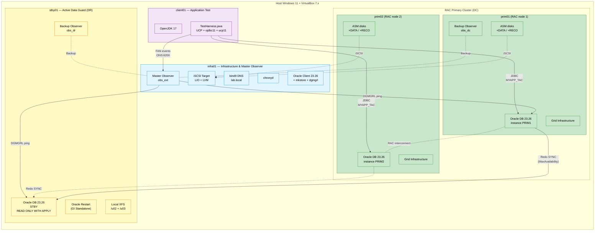
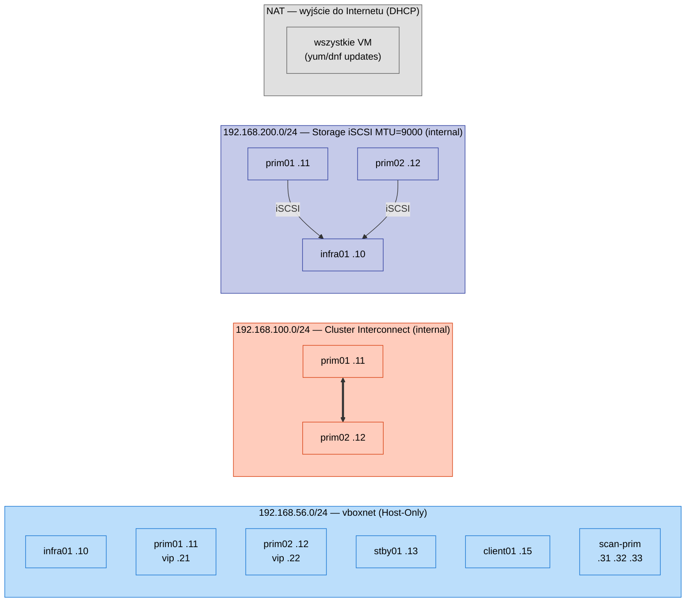
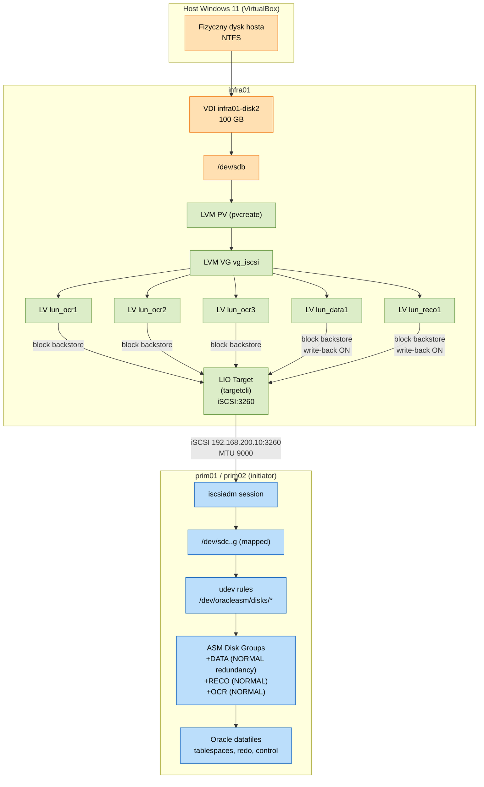
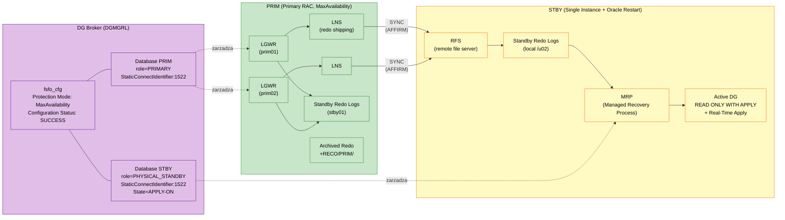
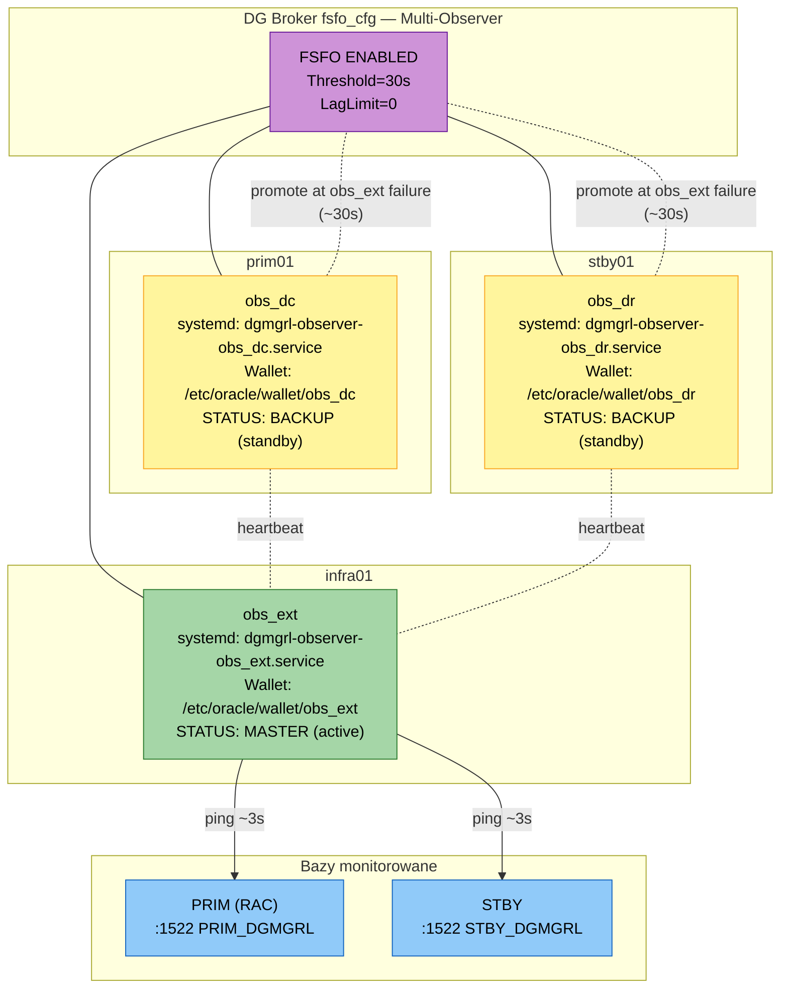
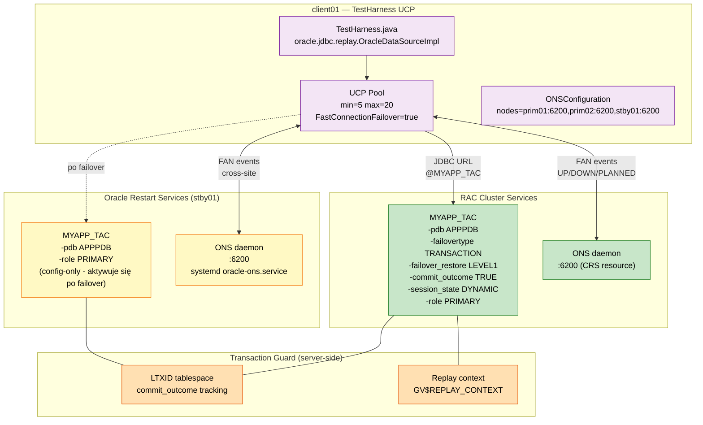
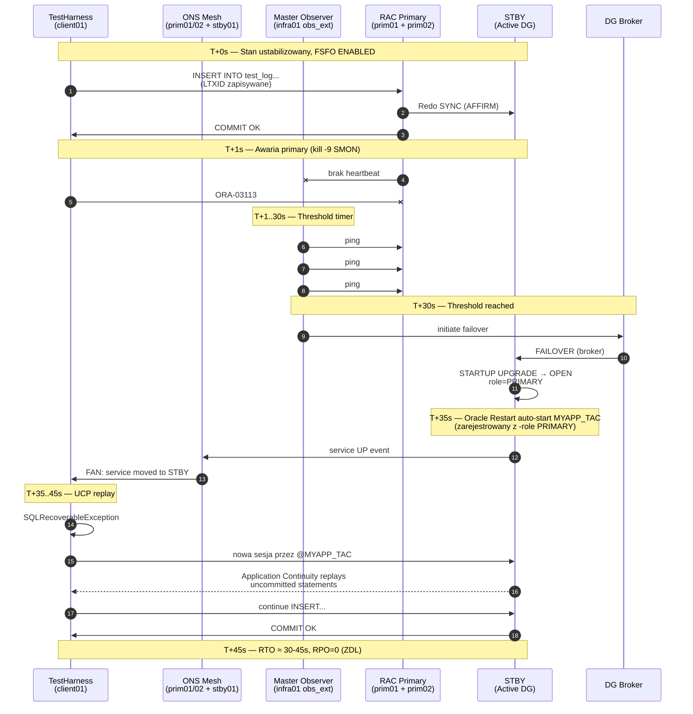
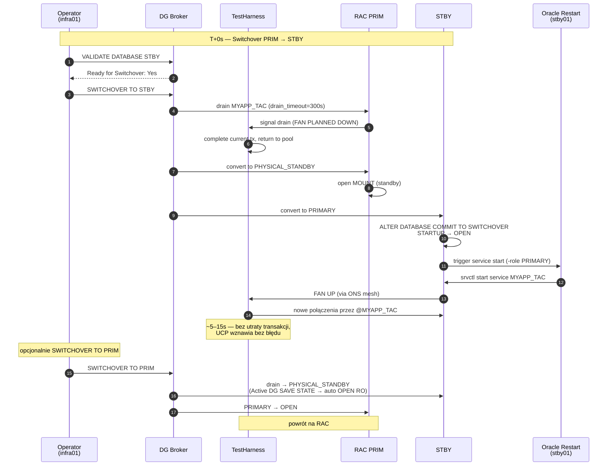
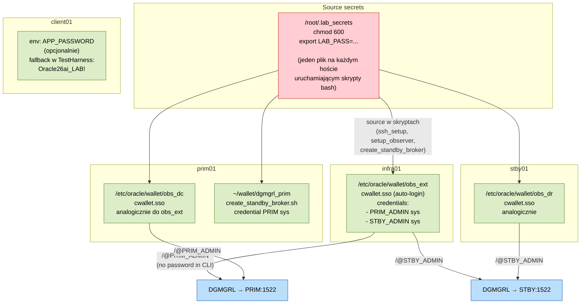
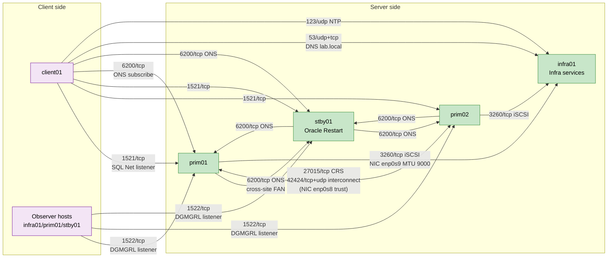

> [🇬🇧 English](./ARCHITECTURE_DIAGRAMS.md) | 🇵🇱 Polski

# Architektura VMs2-install — diagramy Mermaid

> Wizualne uzupełnienie do dokumentacji `01_Architecture_and_Assumptions_PL.md`. Każdy diagram pokazuje inny warstwę / aspekt rozwiązania Oracle 26ai HA (RAC + Active Data Guard + FSFO + TAC).
>
> Diagramy renderują się natywnie w GitHub, GitLab, VS Code (z rozszerzeniem Markdown Preview Mermaid Support), Obsidian i większości nowoczesnych przeglądarek Markdown.

**Spis diagramów:**
1. [Topologia maszyn wirtualnych](#1-topologia-maszyn-wirtualnych-5-vm)
2. [Sieci i adresacja IP](#2-sieci-i-adresacja-ip-vboxnet--internal)
3. [Stack storage iSCSI + LVM + ASM](#3-stack-storage-iscsi--lvm--asm-block-backstore)
4. [Data Guard + Broker + redo transport](#4-data-guard--broker--redo-transport)
5. [Multi-Observer FSFO (Master + 2 Backup)](#5-multi-observer-fsfo-master--2-backup)
6. [TAC + UCP klient + FAN events](#6-tac--ucp-klient--fan-events)
7. [Sekwencja: nieplanowany failover (FSFO)](#7-sekwencja-nieplanowany-failover-fsfo)
8. [Sekwencja: planowany switchover](#8-sekwencja-planowany-switchover)
9. [Bezpieczeństwo: wallety i hasła](#9-bezpieczeństwo-wallety-i-hasła)
10. [Macierz portów sieciowych](#10-macierz-portów-sieciowych-firewall)

---

## 1. Topologia maszyn wirtualnych (5 VM)

**Legenda:**
- 🟦 `infra01` — pojedyncze odpowiedzialności infrastruktury (DNS, NTP, iSCSI Target, Master Observer)
- 🟩 RAC Primary (prim01+prim02) — 2-węzłowy klaster z ASM na shared storage
- 🟨 Active Data Guard (stby01) — Single Instance + Oracle Restart, lokalny XFS
- 🟪 client01 — TestHarness UCP/TAC

---

## 2. Sieci i adresacja IP (vboxnet + internal)

> 💡 **MTU 9000 (jumbo frames)** na `enp0s9` (storage NIC) — F-18.D, daje 1.5–2× sequential reads vs MTU 1500.
> 💡 **Cluster interconnect** (`enp0s8`) jest internal-only — nie ma wyjścia poza VirtualBox; chroni przed split-brain.

---

## 3. Stack storage iSCSI + LVM + ASM (block backstore)

> 💡 **Block backstore zamiast fileio** = brak pośrednictwa filesystem (XFS/ext4) → 2–3× IOPS, brak journal overhead. To wzorzec PROD-like (NetApp/Pure/EMC).
> 💡 **Write-back na DATA/RECO**, sync na **OCR** (voting disks must be consistent).
> 💡 **mq-deadline scheduler** na `/dev/sdb` (F-18.E) — lepszy dla iSCSI z concurrent writers.

---

## 4. Data Guard + Broker + redo transport

**Kluczowe ustawienia (z `create_standby_broker.sh`):**
- `LogXptMode='SYNC'` (Maximum Availability)
- `FastStartFailoverThreshold=30` s
- `FastStartFailoverLagLimit=0` (Zero Data Loss)
- `StaticConnectIdentifier` z explicit `PORT=1522` (FIX-096)
- `srvctl modify database -db STBY -startoption "READ ONLY"` + `SAVE STATE` PDB → trwały Active DG

---

## 5. Multi-Observer FSFO (Master + 2 Backup)

> 💡 **Promote Backup → Master:** po awarii Master Observera, jeden z Backup automatycznie przejmuje rolę active w 10–60 s (zależnie od Threshold). FSFO pozostaje `ENABLED` przez cały ten czas.
> 💡 **Każdy Observer ma własny wallet** — `mkstore` z hasłem SYS dla `PRIM_ADMIN`/`STBY_ADMIN` (nie współdzielimy wallet'ów między hostami).

---

## 6. TAC + UCP klient + FAN events

**Co daje konfiguracja:**
- **`failovertype=TRANSACTION`** — zapisywanie kontekstu sesji + LTXID przed każdym call
- **`failover_restore=LEVEL1`** — replay od ostatniego committed point (NIE od początku sesji)
- **`commit_outcome=TRUE`** — Transaction Guard wie co zostało commitowane
- **FAN events przez ONS** — klient natychmiast (push, nie poll) wie o zmianach roli serwisu
- **Cross-site ONS** — `mesh nodes=prim01:6200,prim02:6200,stby01:6200` daje powiadomienia z obu stron architektury

---

## 7. Sekwencja: nieplanowany failover (FSFO)

---

## 8. Sekwencja: planowany switchover

---

## 9. Bezpieczeństwo: wallety i hasła

**Konwencja hasła w labie (zob. `01_Architektura` sekcja 2):**
- Wszystkie konta OS (root, oracle, grid, kris) i DB (SYS, SYSTEM, ASM, PDB Admin, app_user): `Oracle26ai_LAB!`
- `LAB_PASS` w `/root/.lab_secrets` — odczytywany przez wszystkie skrypty bash (`source` na początku)
- `APP_PASSWORD` w TestHarness — env var z fallback do hardcoded labowego defaultu

W produkcji każdy z tych wallet'ów ma osobne hasło z secret store (HashiCorp Vault / Oracle Wallet z Master Key), zmienne środowiskowe nie są wpisywane w kod ani repo.

---

## 10. Macierz portów sieciowych (firewall)

**Tablica portów:**

| Port | Protokół | Kierunek | Cel | Skonfigurowane w |
|------|----------|----------|-----|------------------|
| 1521 | tcp | klient→DB | SQL*Net listener (LREG-rejestracja serwisów) | kickstart prim01/02 |
| 1522 | tcp | Observer→DB | DGMGRL listener (broker management, StaticConnectIdentifier) | kickstart prim01/02 |
| 6200 | tcp | klient↔serwer / mesh | ONS / FAN events | kickstart prim01/02 + `oracle-ons.service` na stby01 |
| 27015 | tcp | wewnątrz klastra | CRS daemon (HAIP) | kickstart prim01/02 |
| 42424 | tcp+udp | wewnątrz klastra | Cluster interconnect (CSS, DRM) | trust=enp0s8 (full) |
| 3260 | tcp | initiator→target | iSCSI | kickstart infra01 |
| 53 | udp/tcp | klient→infra01 | DNS bind9 | kickstart infra01 |
| 123 | udp | klient→infra01 | NTP chronyd | kickstart infra01 |

> 💡 **`--trust=enp0s8 --trust=enp0s9` w kickstart prim01/02** otwiera całkowicie te interfejsy (interconnect + storage) — to wewnętrzne sieci VirtualBox internal, niedostępne spoza klastra.

---

## Powiązane dokumenty

- `01_Architecture_and_Assumptions_PL.md` — szczegóły topologii w formie tabel
- `03_Storage_iSCSI_PL.md` — implementacja iSCSI block backstore
- `04_Grid_Infrastructure_PL.md` — instalacja GI Cluster + Oracle Restart
- `06_Data_Guard_Standby_PL.md` — DG Broker + Active DG (READ ONLY WITH APPLY trwały)
- `07_FSFO_Observers_PL.md` — Master + 2 Backup Observers
- `08_TAC_and_Tests_PL.md` — TAC service + UCP klient
- `09_Test_Scenarios_PL.md` — testy operacyjne FSFO/TAC
- `10_Performance_Tuning_PL.md` — optymalizacje (paravirt KVM, HugePages, jumbo, write-back)
- `../FIXES_PLAN_v2_PL.md` — kompletny plan poprawek z review

---

**Wersja:** 1.0 (VMs2-install) | **Data:** 2026-04-27 | **Format:** Mermaid 10.x
